CUDA Path Tracer
================

**University of Pennsylvania, CIS 565: GPU Programming and Architecture, Project 3**

* Name: Meghana Seshadri
* Tested on: Windows 10, i7-4870HQ @ 2.50GHz 16GB, GeForce GT 750M 2048MB (personal computer)

## Project Overview

The goal of this project was to get an introduction to writing a GPU Path Tracer in CUDA.

The following features were implemented (most of which can be toggled with flags in `utilities.h`):

Path Tracing Features:

* Shading kernels with BSDF evaluation for:
	- Ideal diffuse surfaces (using cosine-weighted scatter function)
	- Perfectly specular-reflective surfaces
	- Specular-refractive surfaces
* Naive lighting
* Direct lighting 
* Anti-aliasing
* Depth of field

GPU Features:

* Path continuation/termination using Stream Compaction 
* Sorting rays, path segments, and intersections to be contiguous in memory by materials
* Caching first bounce intersections for re-use across all subsequent iterations 

## Renders

### Naive Lighting 

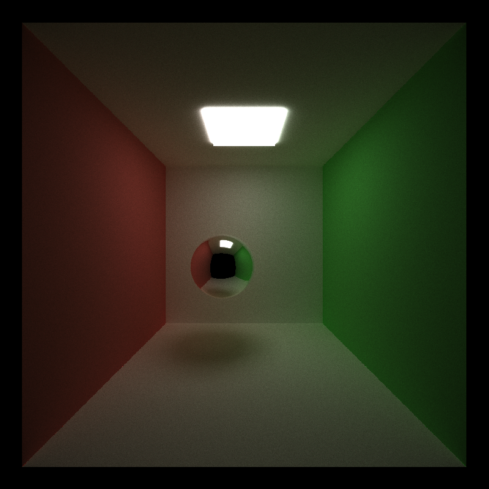
###### (Run with 5000 samples)

### Direct Lighting 

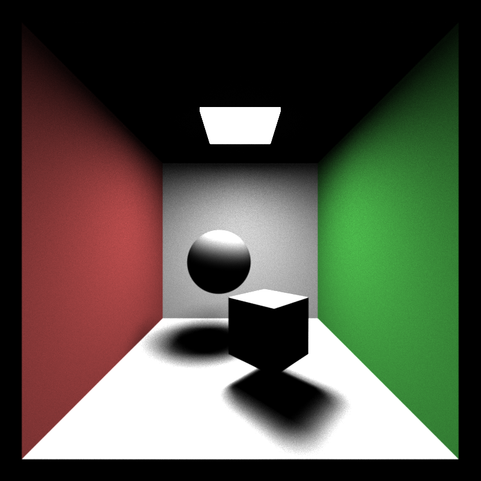
###### (Run with 3860 samples)

### Anti Aliasing 

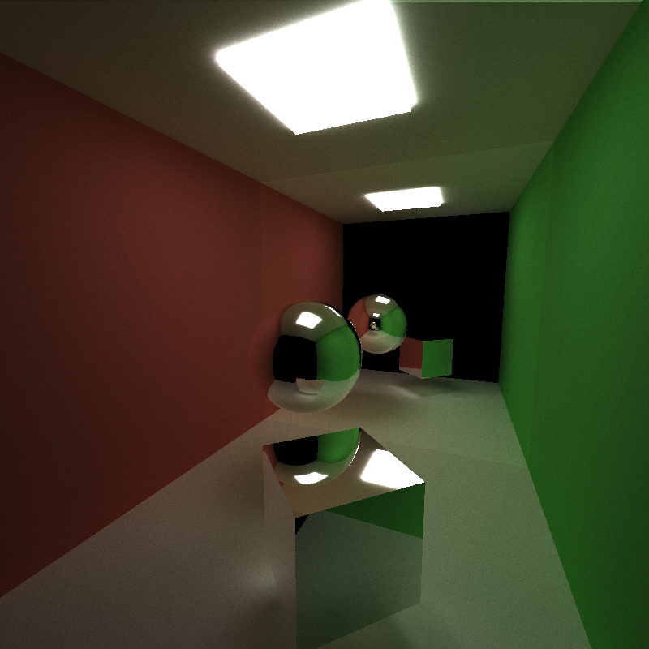
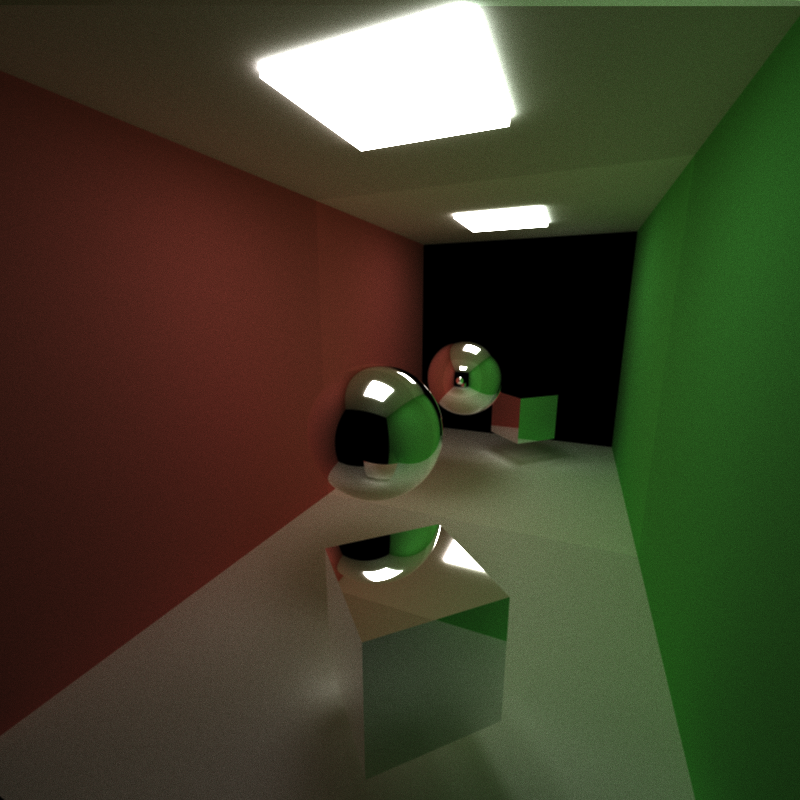
###### (Both images run with 5000 samples)

###### (Run with 67 samples)
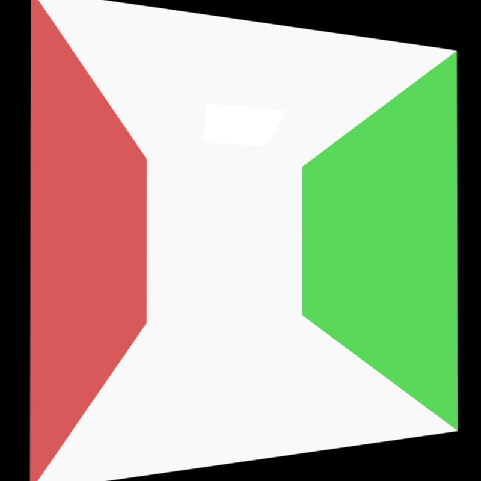
###### (Run with 324 samples)

### Depth of field

###### (Run with 2518 samples, 0.2 radius, 20 focal length)

### Tranmission 

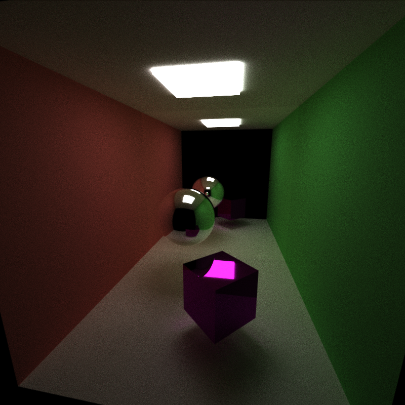
###### (Run with 1558 samples)

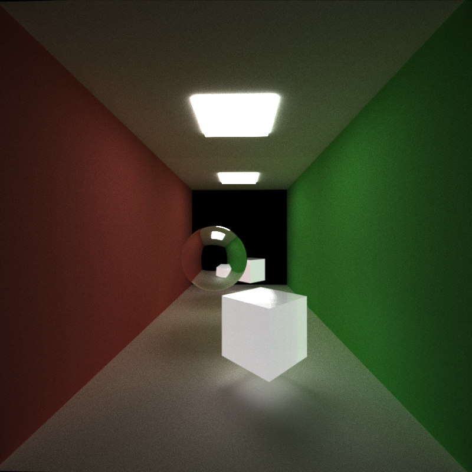
###### (Run with 2364 samples, 1.5 index of refraction)

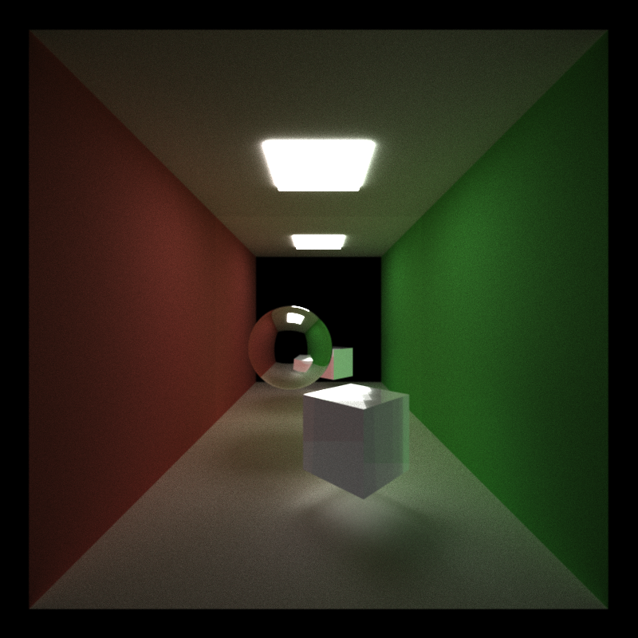
###### (Run with 2801 samples, 2.5 index of refraction)

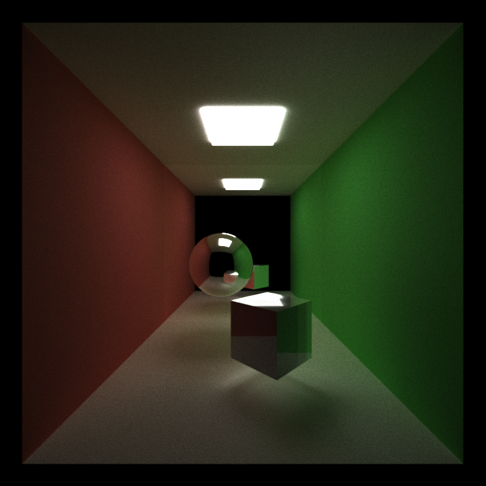
###### (Run with 2442 samples, 5.5 index of refraction)

## Performance Analysis 

All of the following charts and graphs have been tested on one sample with varying ray depths. The scene used is the "TransmissiveCube" scene with the following schematics:

* Naive lighting
* 8 objects (1 transmissive, 1 emissive, 2 reflective, 4 diffuse)

### Stream Compaction 

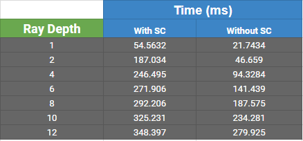

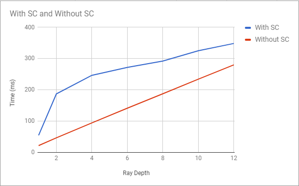

### Material Sorting

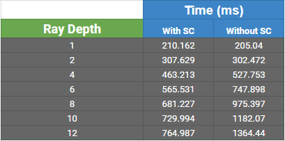

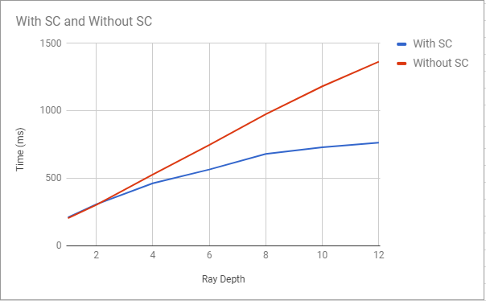

### First Bounce Caching 

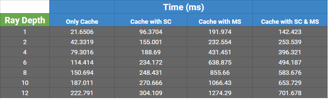

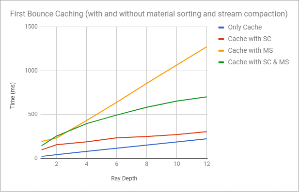

## Features to be implemented in the future

* Material sorting by material type (not just ID)
* Multiple importance sampling lighting 
* Microfacet BTDFs
* Texture and bump mapping
* Arbitrary mesh loading and rendering

## Bloopers