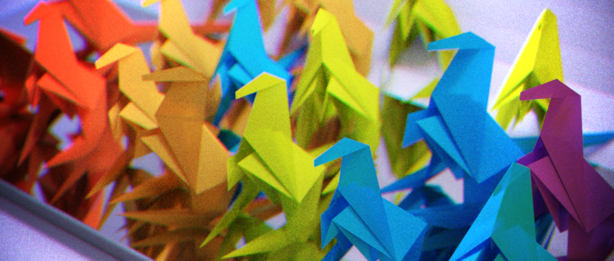
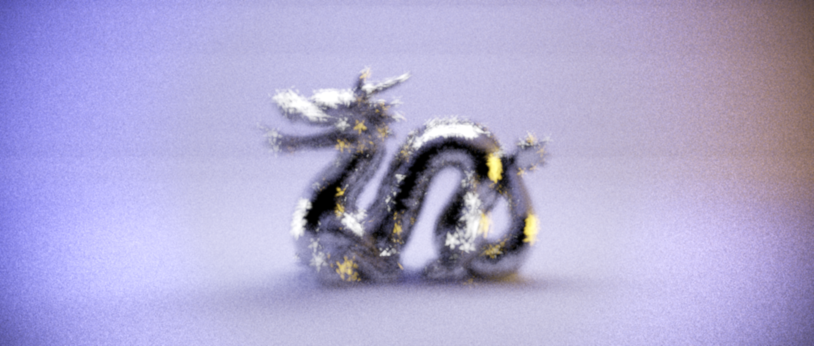
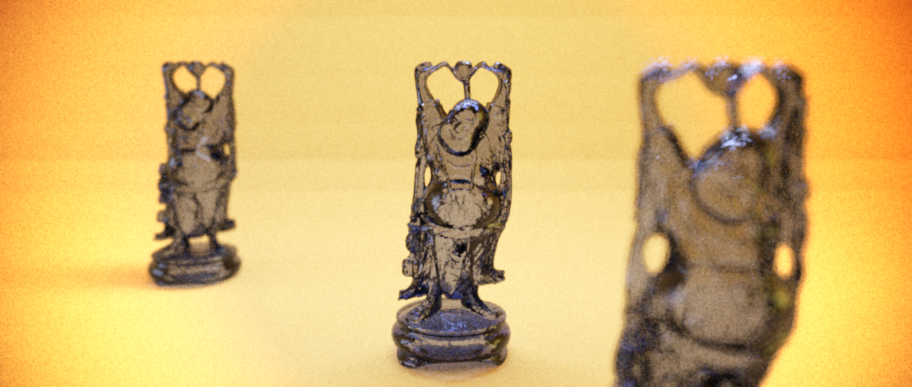
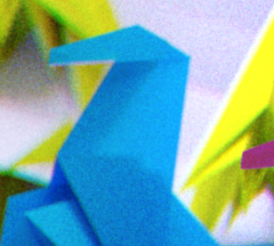
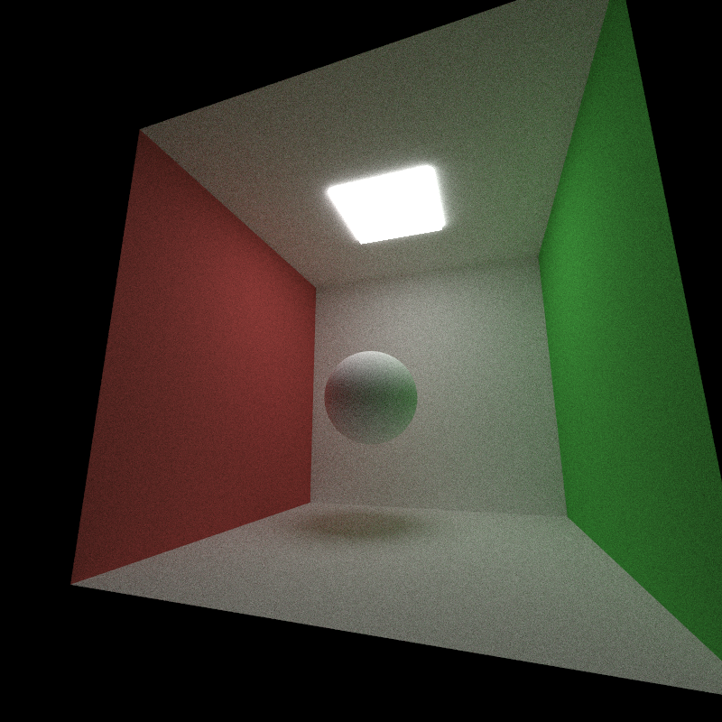
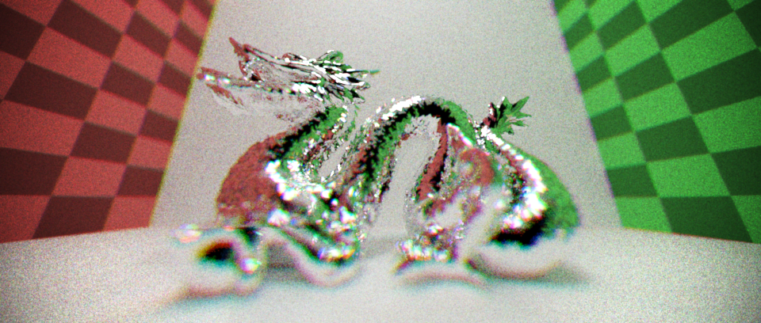

CUDA Path Tracer
================

**University of Pennsylvania, CIS 565: GPU Programming and Architecture**

* Mariano Merchante
* Tested on
  * Microsoft Windows 10 Pro
  * Intel(R) Core(TM) i7-6700HQ CPU @ 2.60GHz, 2601 Mhz, 4 Core(s), 8 Logical Processor(s)
  * 32.0 GB RAM
  * NVIDIA GeForce GTX 1070 (mobile version)

## Details
This project implements a physically based pathtracer through the use of CUDA and GPU hardware. It has basic material and scene handling and supports meshes while keeping an interactive framerate. The main features are:

* Brute force path tracing
* Diffuse, perfectly specular reflective and transmissive materials
  * An approximated translucence brdf for thin walled materials such as paper
* Filmic tonemapping with user editable vignetting
* Depth of Field with arbitrary aperture shape
* Texture mapping and one procedural texture
* Normal mapping
* Mesh loading with an accelerated kd-tree structure that runs in GPU
* Antialiasing
* Gaussian filtering of path samples

## Feature description and analysis

### Core path tracer
The brute force algorithm uses a sequence of compute kernels that intersect and accumulate samples from the scene. After each iteration, it compacts and discards paths that either don't intersect anything or don't contribute to light transport. However, it is a naive path tracing algorithm, as it doesn't use direct lighting nor any multiple importance scheme, given that I felt that they were secondary to the excercise of designing a robust renderer in GPU. I will probably implement this in the future.

### Multiple BxDFs
Apart from the common materials, the purely diffuse material supports a translucence attribute that lets the material transmit light through thin walled geometry, such as triangles. You can see an example in the following figure.

Notice how the paper is translucent on the back of the origami piece.

All materials both sample a direction and evaluate the brdf function, returning a pdf for the Monte Carlo simulation. Note that the kernel is an uber shader and decides which sampling function to call depending on material type.

Wavefront rendering should vastly improve the shading step, reducing divergence and decoupling code better.

### Sample Filtering
To reduce aliasing artifacts that arise from averaging AA samples inside a pixel, I implemented a Gaussian filter step that gathers samples with a specific radius and averages them smoothly, reducing jaggies that may arise on certain situations. It is also helpful in terms of reducing noise. Compare the aliasing artifacts that appear near the area light shape. This happens even with antialiasing, because of the box blur generated from averaging inside a pixel.

Render without filtering

Render with a filtering radius of 2 pixels.

An interesting problem that appeared while designing the filtering step is the need to gather close samples, or using gather-as-you-scatter strategies to prevent having a separate step. In the future, such strategies would improve performance drastically, as the current implementation suffers with big filter radii (although in practice, a radius of 2 is more than enough). 

### Filmic tonemapping
After the filtering step is done, there's one last pass that normalizes the filter samples, does gamma correction, adds vignetting and modifies the result colors to have a more filmic aesthetic. The specific implementation is based on John Hable's tonemapping operator for Uncharted, which can be seen here: http://filmicworlds.com/blog/filmic-tonemapping-operators/

Because the tonemapping pass does gamma correction, all textures and color input is transformed into linear space before the rendering starts. 

Notice how the dark colors are crushed and the highlights are emphasized, and the borders are obscured. The vignetting function is completely custom and is not based on any physical property apart from aesthetic.

A straightforward optimization of the current implementation would be adding LUT textures to reduce the amount of arithmetic operations done on this kernel.

