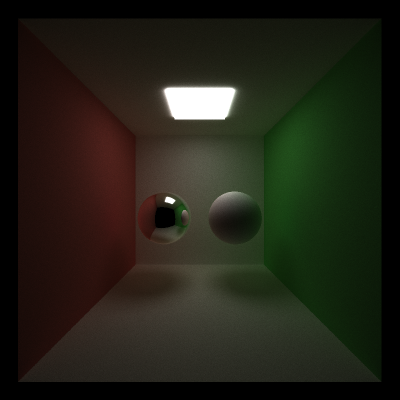
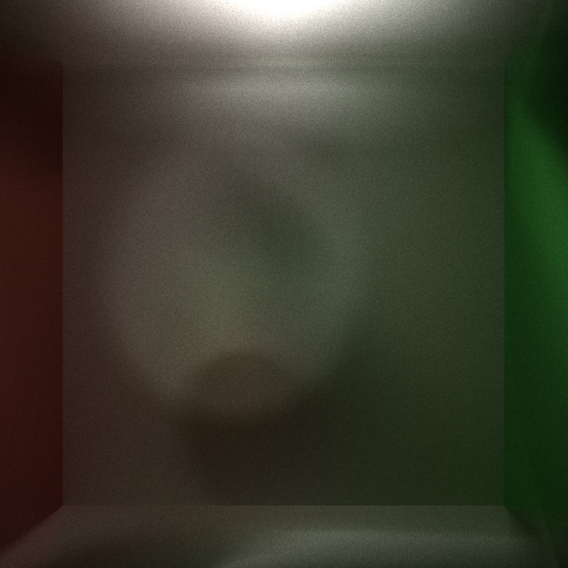
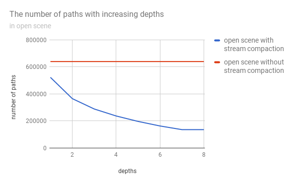
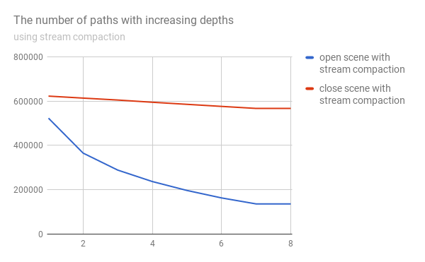
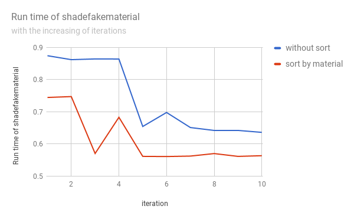
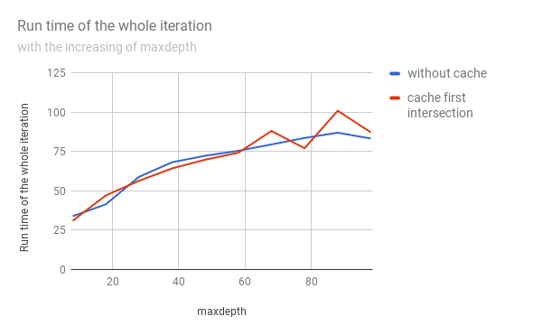

CUDA Path Tracer
================

**University of Pennsylvania, CIS 565: GPU Programming and Architecture, Project 3**

* Yalun Hu
* Tested on: Windows 10, i7-6700HQ CPU @ 2.60GHz 32GB, GTX 1070 8192MB (Personal computer)

# Features

## 1. Basic Path Tracer
* A shading kernel with BSDF evaluation for Ideal Diffuse surfaces and Perfectly specular-reflective surfaces
* Path continuation/termination using Stream Compaction
* Sort pathSegments/intersections by material type
* Cache the first bounce intersections for re-use across all subsequent iterations.

  

## 2. Object motion and motion blur
A Moving sphere.

  

## 3. Refraction with Frensel effects
Refer to PBRT. For a material mixed having both BTDF and BRDF, just randomly choose a BxDF.
But there are some white spots in the scene, and the interior of the sphere looks dark.

  

  

## 4. Physically-based depth-of-field
Added a virtual lens with focalDistance 15.5, lensRadius 20.0.
Nearclip is set to 0.1, and farclip is set to 100.

  

# Analysis
## 1. Basic Path Tracer
* Stream compaction

  

The figure shows that using stream compation in an open scene will reduce the number of paths with increasing depths, thus improving the performance.

* Open Scene vs. Close Scene

  

The figure shows that in a close scene, using stream compaction is not as effective as in an open scene. Because there are less rays that will terminate in each depth in a close scene.

* Sort by material type

  

The figure shows that sorting the path segments by materials to make rays/paths interacting with the same material contiguous in memory improves the performance. Beacause for threads in continuous memory, they will need more time to access different materials copying from other cache.

* Cache the first bounce intersections

  

The figure shows that caching the first bounce intersections improves performance with small maxdepth, but does not improve performance obviously when maxdepth gets larger.
Because when the maxdepth is small, caching the first bounce intersections can save the computation time for other iterations when depth = 1. But when the maxdepth is very large, saving time for depth = 1 is only a small part of whe whole iteration.

## 2. Object motion and motion blur
* **Performance impact**：will not affect performance.
* **CPU VS. GPU**：no difference.
* **Future optimization**：cache the scene for each frame instead of reading the scene from the file.

## 3. Refraction with Frensel effects
* **performance impact**：slightly slower in scatterRay function. Because there will be more if branches.
* **CPU VS. GPU**：no difference for a single thread.
* **Future optimization**：make the interior of the object more realitic, fix the bugs.

## 4. Physically-based depth-of-field
* **performance impact**：slightly slower in generateRayfromCamera, because we should compute the rays generated from the virtual lens.
* **CPU VS. GPU**：no difference.
* **Future optimization** modify and find the optimized parameters of the lens to make the scene more realistic.
