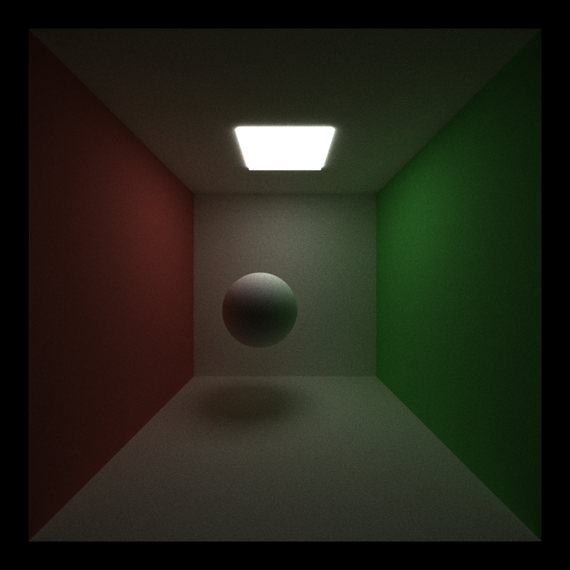
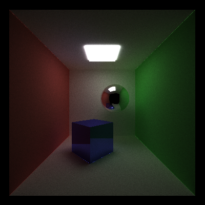
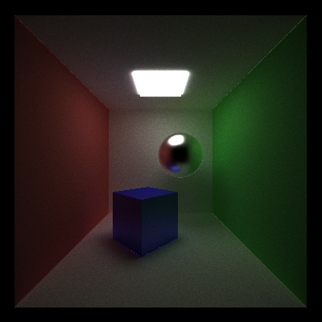
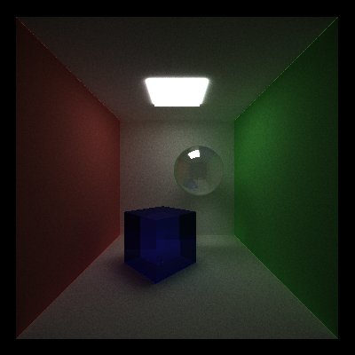
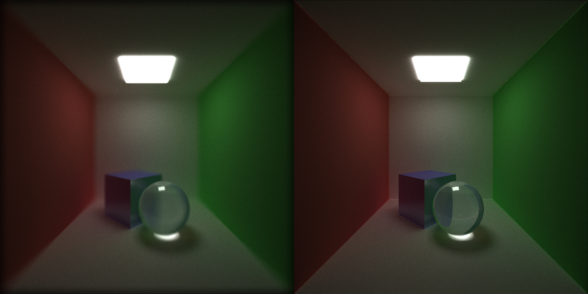
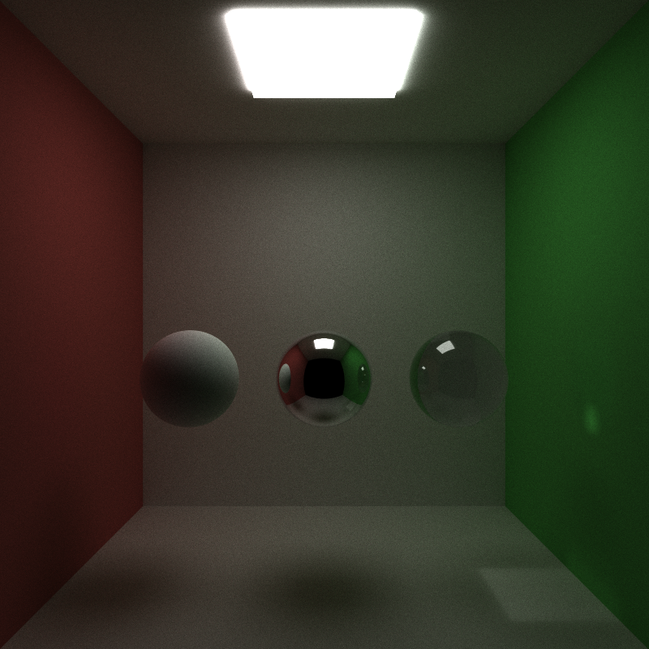

University of Pennsylvania, CIS 565: GPU Programming and Architecture, Project 3 CUDA Path Tracer
======================
* Ziyu Li
* Tested on: Windows 7, Intel Core i7-3840QM @2.80GHz 16GB, Nvidia Quadro K4000M 4GB

## Features
#### All Features
 - A shading kernel with BSDF evaluation
	 - Ideal diffuse surfaces
	 - Perfectly reflective surfaces
	 - Non-Perfectly reflective surface
	 - Refraction with Frensel effects
 - Depth of Field
 - Anti-Aliasing
 - Motion Blur (with Batch Render)
 - Arbitrary mesh loading and rendering with bounding volume intersection culling
 - Path continuation/termination using Stream Compaction
 - Sort rays/pathSegments/intersections contiguous in memory by material type
 - Cache first bounce

#### Shading Kernel with BSDF
| Diffuse | Reflective | Glossy  | Refractive |
| ----- | ----- | ----- | ----- |
|  |  |  |  |

(Figure 1-4: Diffuse, Reflect, Glossy, Refract Shading)


#### Depth of Field


(Firgure 5: Depth of Field Comparison)

#### Anti- Aliasing


(Firgure 6: Anti- Aliasing Comparison)

#### Motion Blur


(Firgure 7: Motion Blur Comparison)
#### Mesh Loading and Rendering


(Firgure 8: Low-Poly Bunny)

For loading custom *.obj mesh into program please use the following format in scene file.

```
OBJECT   [number]
mesh       // indicate a custom mesh
material  [material_id]
TRANS     [x] [y] [z]
ROTAT     [x] [y] [z]
SCALE     [x] [y] [z] 
FPATH	  [relative_path]   // relative path for *.obj file
```


**Third-party loading mesh function are list below**
> tinyobjloader 
>
> https://github.com/syoyo/tinyobjloader


#### Batch Render (Only support Windows 7+ OS or Windows Server 2012+ with .Net Framework)
**For render a sequence of images, please read the following instructions.**
First you have to assign animation to at least one object in scene. This will need to make some slightly change in scene file.

```
OBJECT   [number]
[type]
material  [material_id]
TRANS     [x] [y] [z]
ROTAT     [x] [y] [z]
SCALE     [x] [y] [z] 
FPATH	  [relative_path]   // option
MT          [x] [y] [z]     // Translation
MR          [x] [y] [z]     // Rotation
```

After this, you already define a basic animation.

The batch render is achieved by executing a series command by Windows PowerShell. Most of time, executing such script need OS grant such operation. So first make sure your system grant the execution policies set on host. If you not sure about that or system need such permission, please running the following script in Windows PowerShell as administrator. 

> Set-ExecutionPolicy RemoteSigned

For more information, see https://technet.microsoft.com/en-us/library/ee176961.aspx

Now, your system is ready to execute Windows PowerShell script.
Here's one test script already in **batch** folder, feel free to test or change the script. (Please make sure the both ray tracing program and powershell script is under same directory.)


## Performance Analysis
#### Bounding volume intersection culling

#### 
