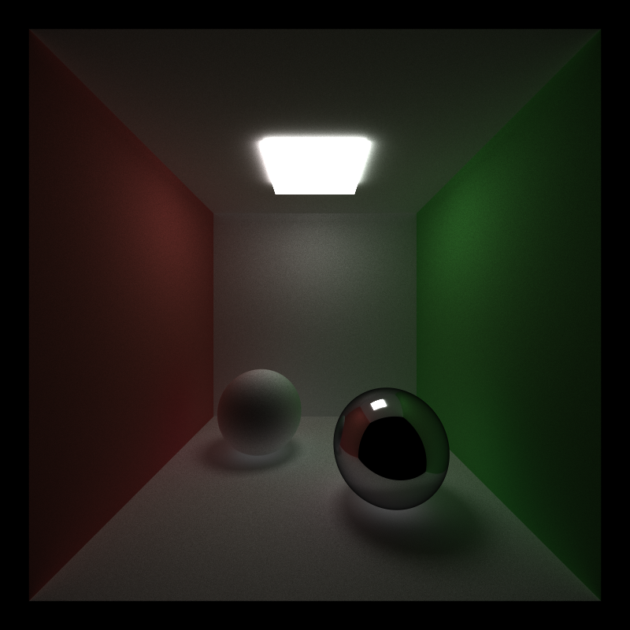
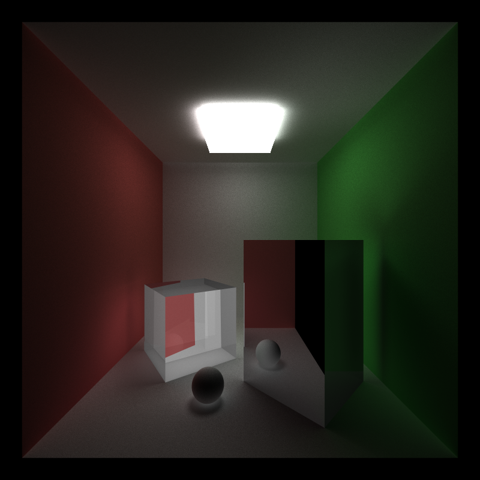
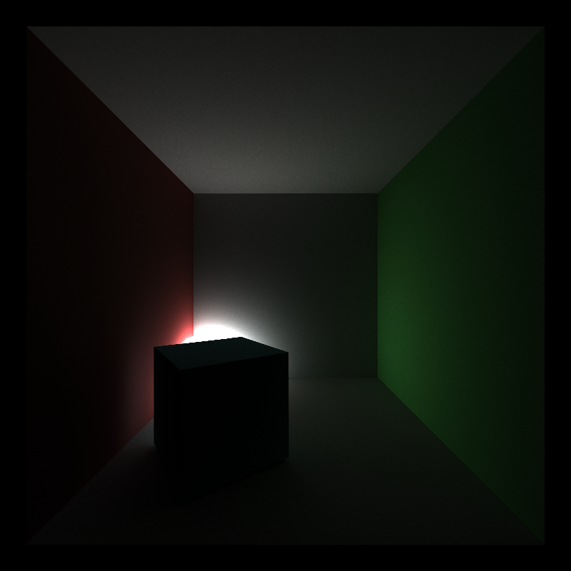
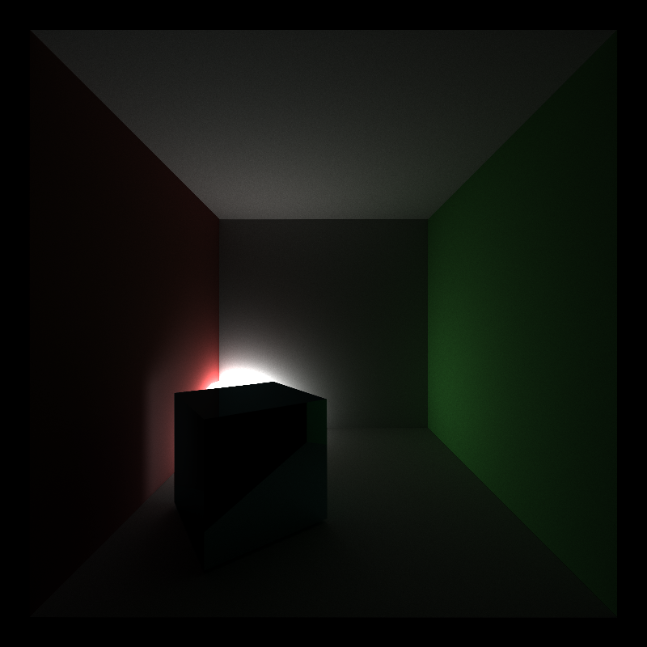
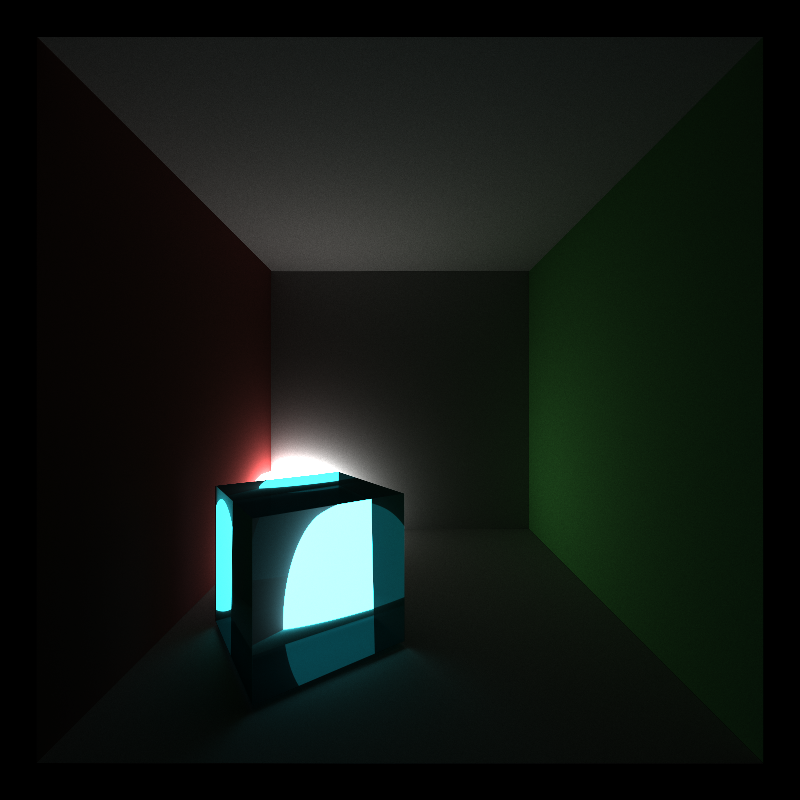
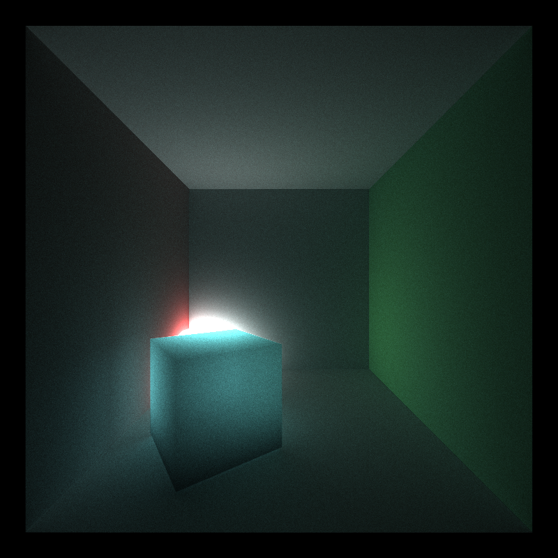

CUDA Path Tracer
================

**University of Pennsylvania, CIS 565: GPU Programming and Architecture, Project 3**

* Jonathan Lee
* Tested on: Tested on: Windows 7, i7-7700 @ 4.2GHz 16GB, GTX 1070 (Personal Machine)

# Overview

In this project, I was able to implement a basic Monte Carlo Path Tracer in CUDA.

Features:
- The Cornell Box
- Depth of Field
- Anti-Aliasing
- Materials
    - Diffuse*
    - Specular*
    - Refractive
    - Subsurface 
- Integration/Shading Techniques
    - Naive*
    - Direct Lighting
- Stream Compaction for Ray Termination*
- Material Sorting*
- First Bounce Caching*

(*) denotes required features.

# Results and Renders

## Depth of Field

No Depth of Field             |  Depth of Field
:-------------------------:|:-------------------------:
 Lens Radius: 0 & Focal Distance: 5  |   Lens Radius: .2 & Focal Distance: 5 |

## Anti-Aliasing

NO AA      |  AA
:-------------------------:|:-------------------------:
   |    |

You can definitely see the jagged edges are more profound on the left since AA is turned off. AA was achieved by randomly offsetting/jittering the pixel at each iteration.

## Materials

### Subsurface Scattering

  |   | 
:-------------------------:|:-------------------------:|:-------------------------:

### Material Comparisons
Diffuse             |  Specular
:-------------------------:|:-------------------------:
  |   |

Transmissive          |  Subsurface
:-------------------------:|:-------------------------:
  |   

## Integration/Shading Techniques

Naive             |  Direct Lighting
:-------------------------:|:-------------------------:
  |  

There is no global illumination in direct lighting. When a ray hits an object in the scene, we sample its BSDF and shoot a second ray towards the light. We sample a random position on the light and determine its contribution. If there is another object in between the original object and the light, then the point is in shadow, otherwise the light is not occluded and we account for the light's contribution. Direct lighting only does a single bounce as opposed to the naive integrator.

In addition to not having Global Illumination, there is no support for transmissive and specular objects since there is only one bounce per iteration.

# Future Work

- Full Lighting/MIS
- Photon Mapping
- Acceleration Structures
- OBJ Loader

# Bloopers

### Naive 
Unless noted otherwise, I don't entirely remember how most of these happened other than messing around in `scatterRay` and depth values.

I assumed the ray was coming from the camera to the object so I negated the outgoing ray which would definitely affect the reflection.

### Sorting fails

First attempt at sorting the paths by material. I did things on the CPU and also didn't update the paths.

Forgot to sort the materials before shading. :unamused:

### Direct Lighting

I think for this one I added an extra lighting term.

I inverted the shadow ray, so everything was in shadow.
