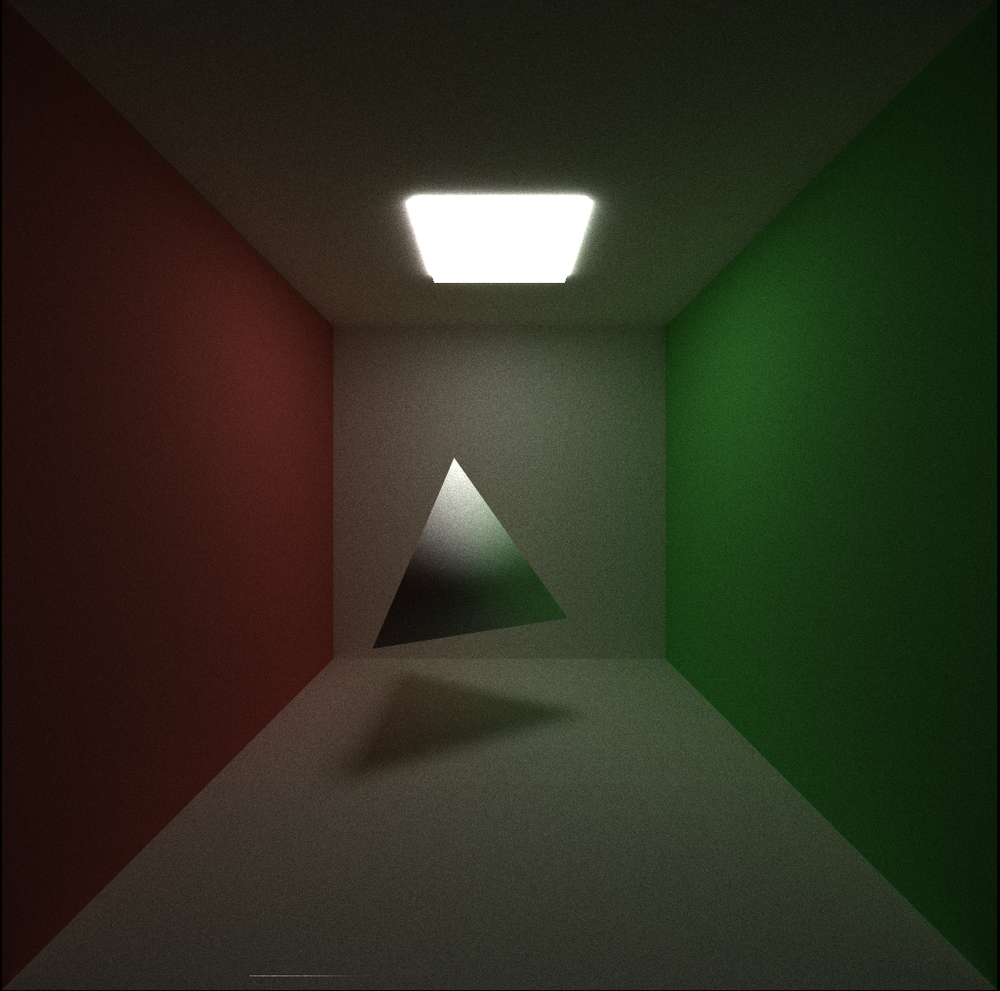

CUDA Path Tracer
================

**University of Pennsylvania, CIS 565: GPU Programming and Architecture, Project 3**

Sarah Forcier

Tested on GeForce GTX 1070

### Overview

#### Controls

* Esc to save an image and exit.
* S to save an image. Watch the console for the output filename.
* Space to re-center the camera at the original scene lookAt point
* left mouse button to rotate the camera
* right mouse button on the vertical axis to zoom in/out
* middle mouse button to move the LOOKAT point in the scene's X/Z plane

### Path Tracing Features

#### Materials

##### Ideal Diffuse

##### Perfectly Specular-reflective

#### Arbitrary Mesh Loading

| Tetrahedron | Octahedron |  Icosahedron | Dodecahedron| 
| ----------- | ----------- | ----------- | ----------- |
| 4 Triangles | 8 Triangles |  20 Triangles | 36 Triangles | 
|  |  |  |  |

#### Depth-of-Field

| f = 10, r = 0.2 | f = 11, r = 0.4 | f = 10, r = 0.8 | 
| ------------- | ----------- | ----------- |
|  |  |  |

| f = 5, r = 0.4 | f = 11, r = 0.4 | f = 15, r = 0.4 | 
| ------------- | ----------- | ----------- |
|  |  | 

#### Antialiasing

| Naive | Anti-aliasing | 
| ------------- | ----------- |
|  |  |

### Optimizations

#### Ray Termination

#### Sorted Materials

#### Cache first bounce intersection

#### Shared Memory Stream Compaction