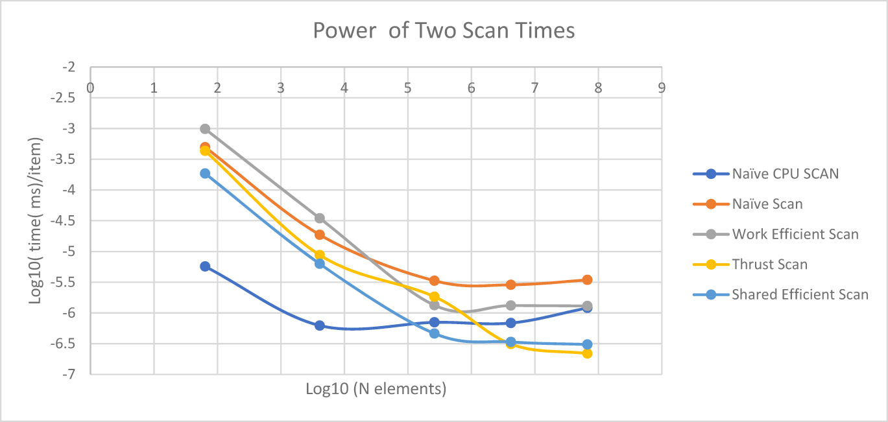
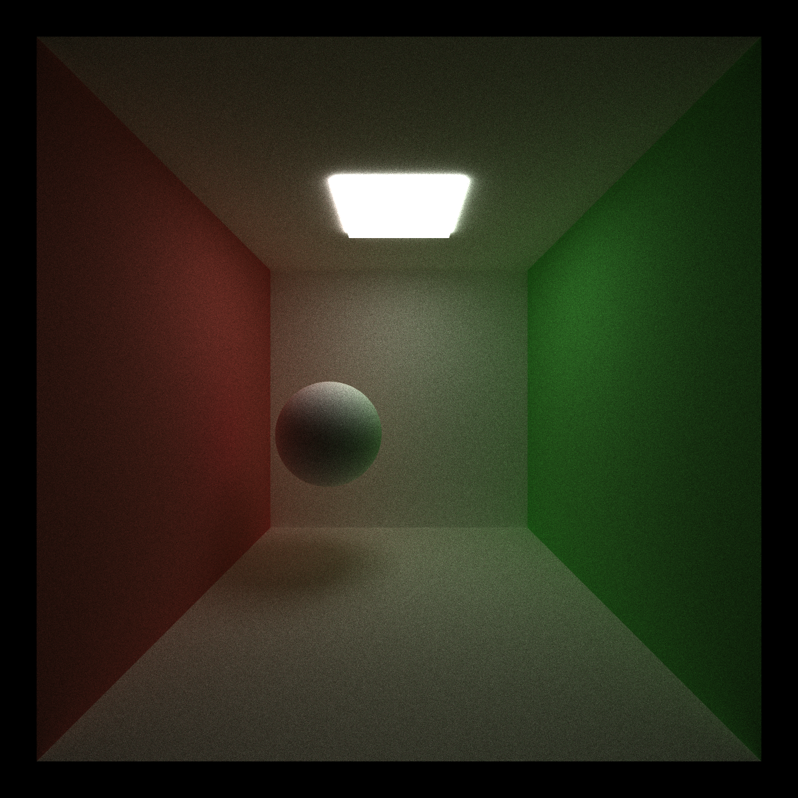
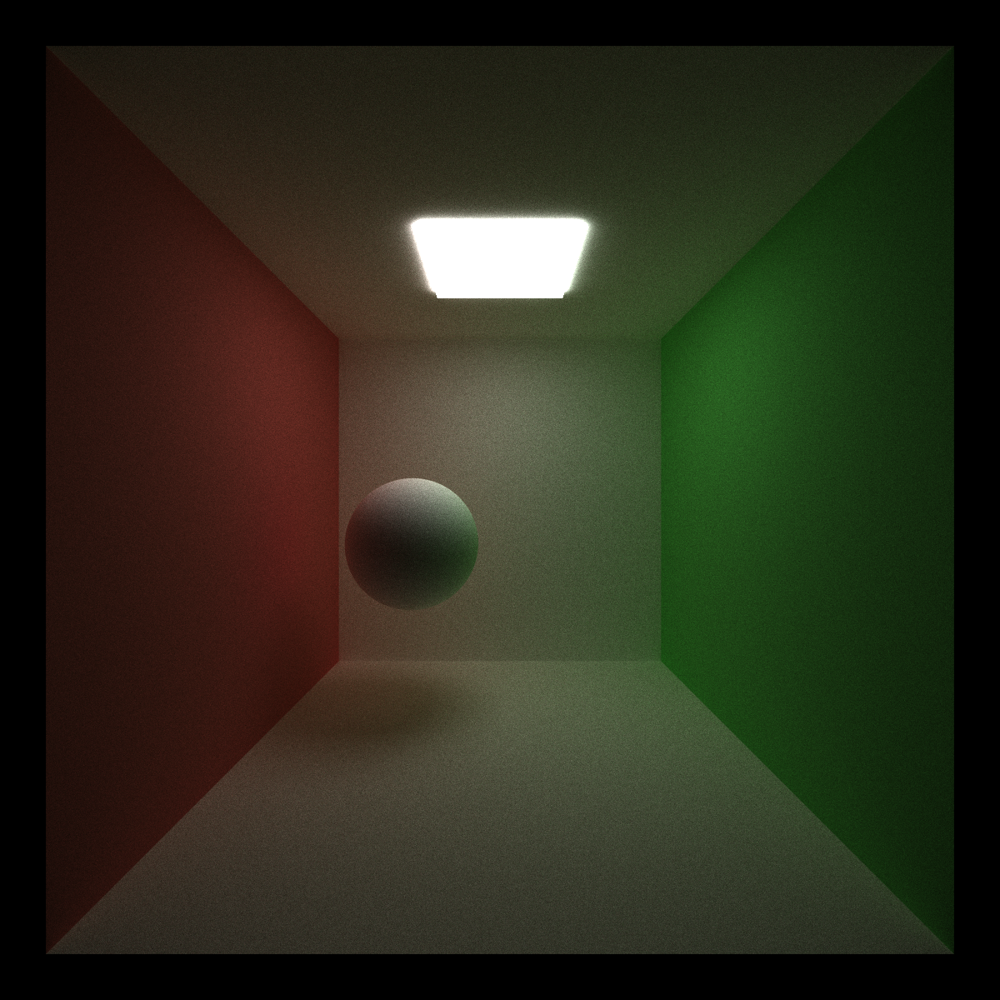
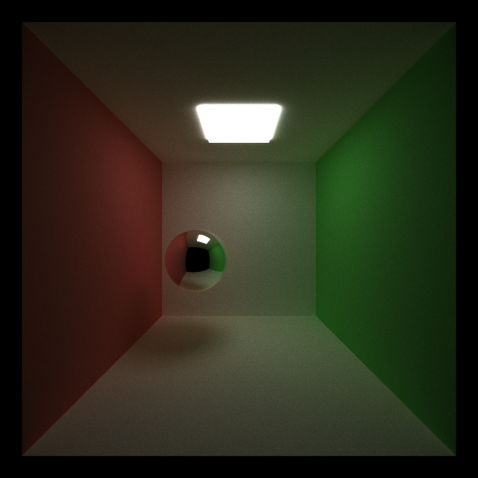
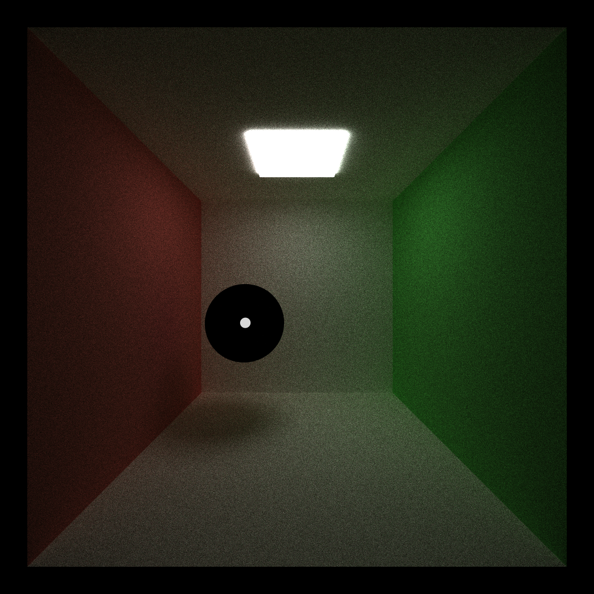
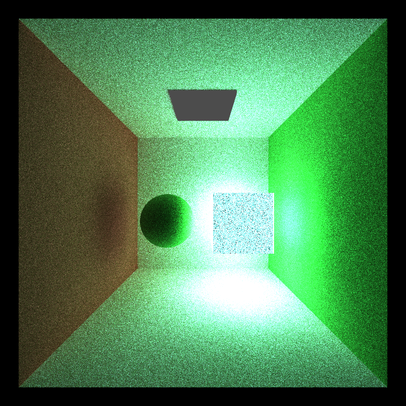

CUDA Path Tracer
================

**University of Pennsylvania, CIS 565: GPU Programming and Architecture, Project 3**
https://github.com/akhabbaz/Project3-CUDA-Path-Tracer
* (TODO) Anton Khabbaz akhabbaz
* Tested on: (TODO) Windows 10, i7-622 Surface book with a 965 M GPU)

### (TODO: Your README)
This project represents a path tracer, an algorithm for shading all the pixels in a scene realistically, and running on a GPU so that each pixel gets calculated independently.  I worked on the most complex part of this project first, that is to write a shared Scan routine on the GPU to sum in a parallel way.  That algorithm delayed me one week.  I then worked on the path tracer section and that took me a long time to understand how it could possibly work.  I didn't understand how rays that bounce from object to object could end up being parallelized.
That delayed my submission significantly. Here it is now complete.

Work Efficient Shared Scan

The heart of the algorithm is a scan or a parallel sum of integers, where takes an array of integers and produces another that is the sum of all prior integers.Below we will see how this is used.  Prior to this we wrote an "Efficient Scan" that used global memory to complete the reduction step and the downsweep.  That all worked in project2.  

Here though instead of doing the additions in global memory, which is slow to access and requires a long latency, the array were divided into Tiles, where each block copies the elements in the tile in shared memory, does the reduction and downsweep, and stores the sum in a separate location. The big advantage here 
is that all the copies and intermediate sums occur in shared memory which is fast and has low latency.  These tile sums are then scanned themselves and summed and the tile sums are then added back to the original scans so that the sum is a global sum of all elements, not just those in the tile.  That last step requires that the sum of all prior tiles be added to the current tile.  To scan the Tile sums one needs to break those into tiles as well and so the routine is recursive. 

My implementation first allocated memory for the scan_sums.  Even though it is recursive, one can predict how much memory one will need for all the scan sums sine one needs one sum for each tile; since each tile sums many elements (say 256) then the scan_sums are 256 times smaller than the original.  I wrote two routines to predict the size of the scan sums, one based on a formula that I derived and one based on a simple loop and both yeilded the same answer.  This was preallocated so that in all the recursions there was no need to allocate more memory. That all worked. 

My algorithm also used all the threads for summing, so that the tile size was twice the number of threads per block; this allowed all the threads to do work especially in the beginning of the execution.

The results are shown in 
.

The new part of this curve is called Shared Efficient Scan (magenta) , and the plot is log10(time(ms)/ item) vs Log10(number of items). 
Initially there is some overhead but after a certain point, the time per item becomes constant.  The efficient Shared Scan beat all the GPU scans
for low numbers (64), beating the work Efficient SCan by a factor of 5. After about 10^5 elements it was faster than the CPU scan, about 5 times faster
per item at 10^8 items, and about 5 times faster than the work Efficient Scan too.  
It beat the thrust Scan up until about 2 x 10^6 items and afterwards it was only 20% slower than thrust. Non powers of two were about as fast as the next higher power of two in all cases.

The comparison with thrust is not altogether fair because thrust needs to allocate memory for its scan sum and that allocation counts against it. However that allocation time is small compared to the time needed to allocate the original array, so perhaps the comparison is fair.

This result demonstrates the benefit of using shared memory.

This was difficult to debug.  I designed the algorithm so that I could set the tile size less than 2 * blockSize; this was so that I could test the tiling with small tiles of 2 or 4 to see the recursion working.  I got it to work, but the algorithm at first failed for small tiles (2  or 4) and large N (2^11).  The algorithm grew slower than the work efficient Scan for large numbers.  The problem was that I was doing the shared sum more than once for the same data, calling the kernel in a loop.  This gave the wrong numbers but no memory leaks.  I used Cuda Debugging and I printed out the sums after just one reduction stage so I could see where it failed.  I eventually traced it down.

Path Tracer

A path tracer follows rays from each pixel and computes the pixel's color by tracing the path that ray takes.
The path tracer I implemented was designed to handle multiple materials for the same surface and also to allow stream compaction and sorting. The way I did this was to first see if the ray from the camera hit an object or not.  If it did and if the object had more than one material, a random one 
was chosen and the chosen type of material was stored in ShadeableIntersection.  At this point the actual material that will be used this iteration was chosen.  Each material also had an integer stored that had one digit base 2 for each material type that was either true of false. This number was used to determine all possible materials and the number of materials.  It was important to chose the material before Compaction and sorting so that intersections could be sorted by current material, allowing neighboring threads to do the same operations.

The method of computing color could be changed while running (hit C compaction with sorting, F, compaction with no sorting, or N No compaction).  Save or Esc will also show the current GPUTimer based elapsed time.

In terms of materials, I allowed more than one material at a time. I implemented Lambertian surfaces with Phong lighting, mirrrors and transmitted surfaces.  A material can be both emissive and lambertion, reflective and transmissive, or lambertion and reflective for example.

Here are the three algorithms for a Lambertian Sphere:
 Naive Scan no Compaction:: 1000 by 1000 This was the fastest at 104.9 ms per iteration.
 Scan with Compaction and Sorting:: 1000 by 1000 This was the slowest at 194 ms per iteration.
 Scan with Compaction and No Sorting:: 1000 by 1000 This was intermediat at 129 ms per iteration.

What I conclude from this is that all the algorithms work.  They produce the same light overall and virtually identical images.  That verified to me that I amcomputing the light correctly.  

This required alot of debugging to work. My first images were all black because the material index was not calculated correctly. Then the next images were too bright because the Lambertian color was too large by a factor of Pi.  Finally that worked.  The Compaction also failed to show the lights--Those pixels appeared dark.  The issue there was that when the array was compacted, the finished pixels need to be stored somewhere otherwise they get written over.  At first I did another compaction on the finished pixels but too compactions made the algorithm slow.  It turns out that the compaction takes time to do so it was faster to just write the finished pixels to the image once they were done and prior to compaction.   

The compaction definitely works.  I see that the number of paths goes down as more and more pixels finish early.  I am sure this helps, but it needs to help more than the time required to do the compaction.

To compact the pixels, they were categorized at the intersection as failed (totally dark), hitting an emissive surface this round, or requiring a ray trace to determine the final color.  In the first two cases, the finished pixels were labelled with remainingBounces == 0. A finalGather like kernel call then wrote only these pixels to the image.  Using the efficicient scan above and the compaction algorithm, the bool and indices arrays were calculated and then used scatter the pixelSegments and Scaleable intersections.  This could be done while running by selecting Compact (F).  

I first did two sums per interation compacting.  The first compacted the active pixels and the second stored the terminated pixels.  That compacted everything but turned out to be slower. After that I just ran one compaction per iteration.

To sort I used sort_by_key and sorted based on the mateiral chosen id.  I then used a pair the origina indices.  These indices were then used to sort pathSegments and intersections.  I tried doing a direct sort using thrust but that did not compile.

Reflective Sphere

 Naive Scan no Compaction:: 1000 by 1000 Reflective Sphere.

Transmissive Sphere
 
Here are other transmissive objects:

These images show transmission through the objects.  One can see light passing pthrough the objects and appearing on the walls.  one also sees the corner of a cube as bright or the middle of the sphere. As the index of refraction gets smaller, the diameter of the bright patch actually grows as one can see in a couple of the images.  The dark spots are becauseat those angles one would get total internally reflected and so the transmission will be zero or black.  In the center of the sphere the angles are near normal, so the light passes through during refraction.  By coloring the cube red, with a low enough index of refraction (1.1) the cube will appear red.  The file to make these work was "TransmissionCube.txt"

Sum of two materials:

Here is a series of images that show that the sum of two materials is working.  These were done using a file "TransmissionReflective.txt".  I turned down the 
light intensity alot so that the pixels would not saturate.

.  This image is reflective only. One can see how the cube is reflecting the light on the far wall and on the sphere.

.  This image is transmitted only.  One can see how the cube is light because there are angles that pass from the light to the camera.  one can see the transmitted light on the walls.

 This is both transmitted and reflected. The image is very bright.  THis is because the light is simply adding.  Physically speaking the transmitted and reflected contributions shoud be attenuated by the fresnel coefficient, and this has not been implemented yet. To do that I would add another field to the image so that one could have mirror reflection (always reflecting) and Fresnel reflection (dividing up the light intoreflected and transmitted amplitudes).

Here one also sees that the time per frame is still better for no compaction (76 ms) but compaction with sorting was not that much worse (125 ms per iteration).  Now there are two or more materials so the threads will require different algorithms.  As more and more materials are added, the compaction with Sorting will be a better and better improvement.

