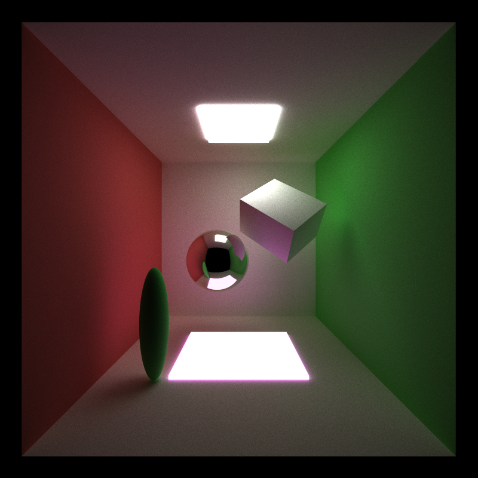
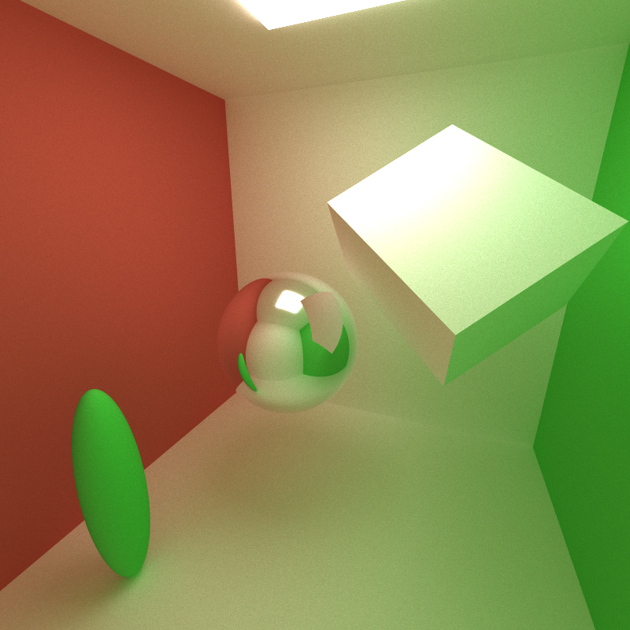
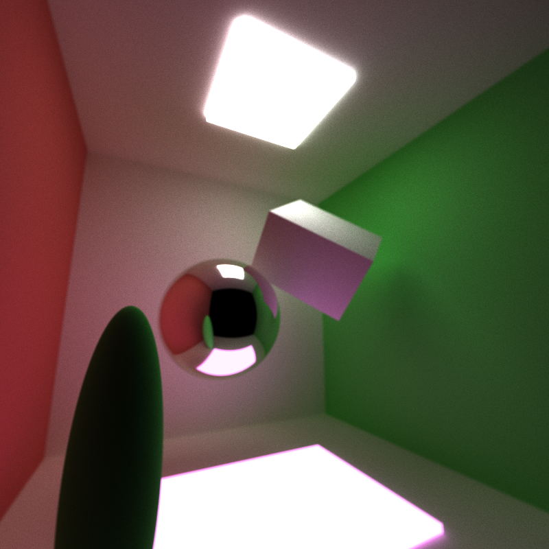
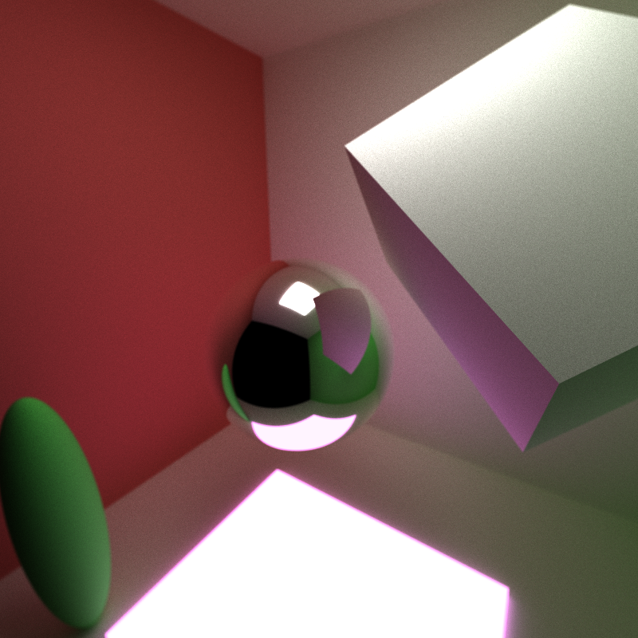
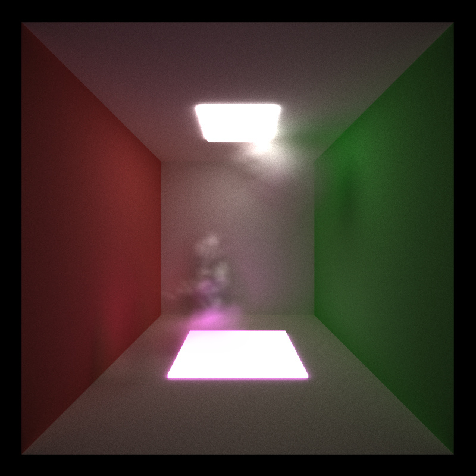
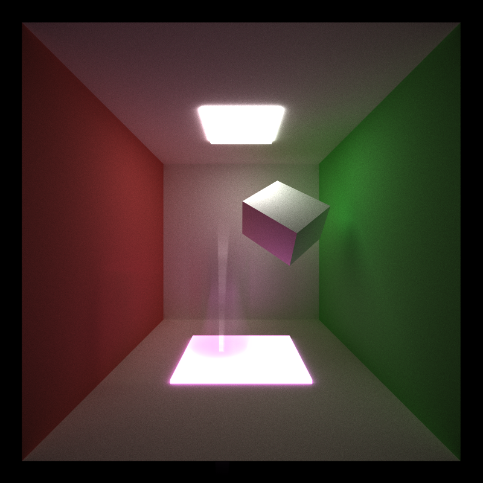
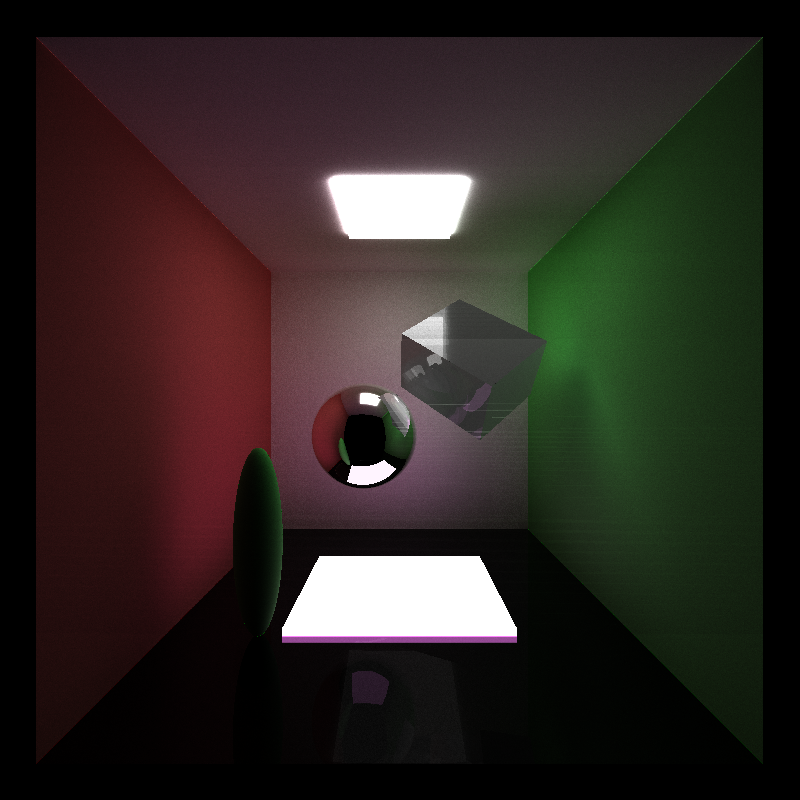
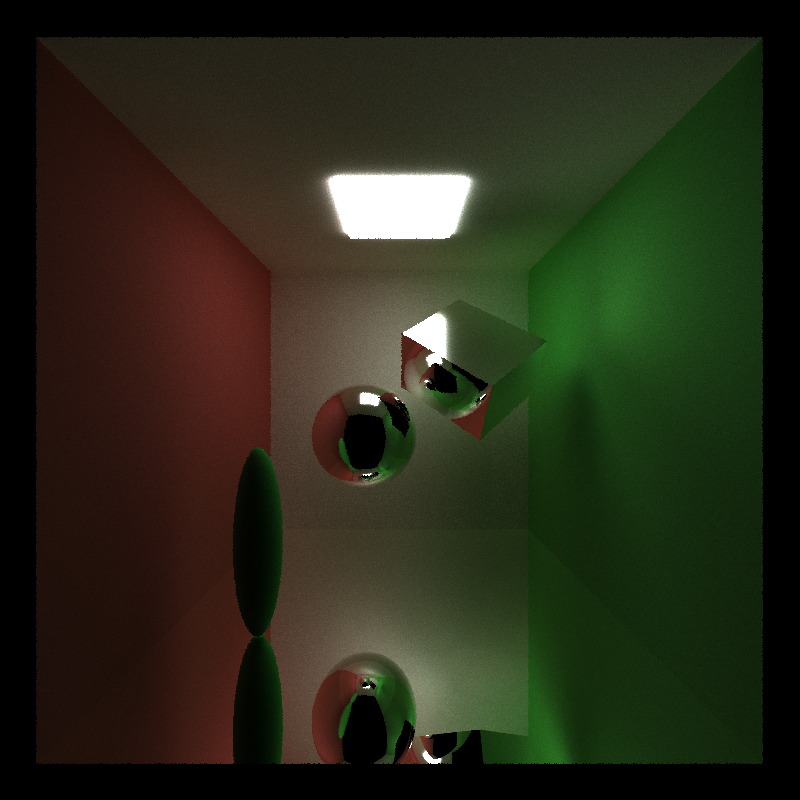
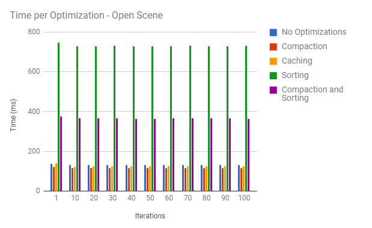
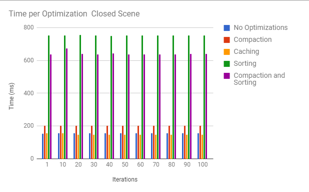

CUDA Path Tracer
================

**University of Pennsylvania, CIS 565: GPU Programming and Architecture, Project 3**

* Ricky Rajani
* Tested on: Windows 7, i7-6700 @ 3.40GHz 16GB, NVIDIA Quadro K620 (Moore 100C Lab)

This project implements a CUDA-based path tracer capable of rendering globally-illuminated images very quickly. Base code was provided; however, the core renderer was implemented by the author.

### Core Features:
- A shading kernel with BSDF evaluation for Ideal Diffuse surfaces [PBRT 8.3] and perfectly specular-reflective (mirrored) surfaces
- Path continuation/termination using Stream Compaction
- Path segments and intersections are contiguous in memory by material type before shading
- First bounce intersections are cached for re-use across all subsequent iterations

### Extra Features:
- Refraction [PBRT 8.2] with Frensel effects using Schlick's approximation
- Physically-based depth-of-field (by jittering rays within an aperture) [PBRT 6.2.3]
- Stochastic Sampled Antialiasing
- Motion blur through averaging samples at different times during the animation

*All features are easily toggleable

# Samples - 5000 iterations

Open scene with core features and anti-aliasing

Closed scene with core features and anti-aliasing (only one light)

Open scene with depth-of-field, stream compaction and anti-aliasing

Open scene with motion blur, stream compaction and anti-aliasing

Open scene with refraction, core features and anti-aliasing

Open scene with reflection, core features and anti-aliasing

# Performance Analysis

### Stream Compaction:

Stream compaction helps most after a few bounces. It reduces the number of active paths during an iteration. The plot above shows the reduction in paths for open and closed scenes during one iteration. The thrust implementation (remove-if) was used for stream compaction as it was significantly faster than the work-efficient compaction.

Using compaction reduces time spent on computing intersection of rays on object considerably. However, the drawback with stream compaction is time spent removing inactive paths. Thrust takes a significant amount of time with compaction which decreases its benefits.

Examining the data, it is also evident that stream compaction is beneficial only for open scenes as the number of paths terminating in a closed scene is significantly less than in an open scene. 

### Caching First Bounce:

Caching the first bounce during an iteration reduces the time complexity significantly. However, this optimization can't be used under certain circumstances where the scene is not static, such as depth of field or motion blur. 

### Sorting Path Segments and Intersections:

Sorting path segments and intersections seems to not be beneficial for the scene (cornell) used as there are not that many materials used. In this scenario, sorting actually increases the time complexity and is not an optimization. In the open scene, it is more efficient to remove inactive paths rather than making them contiguous in memory. In the closed scene, since memory doesn't decrease significantly, sorting will take longer. In both cases, there still are not enough materials in the scene to balance the cost of sorting.

## References
- [PBRT] Physically Based Rendering, Second Edition: From Theory to Implementation. Pharr, Matt and Humphreys, Greg. 2010.
