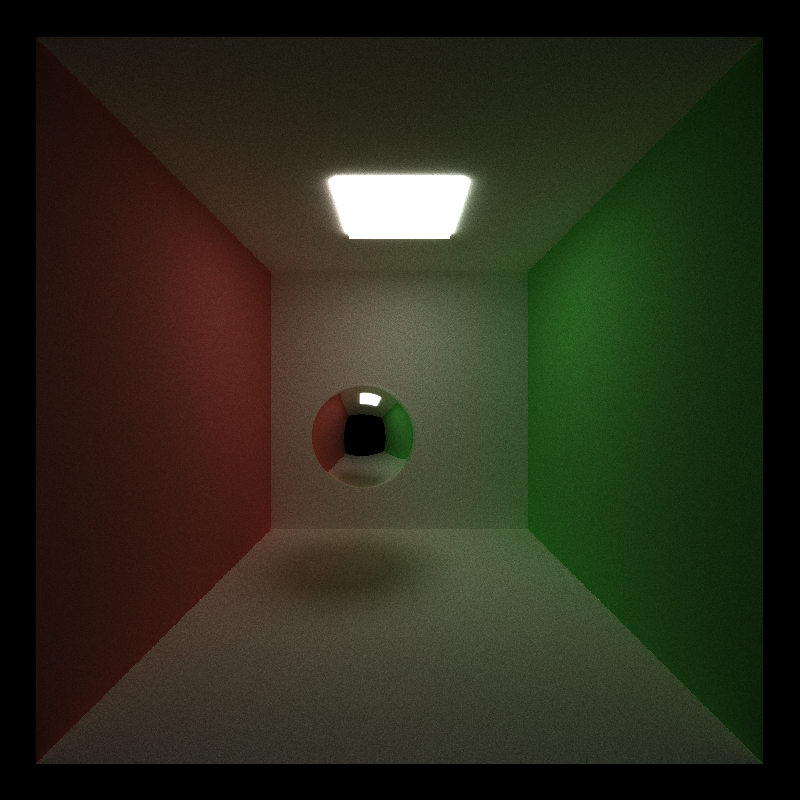
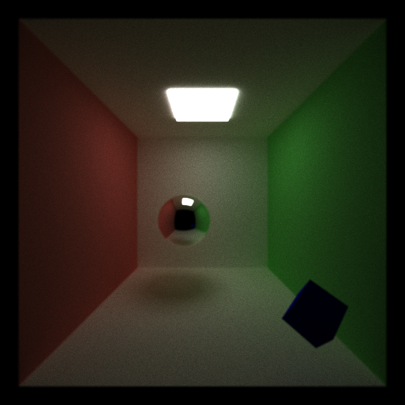
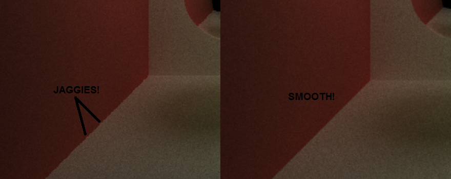
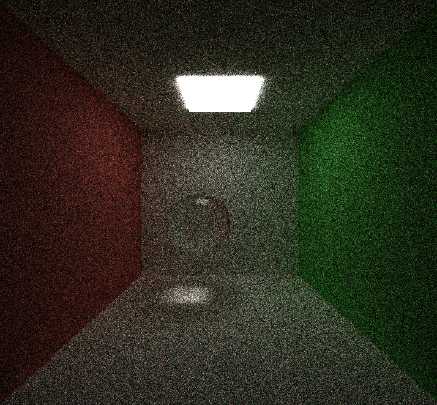
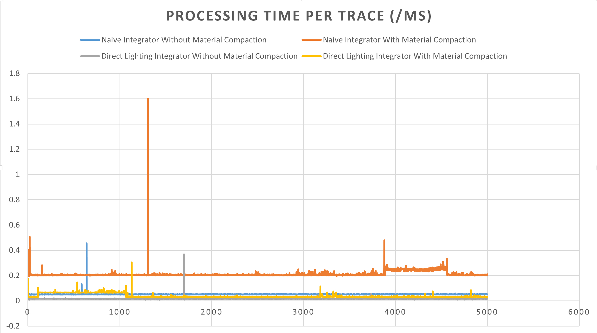

CUDA Path Tracer
================

**University of Pennsylvania, CIS 565: GPU Programming and Architecture, Project 3**

* Yash Vardhan
* Tested on: Windows 10 Pro, Intel i5-4200U (4) @ 2.600GHz 4GB, NVIDIA GeForce 840M 2048MB

In this project, I have implemented a CUDA-based path tracer through the use  of GPU. I have implemented some awesome feature like reflection, anti-aliasing, refraction. More to come soon!

# Features:
* A shading kernel with BSDF evaluation for:
  * Ideal Diffuse surfaces.
  * Perfectly specular-reflective (mirrored) surfaces (e.g. using `glm::reflect`).
  * Imperfect specular surfaces.
* Path continuation/termination using Stream Compaction from Project 2
* Sort the rays/path segments so that rays/paths interacting with the same material
  are contiguous in memory before shading.
* A toggleable option to cache the first bounce intersections for re-use across all
subsequent iterations. Provide performance benefit analysis across different
max ray depths.
* Work-efficient stream compaction using shared memory across multiple blocks.
* Refraction [PBRT 8.2] with Frensel effects using Schlick's approximation
* Physically-based depth-of-field (by jittering rays within an aperture) [PBRT 6.2.3]
* Stochastic Sampled Antialiasing
* Toggleable Timer

# Results:

Simple Reflection
-----------------

Depth of Field
--------------

Antialiasing
------------

Refraction
----------

# Performance Analysis:

The below measurements for execution time are for 500 iterations and depth of 8.

Caching corresponds to the fastest execution time. I found that sorting the path segments didn't actually help increase the performance. This could be due to the effect of thr sorting complexity on execution time. Stream Compaction was done by using thrust's partition and also by using work-efficient stream compaction. In both the cases the use of stream compaction led to better performance, specially with caching enabled. But thrust gave better performance, which might be due to the memory access in the work-efficient stream compaction.