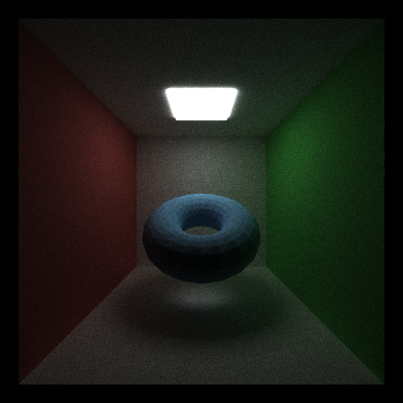
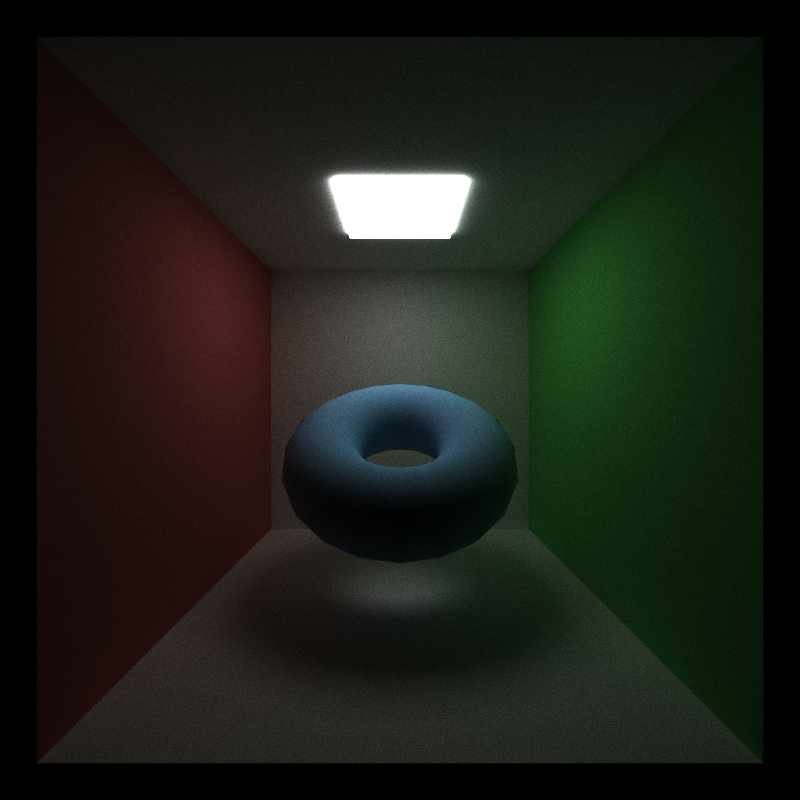
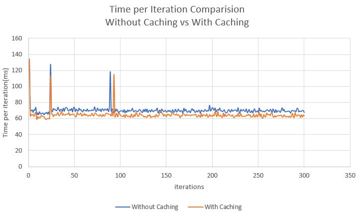
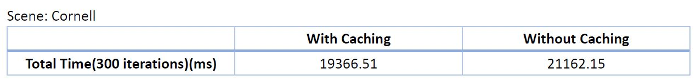
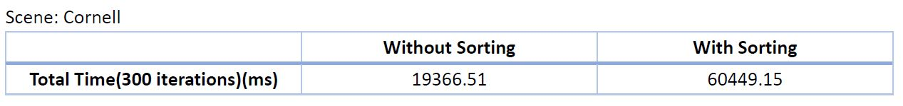
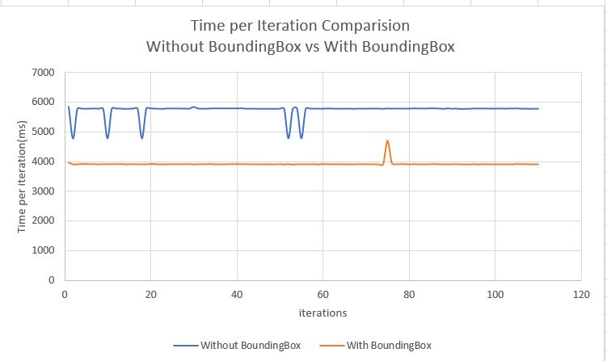
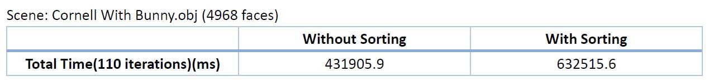

CUDA Path Tracer
================

**University of Pennsylvania, CIS 565: GPU Programming and Architecture, Project 3**

* Jiawei Wang
* Tested on: Windows 10, i7-6700 @ 2.60GHz 16.0GB, GTX 970M 3072MB (Personal)
## Results:
___

### Final Path Tracer:
___

### Detailed Features:
___
* **Anti-Aliasing**: Realized by Stochastic *Sampled Antialiasing*, just jitter a little bit when create Camera ray, this will cause a little blur on the image, which can solve the aliasing problems. 
  Here is the results: (left: `without anti-aliasing`, right: `with anti-aliasing`)
  
  

* **Depth Of Field**: Realized by jittering around pixel. See at [PBRT 6.2.3] 
  Here is the results:  
  (left: `lens_radius = 0.5`, right: `lens_radius = 1.0`) 
  
  (left: `focal_length = 9`, right: `focal_length = 19`) 
  

* **Refraction(Frensel Effect)**: Frensel Effect requires not only the refration effect, but also the reflection effect. This is realized by generate a random value for each sample and use this value comparing with the **dot product** to decide whether this sample is counted as a reflection sample. 
  Here is the results: (left: `no reflection`, right: `both reflection and refraction`) 
  
  You can see that the right one is more realistic, 'cause the ball reflects the light on the celling. 
  
* **Motion blur**: Realized by jittering ray of different iterations between the `transition_start` to the `transition_end`, which can generate an effect like followings: 
  

* **Direct light**: In this project, I only implemented the most basic direct light, make the ray direction to the ligths when the `ray.remainning bounce == 1`, and then average the color of them.  
  Here is the results: (left: `no direct light`, right: `direct light`)  
   

* **Arbitrary Mesh Loading**: Used `tiny_obj` tools to load the obj file and `glm::intersectRayTriangle` function to do the intersection test. 
  Here is the results:  
   
  (left: **Flat Shading**, right: **Smooth Shading**) 
   
  **Smooth Shading** is realized by interpolating the normal on each pixel using the vertex normals. 

## Optimization and Performance Analysis:
___
### Stream Compaction
* Instead of using one thread to run a whole path, we use one thread to run one bounce of the path. 
* This will optimize the "waitting situation", for example, path1 bounces more than 10 times and path2 only bounces once, in that case, even though the path2 is finished but it has to wait until the other paths like path2 to finish and then it can finished its thread.This situation will happen all the time, which will cause lots of meaningless stalls of the threads
* We can realize this by maintaining a *Thread Pool*, and use *Stream compaction* to delete the terminated rays.
* I didn't finish the version without the Stream compaction, so I couldn't present an exact comparison here. But according to the explanation above, we could know that the *Stream Compaction* can reduce the time of stalls while it will increase the time of compaction operations. 
* Therefore, it's easy to get the conclusion that: At first, the method without *Stream Compaction* is faster. But with the increment of the `max_bounce_time`, the time of stalls will be longer, the advantage of *Stream Compaction* will be more obvious, and when the `max_bounce_time` is big enough, the *Stream Compaction* is faster and will be much faster after that.
* When the scene is closed, which means no ray can get out of the "box", the *Stream Compaction* may not be that good. Because in this case, every ray has to intersect with a geometry in the scene. Only the path hit the light can terminate before it reaches its max_bounce, so the time of stalls is much shorter, and the *Stream Compaction* may be not a good choice
### Caching First Bounce
* We have to take lots of samples to get the final image, and each iteration we need to generate the rays from camera at first. However, the rays from the camera are the same of each iteration, which means the intersections, the paths information, like origin and direction are also the same of each iteration. 
* Therefore, we can cache these information of the first iteration and reuse in the following iterations.
* Here is the comparision results:

* We can see that the caching does make the path tracing faster.
* **Warning**: When we turn on the `Anti-Aliasing`, `Montion Blur`, `Depth Of Field`, we couldn't cach the camera ray anymore. Because they have to generate different camera rays(`Anti-Aliasing`,`Depth Of Field`) or get different intersections(`Motion Blur`) every iteration.

### Sorting the Materials
* Although one thread is dealing with one bounce right now, there are still some "waitting situation" will happen. Because each bounce is dealing with diffrent materials and different materials have different time to run, which will cause some meanless stalls for the threads in the same block. 
* The solution is that we can sort the paths according to their materials before we do the shading, this will enable the threads next to each other has the same time to run, which can reduce the stalls.
* We can use **Radix Sort** to sort the materials
* Here are the comparisions between the sorted and unsorted methods：

* The Results show that the sorted method is much more slower than our expectations, I think there may be 3 reasons as following:
  * firstly, the number of materials is not large enough, which means the original continuity is good enough, and we just waste our time on the sorting.
  * secondly, the complexity of the calculation of the materials shading is not high enough, which means the difference between the computation time of different materials is very small.
  * thirdly, we didn't take advantage of the using of shared memory, because materials are continuous, we can store the material related data on the shared memory, which will save lots of time on memory accessing.
  
### Bounding Box
* When we are compute intersections with a complex mesh, we can compute if the ray hit the bounding box first. Because checking intersection with box is much more faster than checking every triangles of the mesh.
* Here are the comparision results between the methods without bbox and with bbox:

* The improvement of the using of bounding box is remarkble.

## Third Party Code
* `ConcentricSampleDisk(float u1, float u2)`: this function is to compute a random point on a circle, which take 2 random floats between 0 to 1 as inputs.  
Reference: PBRT source code https://www.dartdocs.org/documentation/dartray/0.0.1/core/ConcentricSampleDisk.html
* `tiny_obj_loader`: a third party library to load obj files.  
Reference: http://syoyo.github.io/tinyobjloader/
* Thanks for Kaixiang Miao(TA), do the color gather inside of the shading function instead of `finalGather`

