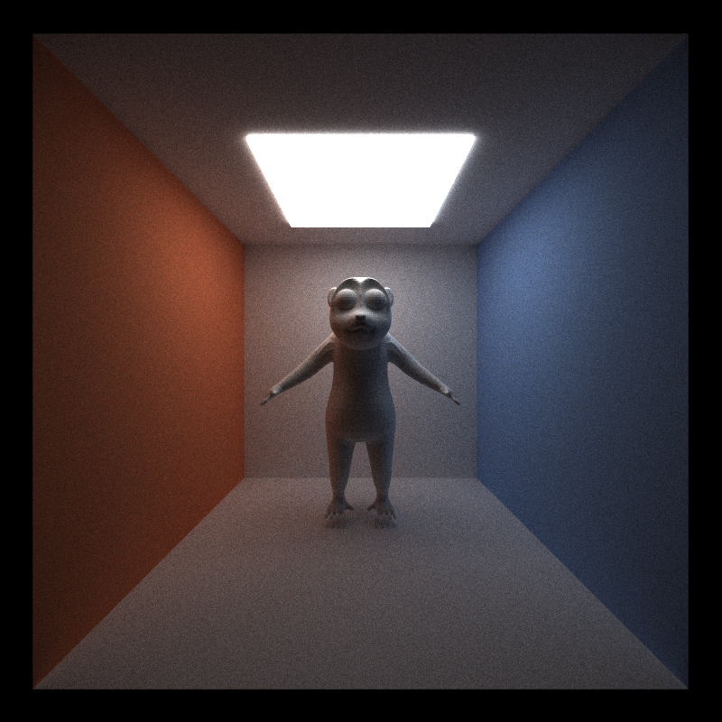
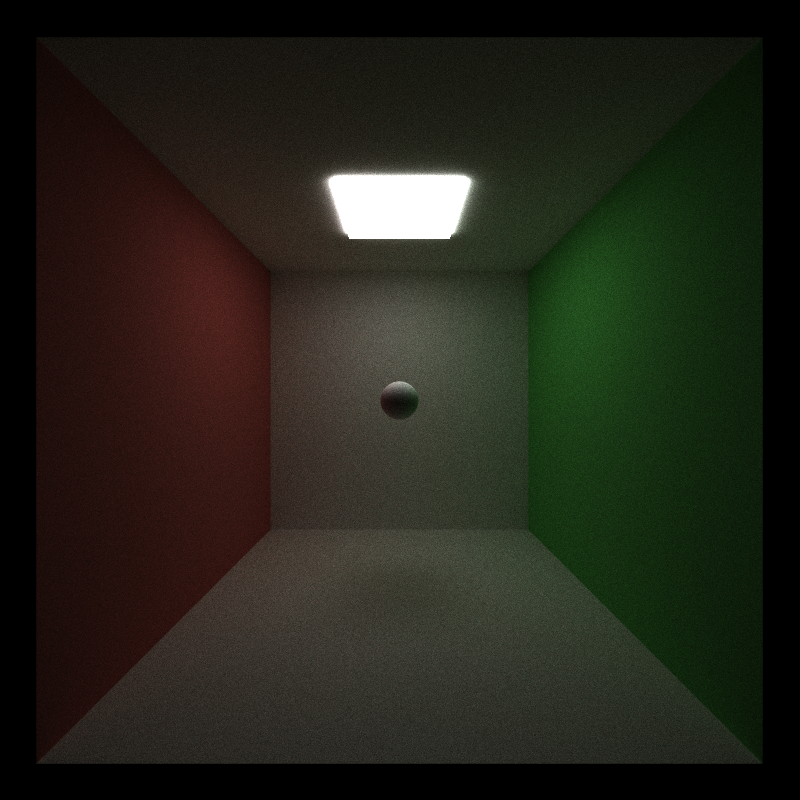
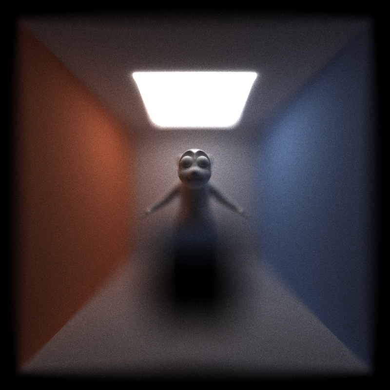

CUDA Path Tracer
================

**University of Pennsylvania, CIS 565: GPU Programming and Architecture, Project 3**

* Charles Wang
* Tested on: Windows 10, i7-6700K @ 4.00GHz 16GB, GTX 1060 6GB (Personal Computer)

# **Project Overview and Goals**

The goal of this project is to implement a simple GPU Path Tracer.

The features included in this project are:
 - Naive Path Tracing ("BRDF" sampled lambert and perfect specular)
 - **Highlight of this project** - BVH (Bounding Volume Hierarchy) Acceleration
 - OBJ loading
 - Stream compaction for terminating rays and free-ing up threads
 - Depth of Field
 - Naive Anti-Aliasing
 - Material Sorting (to avoid divergence)

This write up will assume basic understanding of ray tracing and path tracing principles, but will build off of fundamental topics.

## **Naive Path Tracing**

In the base code of this project, I was provided with basic intersection testing functions and the framework to store colors into the output image.

I implemented a simple shading kernel that generates new path segment ray directions for perfectly diffuse (Lambert) materials and perfectly specular materials. I omitted brdf and pdf calculations, because they either cancel out or don't change the light contribution at all. The light equation that is modeled by this path tracer is simply based off of the brdf light contribution, and as a result, renders will take many iterations to converge.

## **BVH Acceleration**

Much of my implementation is derived from [PBRT] Physically Based Rendering, Second Edition: From Theory To Implementation. Pharr, Matt and Humphreys, Greg. 2010, but parts are adapted to work on the GPU

In addition to simple geometry defined by functions (sphere, cube), I've implemented .OBJ importing to incorporate triangle-based models into renders. Many models include thousands to millions of triangles to be intersection tested against rays. As a result, a single intersection may take incredibly long to calculate. The simplest way to test for intersection is to test over every single piece of geometry in the scene, but each intersection can be calculated much faster if we sort the scene's geometry into a spatial data structure such that we avoid testing intersections with a majority of the scene. 

If we repeatedly partition the objects in the scene into recursive bounding boxes that contain "half" of their parents' geometry, we get a structure that looks like the following: 

This way, instead of performing intersection tests over n elements (where n is the number of objects), we only need to perform intersection tests over the log(n) bounding boxes that bring you to your element. 

The trade off for BVH Acceleration Structures is that it requires a great amount of time to construct (and this typically increases with the BVH depth/number of objects). However, if we know that the scene does not change, we save significantly more time with each intersection test.

### **BVH Construction for GPU**

My implementation is mostly sequential and performed on the CPU, but takes advantage of thrust functions (reduction and partition) that can be run on the GPU. Because we have to allocate a static maximum amount of space for arrays on the GPU, we have to predefine a maximum depth for the BVH Tree. This means that some BVH "leaf" nodes may have to contain multiple pieces of geometry instead of just one piece of geometry. Because we can't use resizeable arrays to store pointers to the geometry at leaves, we store start and end indices of the geometry "stored" at leaf nodes and sort the global geometry array such that they line up with their leaf node indices.

The resulting array ordering may look something like this:

At each depth of the BVH Tree, we partition the geometry of each node into two children nodes until we reach the maximum tree depth. For each partition, we choose an different axis to split the parent BVH bounding box. Using a pre-defined number of buckets, we test partitioning the geometry by these buckets and determine the split that results in the most equal partition using the Surface Area Heuristic (SAH). This basically just means we try to ensure that the total surface area of the two partitions are mostly even.

### **BVH Traversal**

My main reference for implementing GPU BVH Traversal is [Nvidia's Thinking Parallel](https://devblogs.nvidia.com/parallelforall/thinking-parallel-part-ii-tree-traversal-gpu/)

BVH traversal fairly simple: at each BVH node, we intersection test its two children. If a child node is hit, we continuously tests its children until we hit a leaf node. For each leaf node we hit, we store the closest intersection to keep comparing to until we know the closest final intersection. 

Because its ill-advised to recurse on the GPU, we keep a stack for the next BVH node to traverse through as well as an array to keep track of the index ranges that store geometry that still need to be tested for the closest intersection.

The following table/graphs demonstrate how the time elapsed per iteration changes when BVH traversal is introduced and how it changes when the maximum tree depth increases. It's also useful to consider how BVH construction time changes with maximum depth.

All measurements are taken on the same scene with about 20,000 triangles

Iteration time does not improve much at depth 14 because log(20000) is between 14 and 15. Thus, increasing maximum BVH depth just results in more empty leaf nodes

\
1000 samples per pixel, ~20,000 triangles, BVH Depth 14

## Places that could be improved/Things to think about for optimization:
 - There is a set stack/array size set in each thread for traversal, maybe I can optimize this size to match the maximum number of registers per thread
 - BVH Tree construction matches the total number of nodes in the maximum tree depth no matter how many objects there are in the scene. If the inputs are not careful, construction time may suffer while interation speed gain does not benefit
 - In BVH Traversal, there is still a lot of global memory access when accessing child IDs. Knowing the current depth means we can perform simple arithmetic rather than memory access

## **Stream Compaction for Terminating Rays**

Stream Compaction is a technique where an array is filtered such that elements that do not meet a specific criterion are removed. I've tested and compared different stream compaction implementations [here](https://github.com/charlesliwang/Project2-Stream-Compaction), but this project, I've taken advantage of thrust's partition device-side function.

Rather than parallelizing by pixel at every path tracing depth, we can parallelize by path segments. If we parallelized naively by pixel, then we would witness extreme divergence because many pixels will result in rays that die off immediately or in a couple bounces (hit nothing or hit light). If we parallelize by path segments, and discard path segments with no more remaining bounces, we can save all of our threads for active path segments, optimizing the number of threads we use per depth and removing a good amount of divergence.

The table below shows how without stream compaction each depth takes about the same amount of time to execute, while with stream compaction, the time decreases with each level.

With the currently maximum depth level, we don't see much of an improvement with stream compaction, but if the maximum number of bounces a path segment could make were higher, then we would see an improvement with stream compaction.

## **Anti-Aliasing**

I implemented Anti-Aliasing by randomly jittering the rays cast from the camera into the scene. This slightly blurs the resulting image and corrects artifacts such as jagged edges without distorting or compromising the image. This feature is simple, but helps clean up the resulting image at practically no computational cost. In my project, the jittering in Anti-Aliasing is simply averaged over the repeated iterations that are already performed.

The first image has jagged edges where the walls meet each other, and the second image has a smoother edge.

## **Depth of Field**

We can simulate physical camera models by offsetting camera ray origins by a point sampled over a disc. With a larger lens radius, the radius of the sampled disc is larger. Given the camera's focal distance, we find a point of interest for the pixel by finding the point on the focal plane that is met by the pixel's original ray cast. Our new ray direction points from the offset origin to the position on the focal plane. If the object lies on the focal plane, the chance of missing the object and blurring is lower, thus creating the illusion of focus. 

Depth of field, like Anti-Aliasing, is simply performing a small computation on each ray cast from the camera, and won't change the execution time at all. However, it will take a lot of iterations to converge to smooth blur.

## **Material Sorting**

Some materials require different amounts of computation to calculate shading. If the path segments running in the same warp run on different materials, then each thread runs as slow as the slowest thread (the material with the most lines of code). If we ensure that our path segments and intersections are contiguous in memory, we can reduce the amount of divergence in the shading kernel.

The following table shows how including material sorting effects the execution time per iteration.

The main reason why we don't see a performance increase is because the two materials implemented in my project are incredibly simple and short. The computation in sorting the long arrays was much more than the computation saved in eliminating divergence.