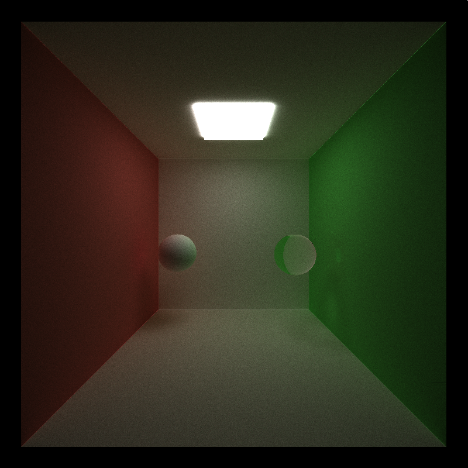
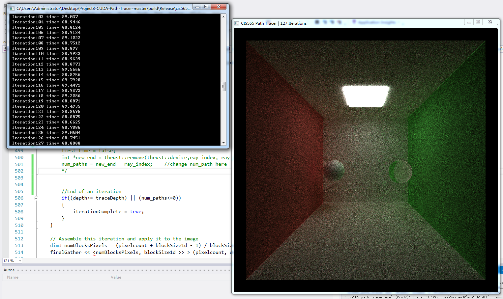
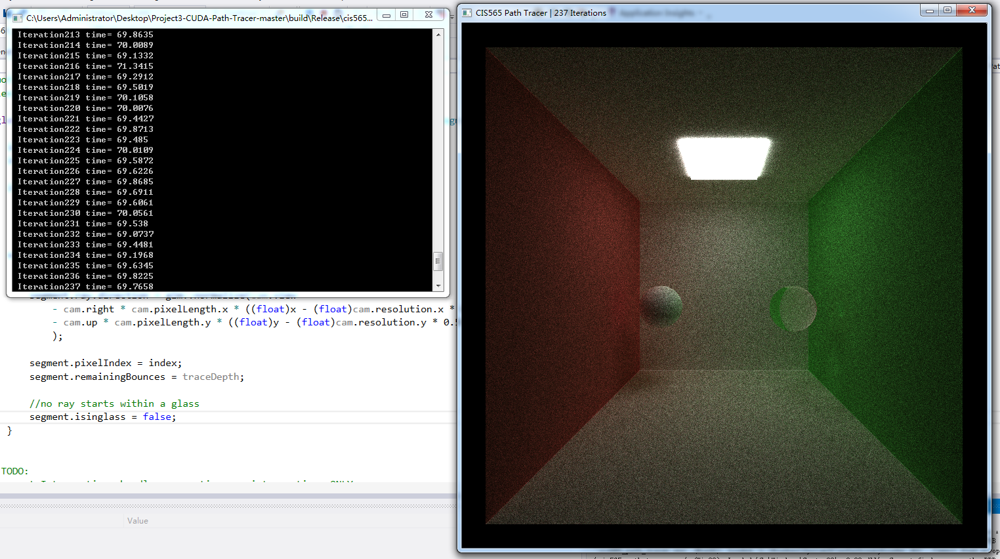
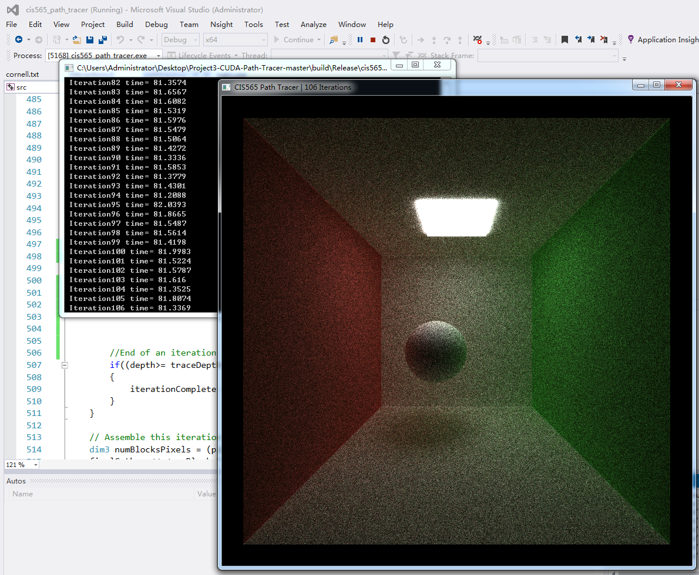
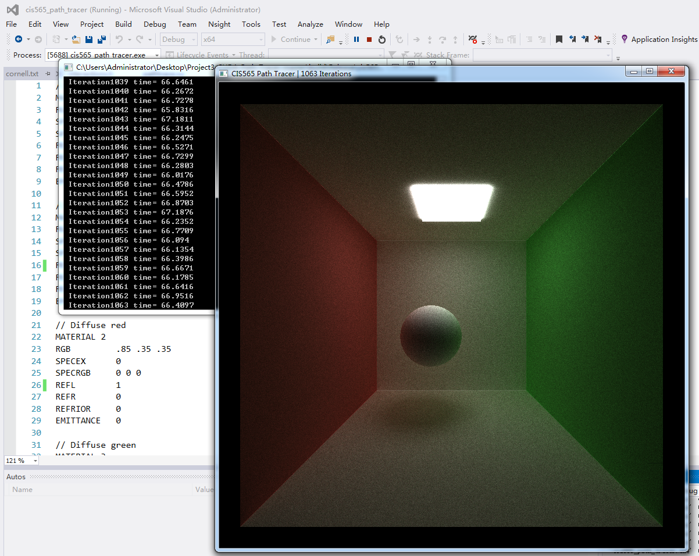
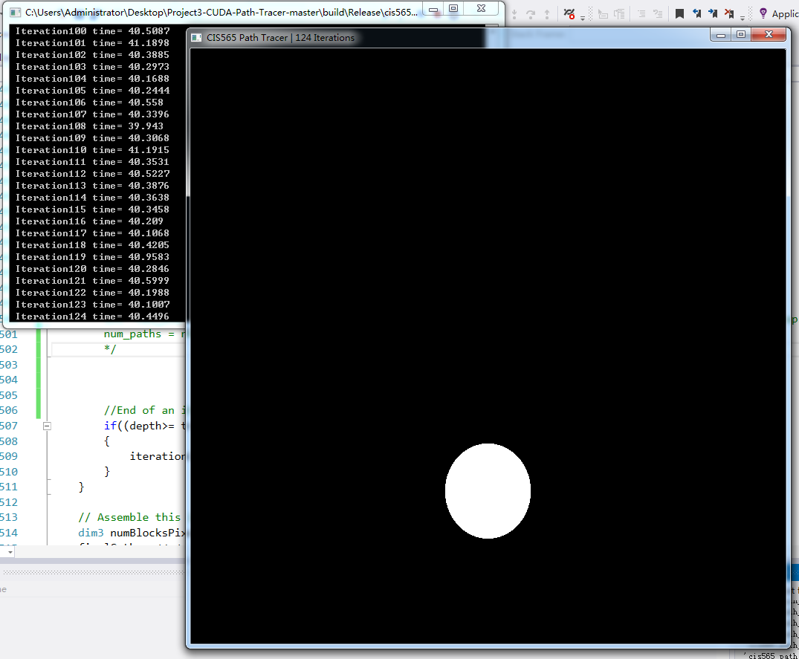
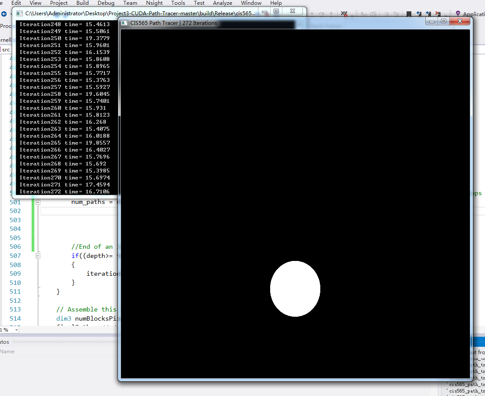

CUDA Path Tracer
================

**University of Pennsylvania, CIS 565: GPU Programming and Architecture, Project 3**

Ju Yang 

### Tested on: Windows 7, i7-4710MQ @ 2.50GHz 8GB, GTX 870M 6870MB (Hasee Notebook K770E-i7)

## TODOs finished: 
  ### 1. naive BRDF of reflection

  I modified the scatterRay function in interaction.h to implement the basic BRDF

  

  This picture is rendered with about 1000 iterations. 

  Reflection parameter in scene files now has a meaning. 

  If REFL is 0, that means it does not color any light. 

  If REFL is between 0 and 1, it will color the light that hits it. The greater REFL is, the stronger effect it has.

  I also modified the scene file "cornell.txt", adding numbers to the REFL from material 1 to material 3.

  ### 2. naive Refraction

  I added a branch in scatterray function to implement the refraction. 

  

  This picture is rendered with about 1000 iterations, in cornell2.txt, with an additional glass ball. 

  Refraction parameter in scene file now determines how "refractive" the material is. 

  In basic path-tracing, there's only 1 ray we could have for each pixel in each iteration. So when hitting the surface, we must decide whether it should refract or reflect. 

  float a = u01(rng)*m.hasReflective / m.hasRefractive; //decide whether this time it will bounce or travel through the glass

  If a is larger than 0.5, then the light should go reflective. Or otherwise, it should go refractive. 

  Besides, about Snell Law, we need to know whether the light is coming into/out the glass. 

  So I added bool isinglass; in the PathSegment struct in sceneStructs.h 

  In generateRayFromCamera, we set it to false. 

  If it is false, and the ray hits a glass, then we know it is travelling from air into glass. And we will turn it to true.

  If it is true, and the ray hits a glass, then we know it is travelling from glass to air. And we will turn it to false.

  Besides, when travelling out of the glass, the snell parameter should be (1/snell).

  ### 3. Stream Compaction
  
  I used thrust::remove to do the stream compaction. 
  
  To do this, we also need a buffer, so I applied a int ray_index[pixelcount] in cuda global memory.
  
  To save some time, I added a bool first_time to do the initialization in computeIntersections(). 
  
  If it is the first time we run the iteration, we will write the ray_index[idx]=idx;
  
  If not, then idx=ray_index[idx];
  
  After intersection, we will enter the shading procedure. Any ray that hits the light or hits nothing(travelled into the deep dark space), its ray_index[idx] will be -1.
  
  Then, in thrust_remove(), all -1 will be removed. This function returns a pointer to the re-sorted array's end. So we know how many rays are left by deminishing it with the start of the ray_index[].
  
  In 800*800 cornell test, this method will remove about 10,000 rays in every trace_depth. 
  
  I'd like to use pictures to illustrate this: 
  
  
  
  
  
  In the cornell2.txt, time spent for each iteration of stream compaction vs non stream compaction is 70:89 in ms, which is 21% time saving. 
    
  
  
  
  
  In the cornell.txt, time spent for each iteration of stream compaction vs non stream compaction is 66:81 in ms, which is 18% time saving. 
   
  
  
  
  
  In the sphere.txt, time spent for each iteration of stream compaction vs non stream compaction is 16:40 in ms, which is 35% time saving. This scene saved most of the time because all rays stops after the first iteration, hitting the light or travelled into the deep dark space. 
  
  
  ### A pity...
  It's a pity that I failed to implement other functions. What I had in mind was implementing optimizations between iterations. 
  
  Currently, rays are distributed euqally among pixels, but I think that's not the way we look at the world. 
  
  Human eyes are more interested in places with higher light intensity, or where colors change rapidly. 
  
  I think I can make some changes in the ray generating function in the future, re-arrange rays according to light intensity and color shifting, to generate a similar picture with fewer iterations. 
  
  And besides, sorry for being late submission for 5 hours. 
