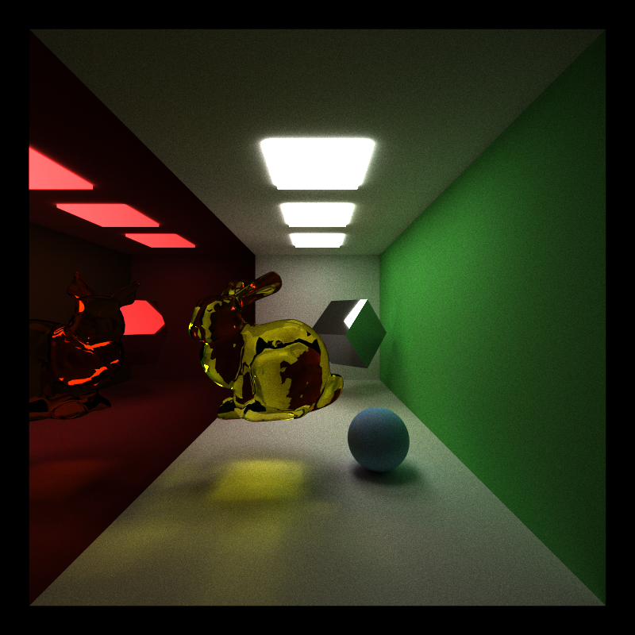
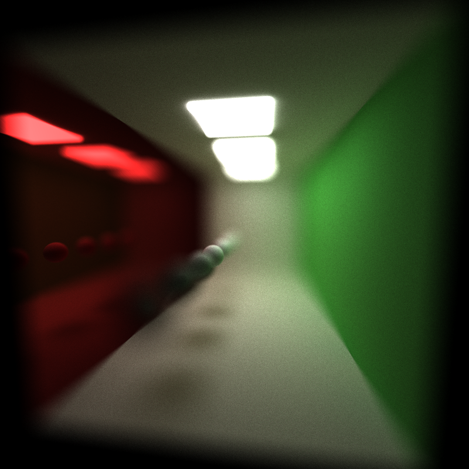
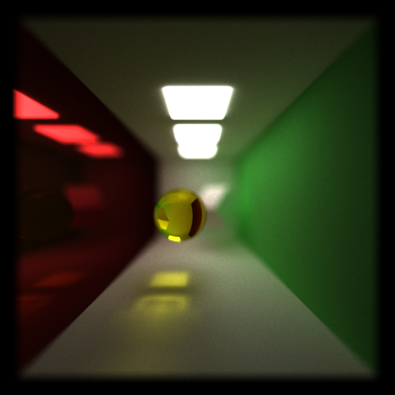
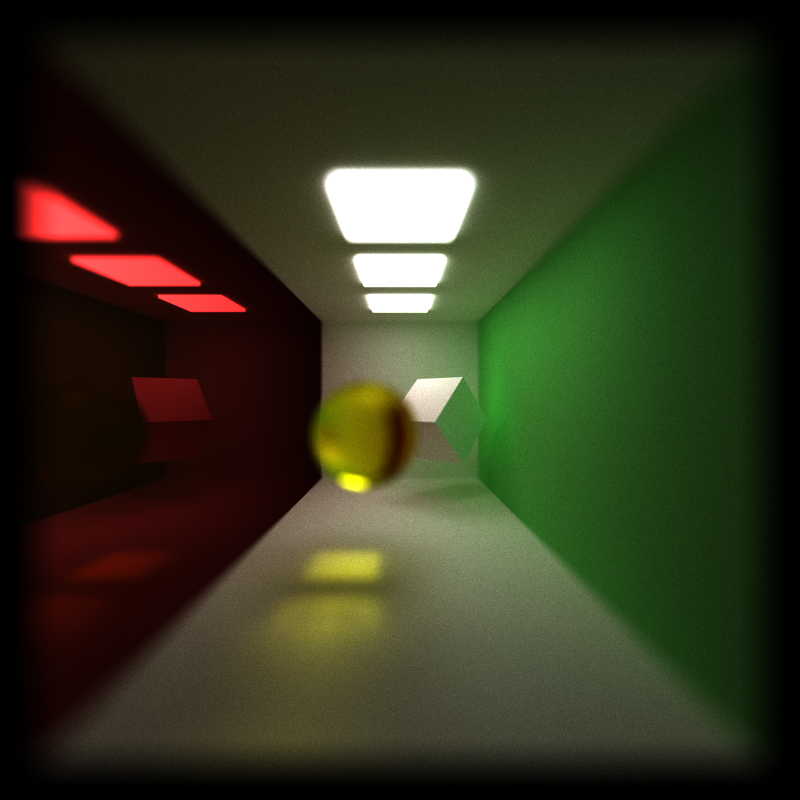
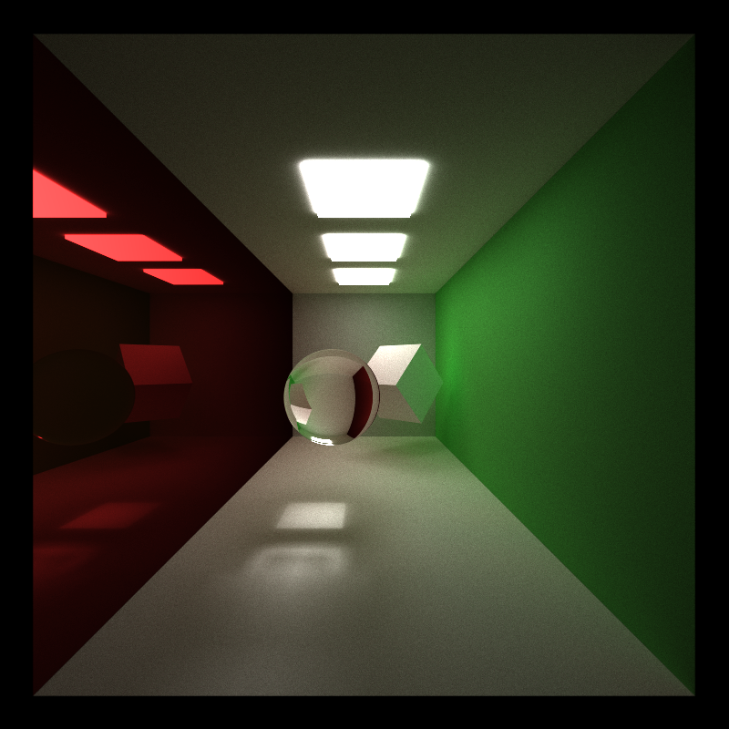
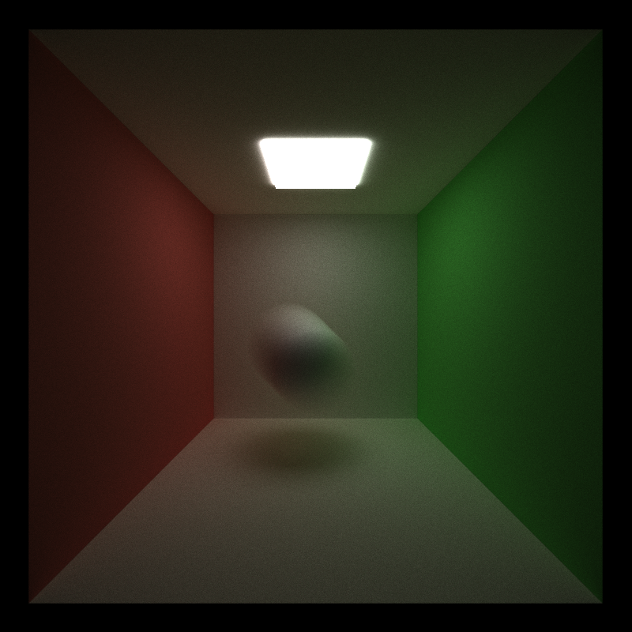
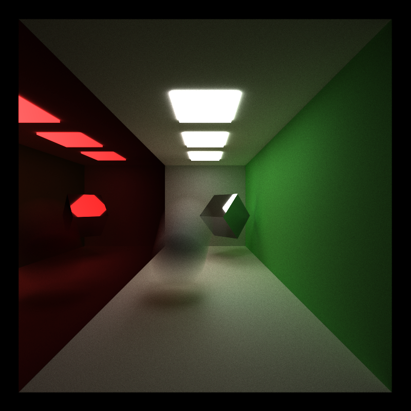
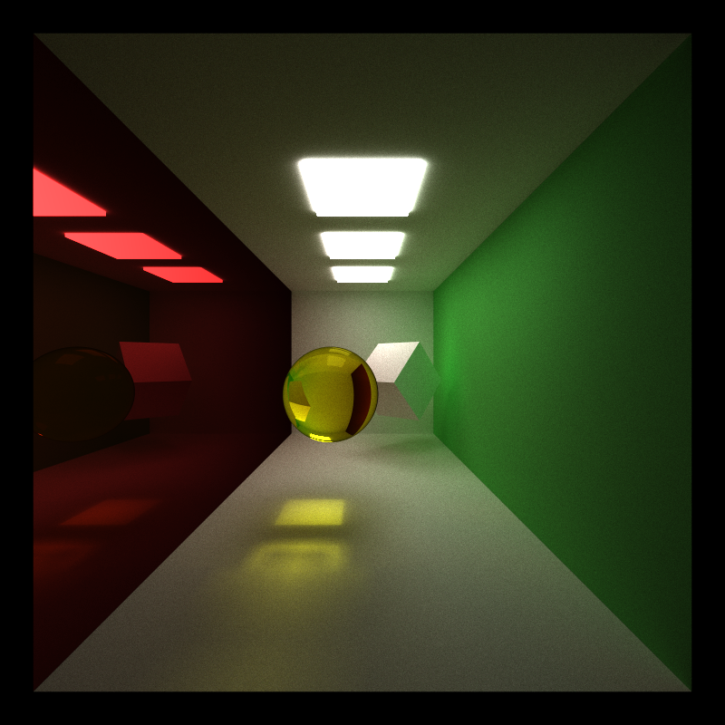
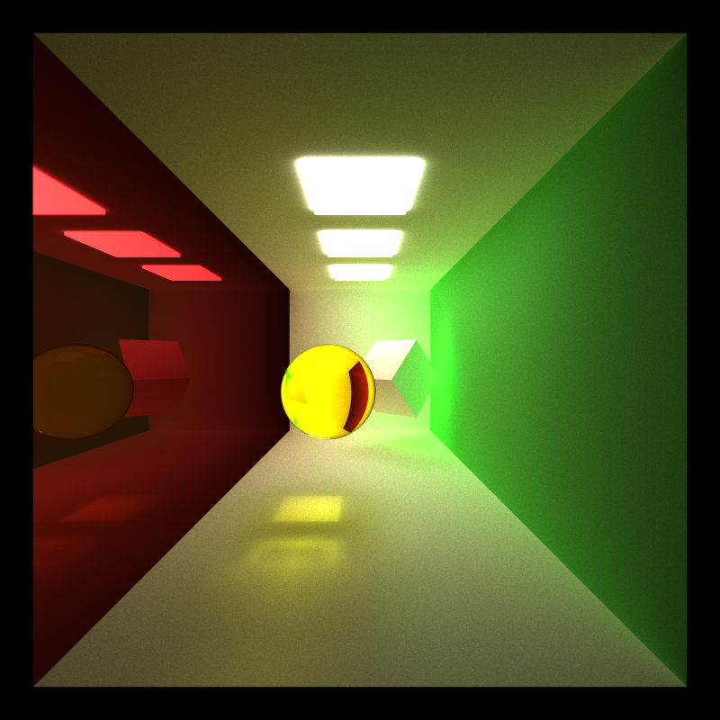
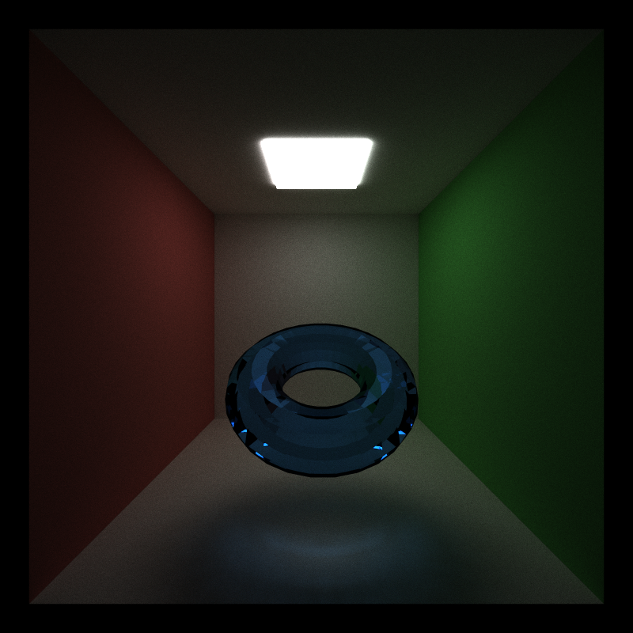

CUDA Path Tracer
================

**University of Pennsylvania, CIS 565: GPU Programming and Architecture, Project 3**

* Jiawei Wang
* Tested on: Windows 10, i7-6700 @ 2.60GHz 16.0GB, GTX 970M 3072MB (Personal)
## Results:
___

### Final Path Tracer:

### Detailed Features:
* **Anti-Aliasing**: Realized by Stochastic *Sampled Antialiasing*, just jitter a little bit when create Camera ray, this will cause a little blur on the image, which can solve the aliasing problems. 
  Here is the results: (left: `without anti-aliasing`, right: `with anti-aliasing`)
  
  

* **Depth Of Field**: Realized by jittering around pixel. See at [PBRT 6.2.3] 
  Here is the results:  
  (left: `lens_radius = 0.5`, right: `lens_radius = 1.0`) 
  
  (left: `focal_length = 9`, right: `focal_length = 19`) 
  

* **Refraction(Frensel Effect)**: Frensel Effect requires not only the refration effect, but also the reflection effect. This is realized by generate a random value for each sample and use this value comparing with the **dot product** to decide whether this sample is counted as a reflection sample. 
  Here is the results: (left: `no reflection`, right: `both reflection and refraction`) 
  
  You can see that the right one is more realistic, 'cause the ball reflects the light on the celling. 
  
* **Motion blur**: Realized by jittering ray of different iterations between the `transition_start` to the `transition_end`, which can generate an effect like followings: 
  

* **Direct light**: In this project, I only implemented the most basic direct light, make the ray direction to the ligths when the `ray.remainning bounce == 1`, and then average the color of them.  
  Here is the results: (left: `no direct light`, right: `direct light`)  
   

* **Arbitrary Mesh Loading**: Used `tiny_obj` tools to load the obj file and `glm::intersectRayTriangle` function to do the intersection test. 
  Here is the results:  
   
  

