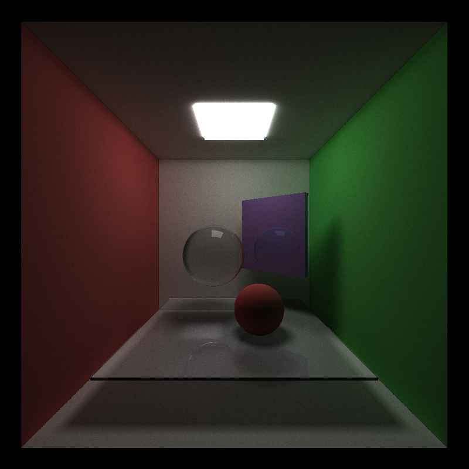
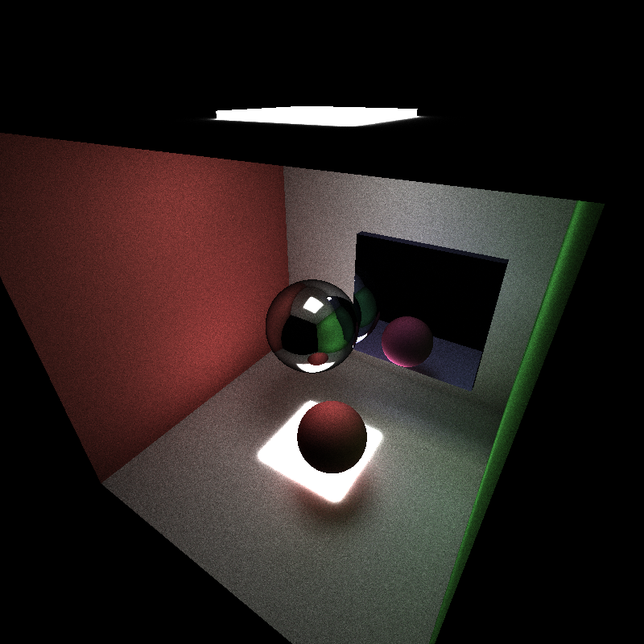
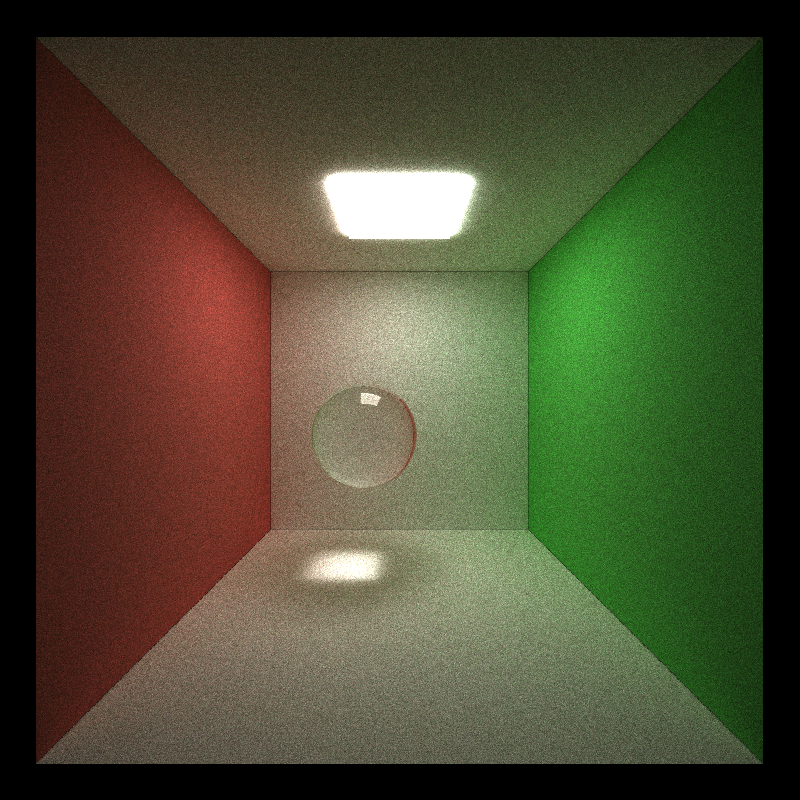
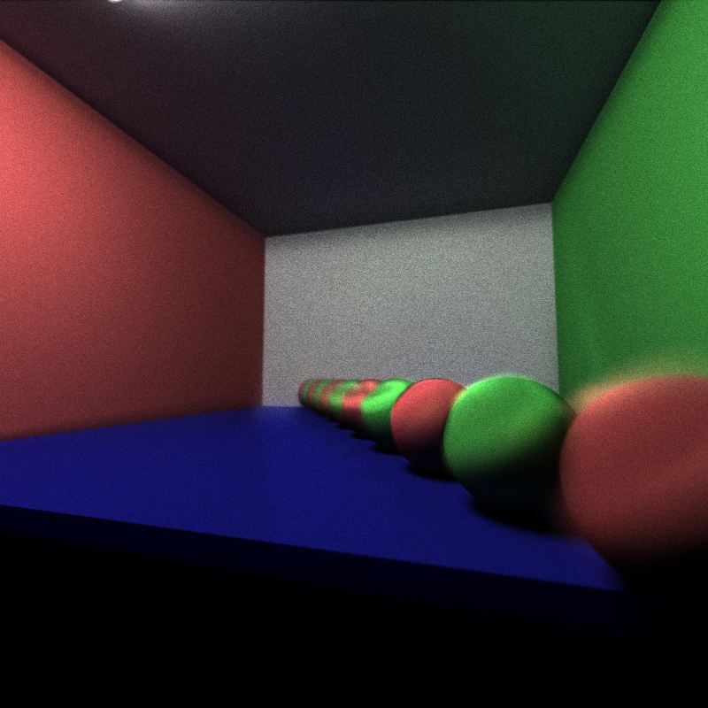
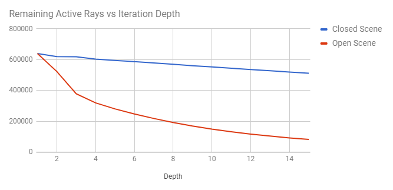
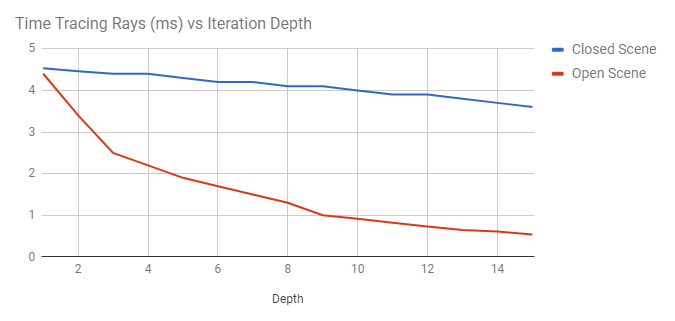
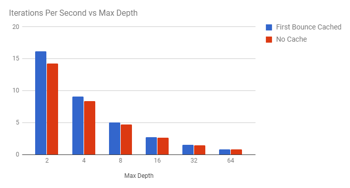
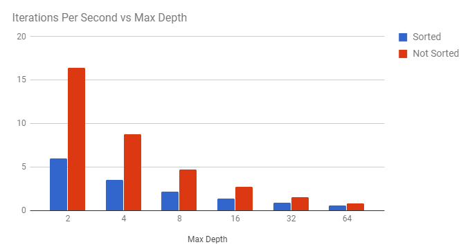

CUDA Path Tracer
================

**University of Pennsylvania, CIS 565: GPU Programming and Architecture, Project 2**

* Name: William Ho
* Email: willho@seas.upenn.edu
* Tested on: Windows 7 Professional, i7-6700 @ 3.40 GHz 16.0GB, NVIDIA QuadroK620 (Moore 100C Lab)

## Overview

This is an implementation of a GPU pathtracer. Due to how easy it tends to make it to simulate physically accurate light behavior, pathtracing has become a popular technique for rendering 3D scenes.

At its core, pathtracing is a technique that employs rays shot out of a virtual camera, which bounce around our 3D scene until they strike a light source, from which we can compute the rays contribution to a pixel color. The computations for evaluating our rays are easily parallelizable, making pathtracing a particularly good candidate for implementation on the GPU. 

## Basic Pathtracer

The first iteration of my pathtracer employed basic Bidirectional Scattering Distribution Functions (BSDF) for diffuse and reflective surfaces. Diffusion was uniform distribution and reflection was perfect reflection.

## Additional Features

### Refraction

Refraction behaviors occur when light moves through a medium. Since light travels at different speed in different materials, it can be said to bend upon moving from one medium to another. 

### Direct Lighting

One technique for adding shaper shadows to a pathtraced image, and terminating rays faster, is to calculate some rays through direct lighting. That is to say, instead of computing bounces through a BSDF, one instead computes a bounce directly to a light by sampling points on lights in the scene. 

### Depth of Field

Real-world cameras use lenses, which refract light in such a way as to make images clearer at a focal distance away from the camera. 

## Optimizations and Evaluations

### Stream Compaction
Once a ray hits a light source, or fails to interesect an object in the scene and can be said to have "escaped" (i.e. gone out of a window or opening in the scene), we can terminate that ray and flag it as no longer necessary to evaluate. This allows us to use **Stream Compaction** to cull our unnecessary rays. (See my exploration into Stream Compaction [here]()) For this pathtracer, I used [Thrust's]() partition implementation. 

These charts show a comparison between the efficacy of Stream Compaction in our open Cornell box scene and our closed Cornell Box scene. As to be expected in our open scene, where the open box allows a large number of rays to escape, we gain significant speed improvements in subsequent ray bounces by culling rays. The wins in the closed Cornell Box Scene are not as dramatic, as the only rays we can cull are those which intersect a light source. Still, this optimization still proves useful. 

### First Bounce Caching
Since we generate the same set of rays from the camera on every iteration, computing these rays' first intersections really only needs to be done once. Thus, for consecutive iterations of our pathtracer for which the camera location and the scene objects locations remain the same, we can store our first bounce iterations. 

Here, we see that caching the first bounce is a somewhat effective optimization, one which compounds as I perform more iterations over a single image. However, its benefit decreases as I increase the maximum depth of our paths, as only our first bounce is pre-determined. 

### Sorting Paths and Intersections by Materials
The memory access patterns of my kernels could use significant optimization. I experimented with preprocesssing my paths and intersections between bounce calculations; sorting them so that intersections on the same materials would be contiguous in memory. I do not believe my kernels currently leverage the advantages of having contiguous data. this might require separating out my materials evaluation into separate per-material kernels. However, it is still useful to include a visual on this attempted optimization. 

## The Process

![]cornell.2017-09-28_19-31-31z.7samp.png)
![]cornell.2017-09-28_18-29-39z.10samp.png)
![]cornell.2017-09-26_15-32-21z.105samp.png)

