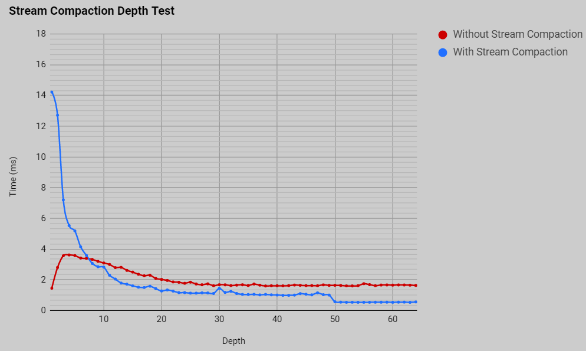
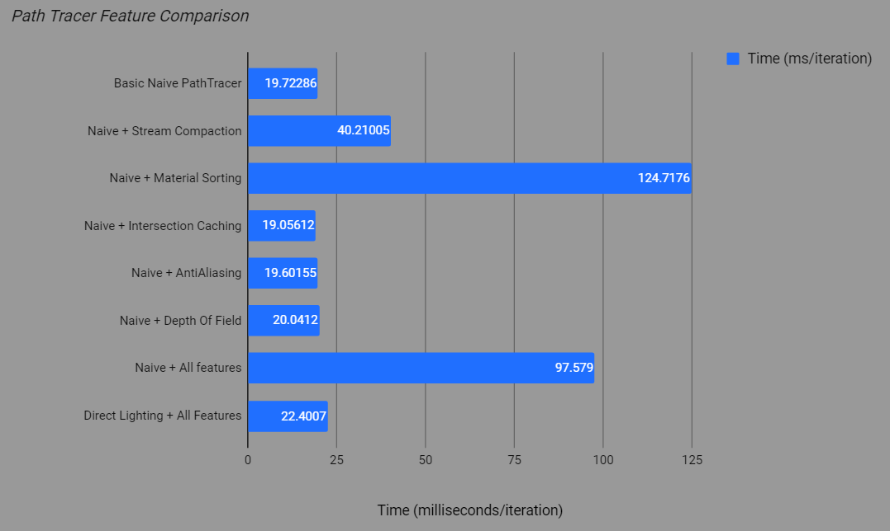
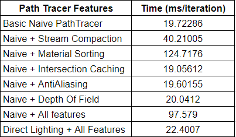
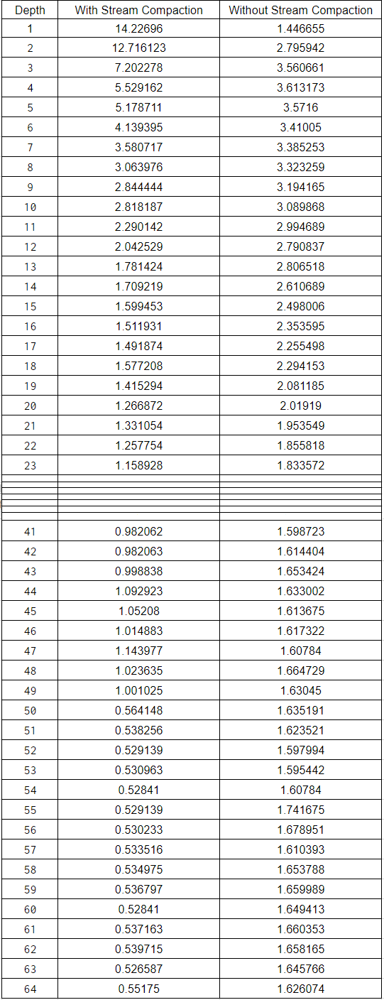

CUDA Path Tracer
================

**University of Pennsylvania, CIS 565: GPU Programming and Architecture, Project 3**

* Aman Sachan
* Tested on: Windows 10, i7-7700HQ @ 2.8GHz 32GB, GTX 1070(laptop GPU) 8074MB (Personal Machine: Customized MSI GT62VR 7RE)

## Overview

In this project, I implemented a simple CUDA Monte Carlo path tracer. Although path tracers are typically implemented on the CPU, path tracing itself is a highly parallel algorithm if you think about it. For every pixel on the image, we cast a ray into the scene and track its movements until it reaches a light source, yielding a color on our screen. Each ray is dispatched as its own thread, for which intersections and material contributions are processed on the GPU.

### Introduction to Monte Carlo Path Tracing

Monte Carlo Path tracing is a rendering technique that aims to represent global illumination as accurately as possible with respect to reality. The algorithm does this by approximating the integral over all the illuminance arriving at a point in the scene. A portion of this illuminance will go towards the viewpoint camera, and this portion of illuminance is determined by a surface reflectance function (BRDF). This integration procedure is repeated for every pixel in the output image. When combined with physically accurate models of surfaces, accurate models light sources, and optically-correct cameras, path tracing can produce still images that are indistinguishable from photographs.

Path tracing naturally simulates many effects that have to be added as special cases for other methods (such as ray tracing or scanline rendering); these effects include soft shadows, depth of field, motion blur, caustics, ambient occlusion, and indirect lighting, etc.

Due to its accuracy and unbiased nature, path tracing is used to generate reference images when testing the quality of other rendering algorithms. In order to get high quality images from path tracing, a large number of rays must be traced to avoid visible noisy artifacts.

## Features

### Stream Compaction

### Material Sorting

### First Bounce Caching

### Anti-Aliasing

### Depth of Field

