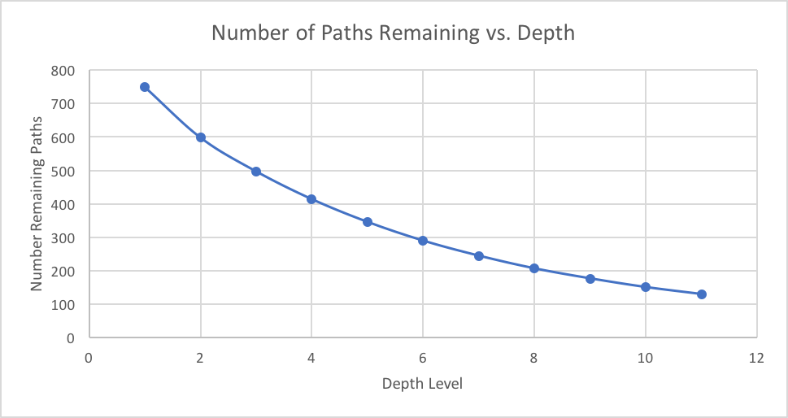
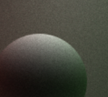
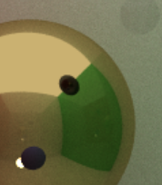
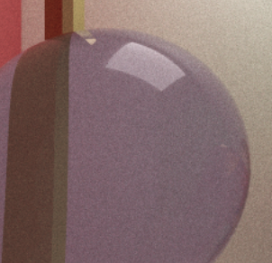
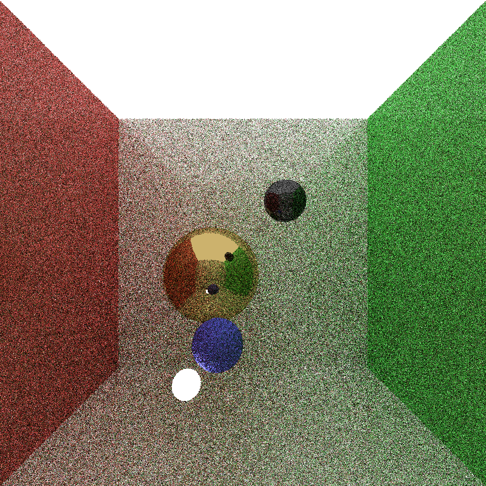
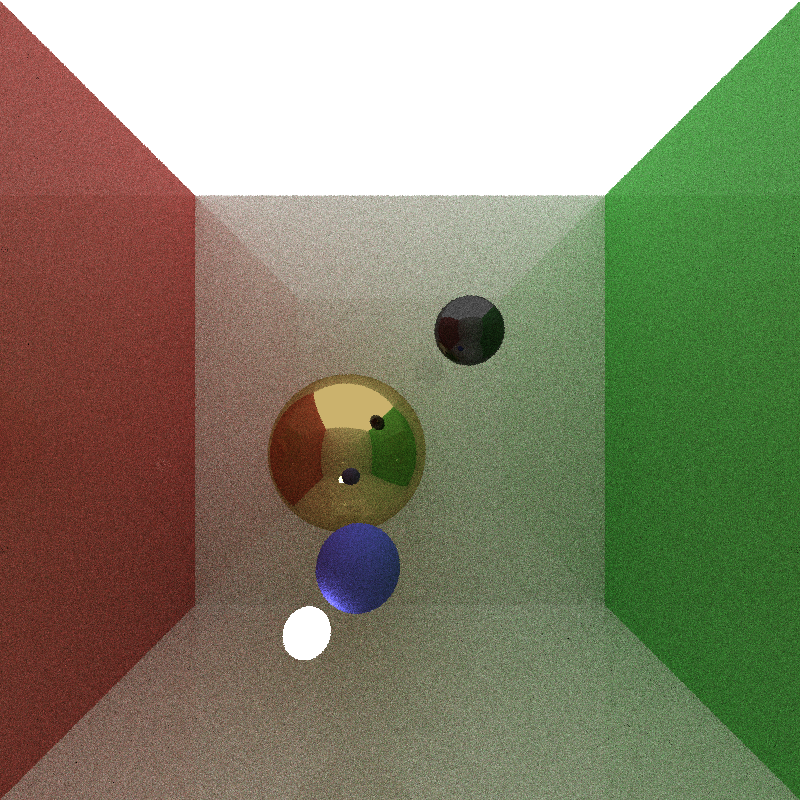
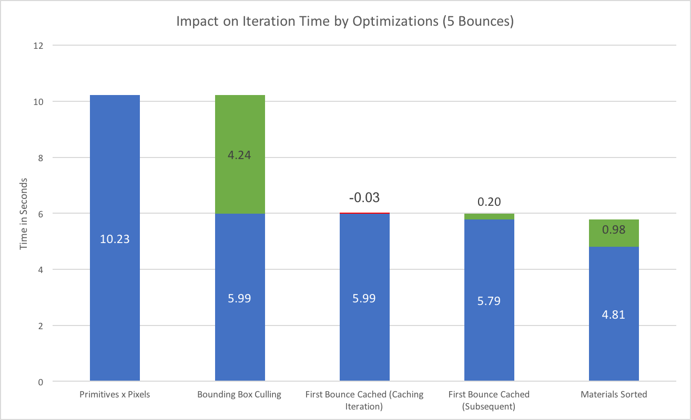
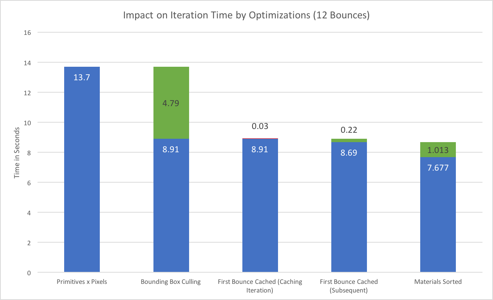

CUDA Path Tracer
================


**University of Pennsylvania, CIS 565: GPU Programming and Architecture, Project 3**

* Daniel Daley-Montgomery
* Tested on: MacBook Pro, OSX 10.12, i7 @ 2.3GHz, 16GB RAM, GT 750M 2048MB (Personal Machine)

  High-speed rasterization pipelines like OpenGL might be able to put a lot of images on the screen in short time, but when it comes to true physical realism, path tracing is king. Used by modern movie studios, path tracing models rays of light by tracing them in reverse from the camera eye to light sources, bouncing around the scene in the process. This allows for the capture of indirect light, as shown below.


  The problem with path tracing is that, at its best, it's extrmely slow. This project will aim to accelerate a path tracing system by parallelizing over light rays on the GPU. At a high level, the program will look like this:
```
//Generate rays
for each pixel in parallel {
  new path (x,y)
}

//Bounce around the scene
while (active paths exist) {
  
  //path collisions
  for each path in parallel {
    path.collide(scene)
 
    //shading
    if (collision) {
       path.color(collision)
       if (isLight(collision) path.deactivate
       path.redirect(collision, random variable)
    } 
    
    else path.deactivate
` }
}

for each path in parallel {
  screen.add(path.color)
}
```


### Path Generation and Collision

  While writing *path.collide(scene)* is easy, this is the most performance-intensive part of my path tracer. The basic approach -
  ```
  for each path in parallel {
    for each primitive in parallel {
      detect collision (path, primitive)
    }
  }
  ```
- is ghastly. With a 900x900 scene, 2,000 primitives, and 12 bounces I could have as many as *19.4 million* collision tests to do in one iteration in the worst case. Fortunately, we've got a few optimizations to speed things up:



###### Stream Compaction

  First, that worst case should never have to happen when we can stop tracing paths that hit lights or fly into space. But we dont want to launch kernels that check *if (path is dead) return;*, because if a warp of 31 dead paths and 1 active path is launched, it will take just as long as 32 active paths... the last bounce will be as costly as the first!
  
  Instead, I specifically separated active paths from inactive ones using *stream compaction*, provided by the [thrust](https://developer.nvidia.com/thrust) library, and was thus able to only launch as many threads as was necessary to cover the active ones.

###### Caching

  One easy way to save a round of intersections tests is caching the first bounce. Since we're casting them through pixels, they'll always hit the same location. I accurately simulated the first bounce, saved it to device memory, then was able to start on the second bounce every subsequent frame.
  
  When I decided I wanted anti aliasing, this became an issue. A jittered antialiasing solution would change my first bounce, rendering my cache incorrect. To get the best of both worlds, I jittered and re-filled my cache every *x* frames. This means that after the first bounce my caching is *1/x*% less effective, but effective nonetheless.

###### Primitive Reduction

  While 5 or 6 boxes or spheres can be practically nigligible in terms of compute time, even my <1000 triangle elephant blew up iteration time. As the first step to cutting down this nested path-geometry relationship, i implemented a bounding box for my mesh imports. If a ray didn't hit the bounding box (or already had a closer hit), it ignored the rest of the mesh as well.
  
  While this was extremely helpful, it won't get my CUDA path tracer to any competitive speeds. Instead, my next improvement will be to the entire scene: A [bounding volume heirarchy](https://en.wikipedia.org/wiki/Octree) accesible on the GPU. Like [light clustering](https://github.com/illDivino/Project5-WebGL-Clustered-Deferred-Forward-Plus), I predict this will have a massive impact.

#### Shading and Redirection

  Once we have a collision, we can get to the best part. At the shading stage, we try our best to represent physical meterials and their light reflection/absorbtion/transmission/emission tendencies. In my project, I included the following three material properties, which could be blended together by assigning the likelihood that a given collision would chose any lighting model. Pictured as well are the [BRDFs](https://en.wikipedia.org/wiki/Bidirectional_reflectance_distribution_function) used to represent the new direction of an incident ray:

|Perfect Difusse|Perfect Specular|Fresnel Refractive|
|-----|-----|-----|
||||
||||

  Because different materials have different amounts of work involved in processing (and also different likelihoods of deactivating a ray on this iteration or the next), we can prevent even more divergence if we sort rays by the material they hit.
  
  The level of randomness in choosing in a direction necessarily produces noise in the output image. While it's impossible to sample the continuous hemisphere around a normal, we can get a good picture given enough random samples:

|Iterations|Result|
|-----|-----|
3||
10||
25||
50||
200||
1000||

This is the '[Monte Carlo](https://en.wikipedia.org/wiki/Monte_Carlo_method)' in Monte Carlo Path Tracing. Various techniques, like bidirectional, direct, and importance sampling can help accelerate convergence to the final image. These methods have unfortunately not yet been implemented in my project.

##### Performance

The following stats were captured with the test image at the top of this wiki. Notably, his image had a wall behind the camera preventing rays from being deactivated due to no collision.




  With any mesh in the scene, the far-and-away most important improvement is bounding boxes. For paths who do not intersect the mesh, this reduced intersection tests by 95%, especially influential when more than %90 of my GPU time was spent in generating collisions.
  
  Surprisingly, the materials sorting was influential even though my materials were rather simple. My guess is that the important separation was between those rays that hit the mesh (gold material) and those that didn't, since those that did would be guarunteed to hit the mesh's bounding box on the next collision generation.
