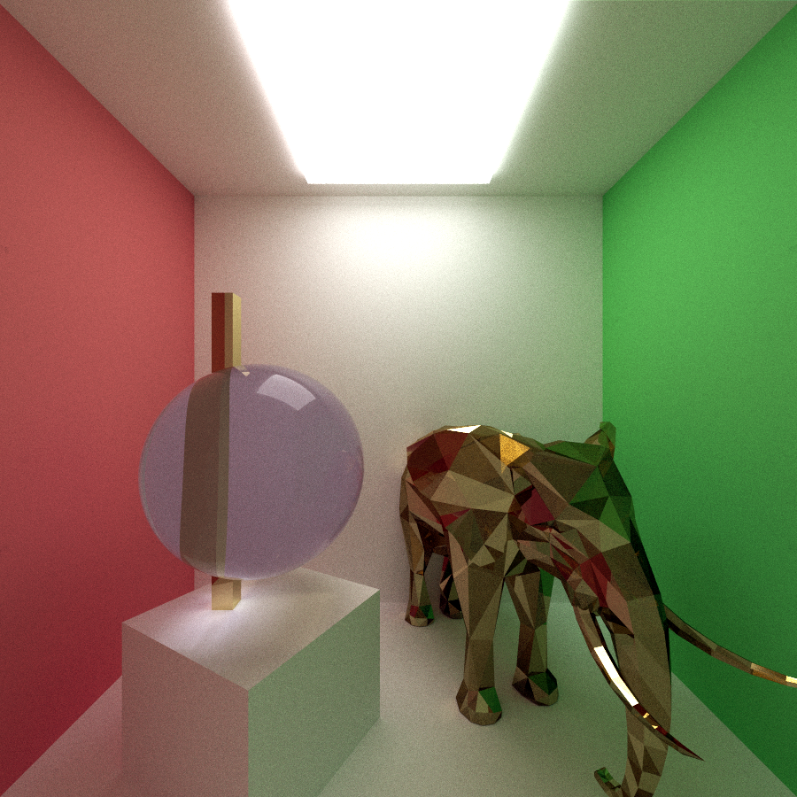

CUDA Path Tracer
================

**University of Pennsylvania, CIS 565: GPU Programming and Architecture, Project 3**

* Daniel Daley-Montgomery
* Tested on: MacBook Pro, OSX 10.12, i7 @ 2.3GHz, 16GB RAM, GT 750M 2048MB (Personal Machine)

### Overview

This is what its used for, how great it is

This is how it works

##### Ray Generation and Collision

-Generation per Pexel
-Loop Geoms, Strike a surface to collect normal and material info

-stream compact to remove extra

-Can cache first bit

-Can reduce overload with my thing or with heirarchical

##### Shading and Redirection

-Based on material decide what coloring to apply and what direction to send new ray. 
- i have diff spec and refr

|Difusse|Spec|Refra|
|-----|-----|-----|
||||
||||

More physically accuract shaders have lobes

Sort first so that we can have similar behaviors in similar places

*DO NOT* leave the README to the last minute! It is a crucial part of the
project, and we will not be able to grade you without a good README.

