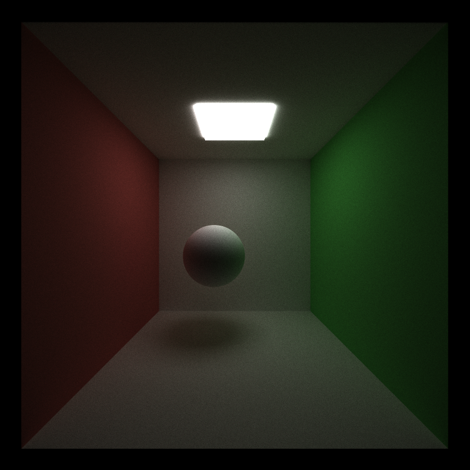
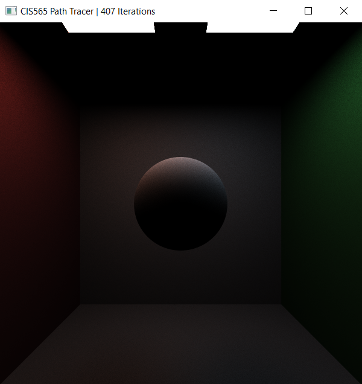
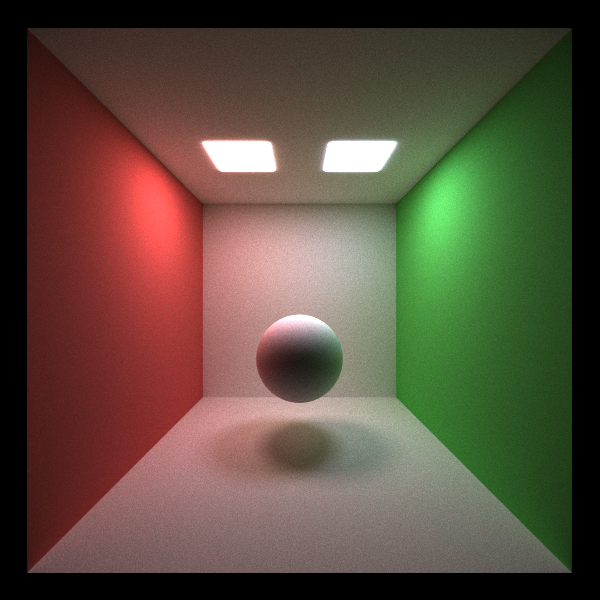
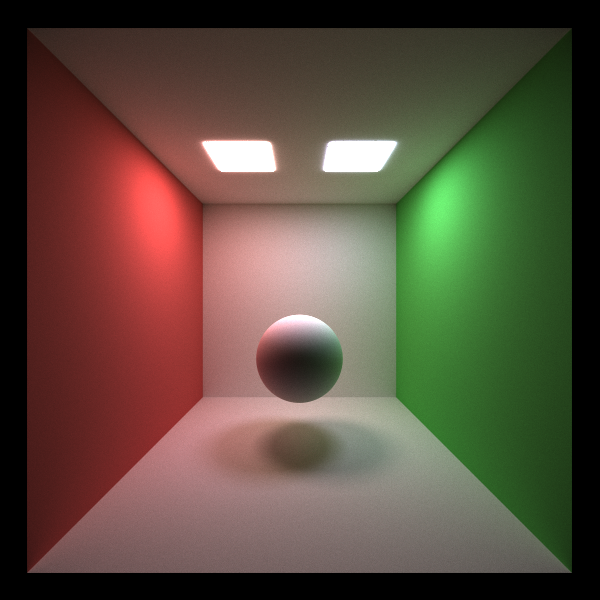
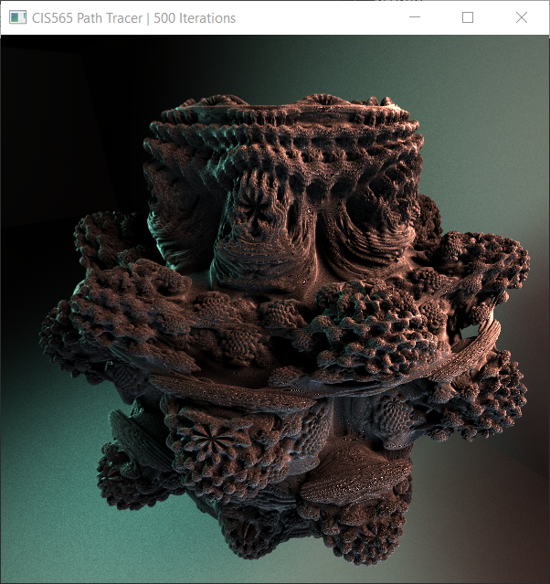
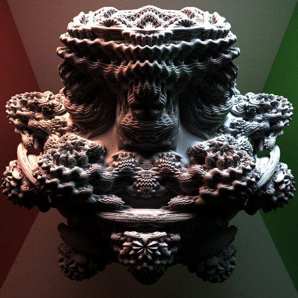
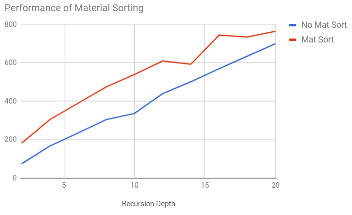
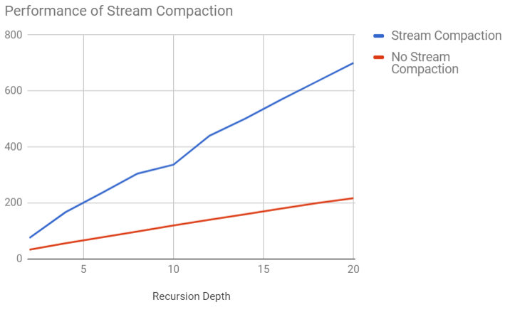

CUDA Path Tracer
================

**University of Pennsylvania, CIS 565: GPU Programming and Architecture, Project 3**

* Joseph Klinger
* Tested on: Windows 10, i5-7300HQ (4 CPUs) @ ~2.50GHz 2B, GTX 1050 6030MB (Personal Machine)

### README

This week, I took on the task of implementing a pathtracer in CUDA. I have already written a multithreaded CPU pathtracer for a previous class,
but implementing the algorithm on the GPU was a different beast.

The features included in this pathtracer are:
- Basic, Naive Pathtracing
- Other Integrators: Direct Lighting, Multiple Importance Sampling
- Implicit Surfaces: Raymarched 3D [Mandelbulb!](http://www.skytopia.com/project/fractal/mandelbulb.html)

The basic, naive pathtracer has a simple goal: hit an object, change the current ray's color according to the material properties, bounce and continue.
While, this while give you a correct image, it will take a terribly long time for the image to converge to one without any noise or graininess. Here, after 5000 samples,
we see the results of a simple cornell box scene integrated naively:

Another way to render the world is through simple direct lighting. Of course, this is not how the real world looks since light bounces, but it is a useful computation
because it is utilized in multiple importance sampling. Here is another cornell box scene rendered using direct lighting:

Since we aren't bothing with global illumination, the image will converge pretty quickly. ~400 is much less than the above 5000.

As I mentioned, multiple importance sampling is a great technique for creating images with global illumination that converge much faster than with simple naive integration.
This computation takes into account direct lighting, utilizes a weighting scheme using the "Balance" or "Power" Heuristic, then computes global illumination. As you can see,
at 5000 samples, we have a much more converged image than the naively integrated scene:

and I let this thing run while I grabbed lunch, here's 20k spp:

So, I've implemented some of the quintessential rendering techniques - great. Cornell boxes don't look that awesome though. One of my favorite techniques for creating
awesome looking scenes is raymarching. Inigo Quilez, who happens to hold the title of "Coolest Person of All Time", is an expert on this and has a [website](http://iquilezles.org/www/) dedicated to learning about
it as well as plenty of other graphics techniques. The basic premise of ray marching is to begin with functions that answer the question "How close am I to the nearest object in the scene?".
Given a ray from the camera, step along the ray at a small interval repeatedly asking "How close am I to the nearest object?" and if the answer to that is close to zero, we know we've
hit an object.

I'm also a fan of fractals, so logically, I had to pathtrace a 3D Mandelbulb, which has apparently never been done in 565 history (?). Here are a couple scenes showcasing the results:

Direct lighting:

and rendered with multiple importance sampling (the image export created some black dots, I will re-render this in the near future):

# Timing / Analysis

Material Sorting only decreased performance - probably because in a Cornell Box scene, the variety
of material types is not large enough to make the cost of sorting all the rays worthwhile. Below shows
the performance comparison:

Stream Compaction also decreased performance, surprisingly. I tried increasing the number of pixels to see if a higher
 ray count would cause the costs involved with stream compaction to be less than the gain, but this did not seem to happen.
 Here's the graph:
 

