CUDA Path Tracer
================

**University of Pennsylvania, CIS 565: GPU Programming and Architecture, Project 3**

* Jonathan Lee
* Tested on: Tested on: Windows 7, i7-7700 @ 4.2GHz 16GB, GTX 1070 (Personal Machine)

# Overview

In this project, I was able to implement a basic Path Tracer in CUDA. Path Tracing is a method of rendering images by determining how the light interacts with the material of each object in the scene. 

100,000 samples, 8 bounces (~1h30m)

Features:
- The Cornell Box
- [Depth of Field](#depth-of-field)
- [Anti-Aliasing](#anti-aliasing)
- [Materials](#materials)
    - Diffuse*
    - Specular*
    - Refractive
    - Subsurface 
- [Shading Techniques](#shading-techniques)
    - Naive*
    - Direct Lighting
- Stream Compaction for Ray Termination*
- Material Sorting*
- First Bounce Caching*

[Analysis](#analysis)

[Bloopers](#bloopers)

(*) denotes required features.

# Results 

## Depth of Field

No Depth of Field             |  Depth of Field
:-------------------------:|:-------------------------:
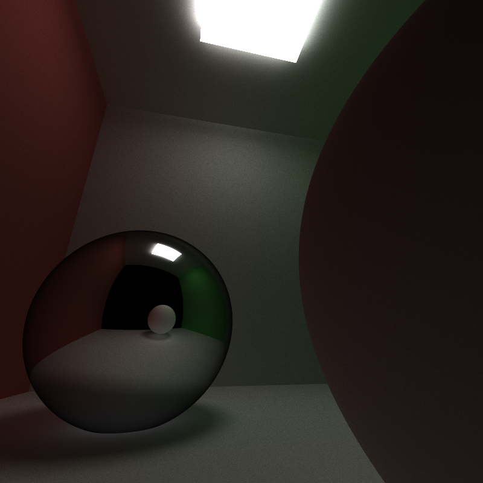 Lens Radius: 0 & Focal Distance: 5  |  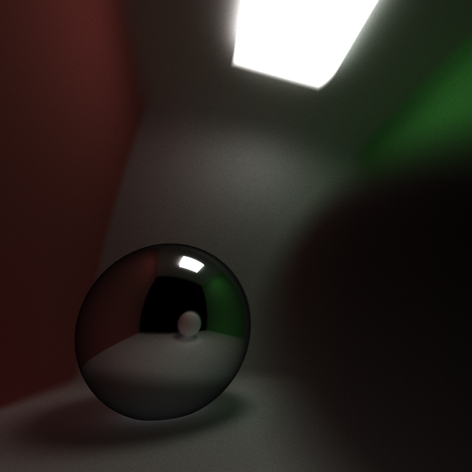 Lens Radius: .2 & Focal Distance: 5 |

## Anti&#8208;Aliasing

NO AA      |  AA
:-------------------------:|:-------------------------:
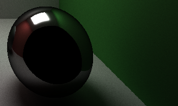   |  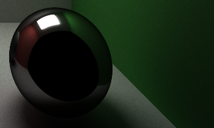  |

You can definitely see the jagged edges are more profound on the left since AA is turned off. AA was achieved by randomly offsetting/jittering the pixel at each iteration.

## Materials

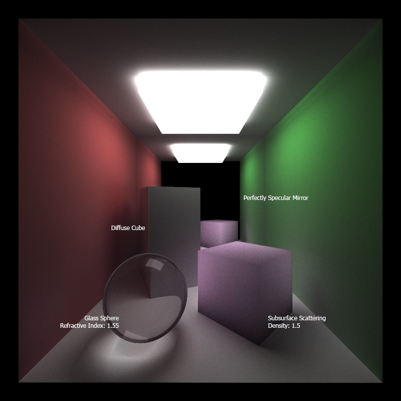

### Specular
Perfectly Specular   |  Pink Metal
:-------------------------:|:-------------------------:
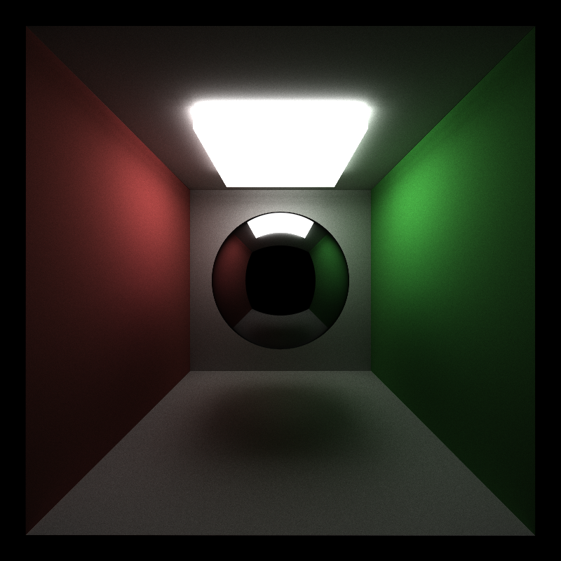      | 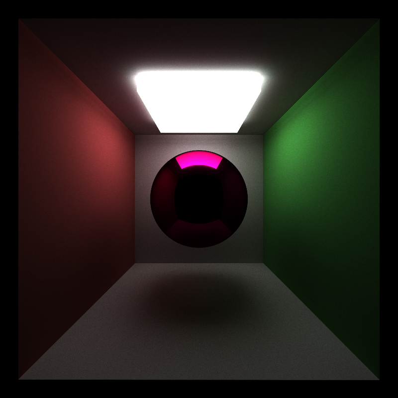  |

### Transmissive
Refractive Index: 1.55    |  Refractive Index: 5
:-------------------------:|:-------------------------:
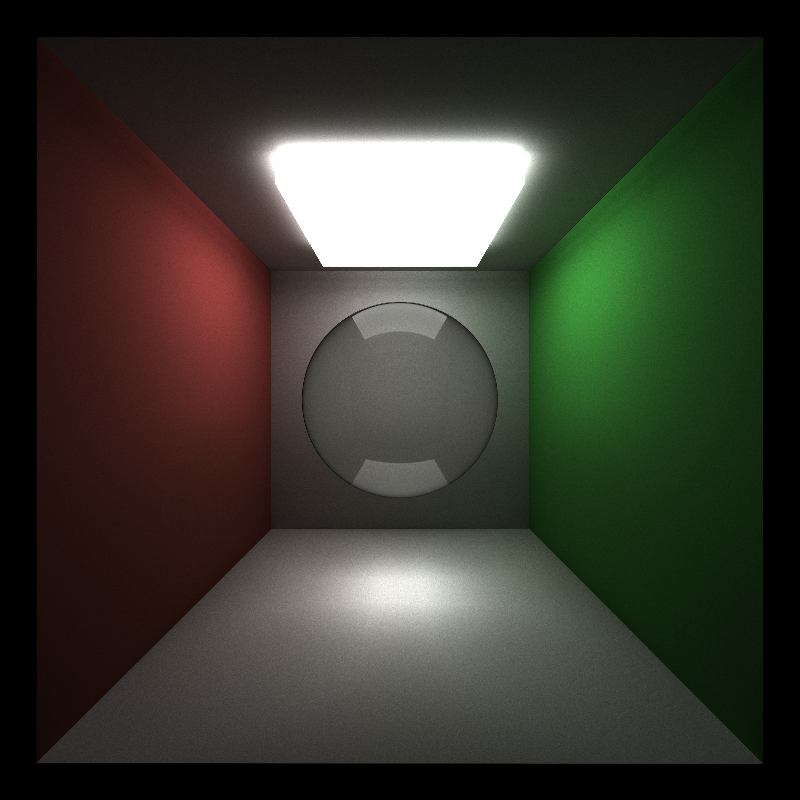      | 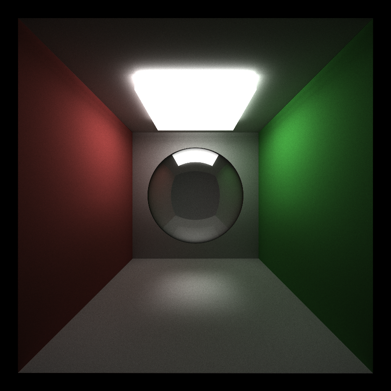  |

Schlick's Approximation was used in place of the Fresnel coefficient. This was used to determine whether or not a ray is reflected or refracted.

### Subsurface Scattering

|   |Density: 0.9 |  |
| ------------- |:-------------:| -----:|
| 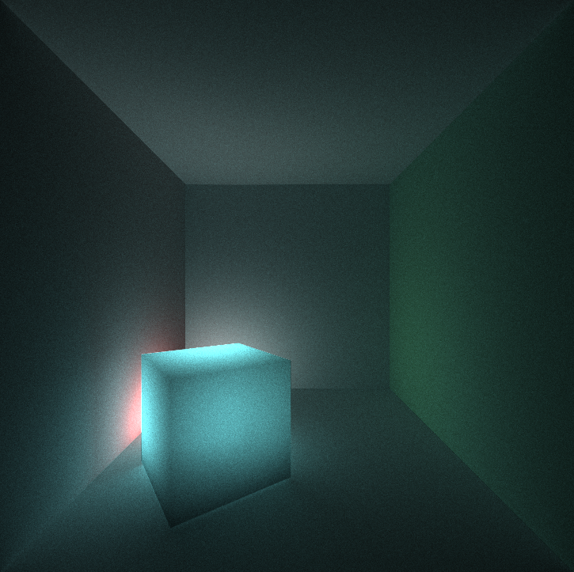      |  | 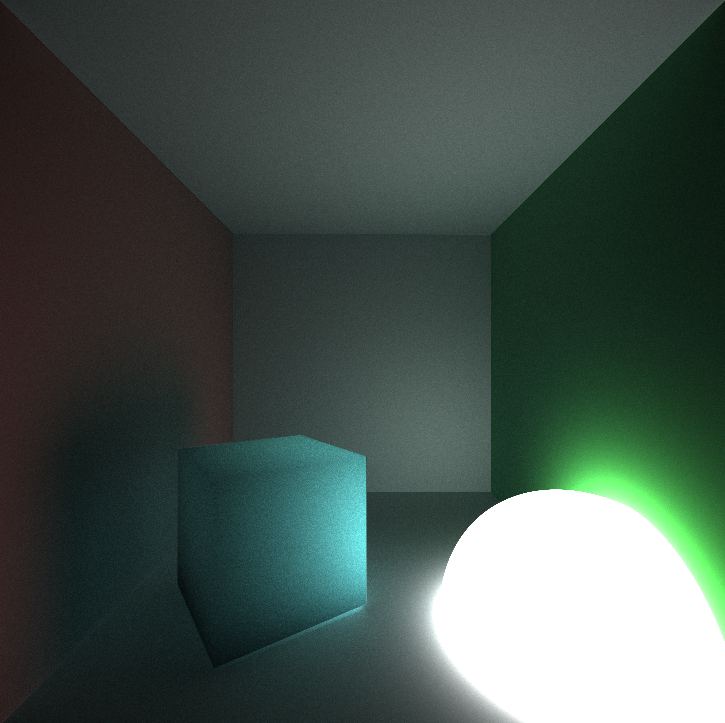 |

At each ray intersection with the object, the ray gets scattered through the object causing a random direction for the next bounce. A direction is chosen by spherical sampling. A distance is also sampled using `-log(rand(0, 1)) / density`.

When a ray hits an object, the ray gets scattered through the object causing a random direction for the next bounce. The ray gets offset based on this randomly sampled direction and is used to create an intersection.

A distance is sampled using `-log(rand(0, 1)) / density`. This is to approximate the `distanceTraveled` of a photon.

The newly computed ray's length is compared to this distance and if the sampled distance is less than the ray's distance to the intersection point then we offset the ray again and attenuate the color and transmission (`exp(-density * distanceTraveled)`).

The only downside to this is that it takes a lot of samples to achieve a smooth surface. 

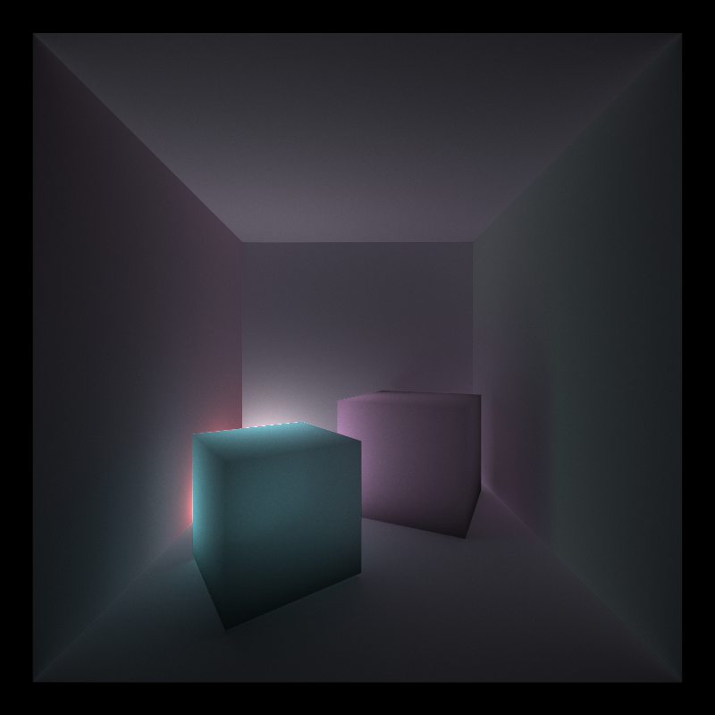

Here's the same scene but with diffuse and transmissive materials.

Diffuse             |  Transmissive
:-------------------------:|:-------------------------:
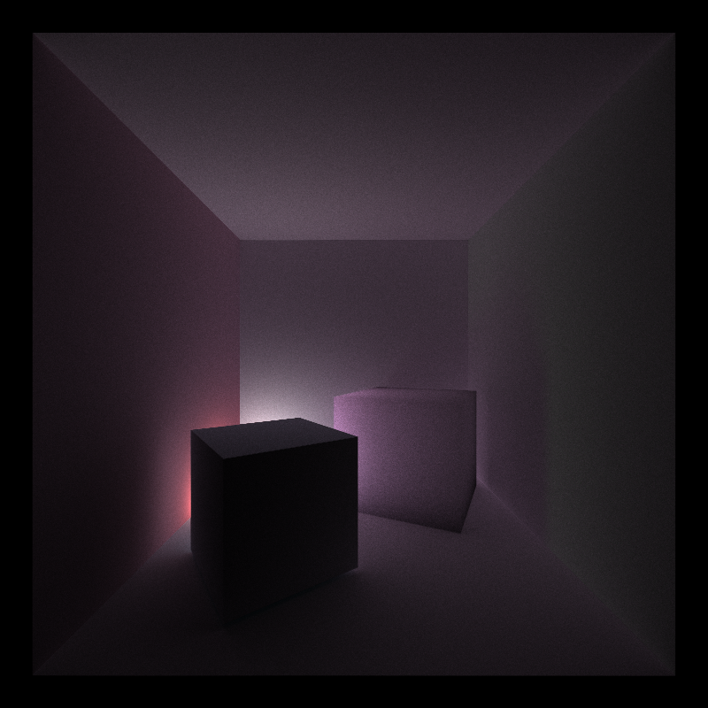  |  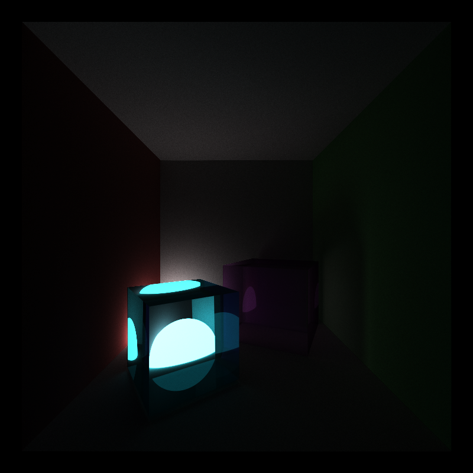

## Shading Techniques

Naive             |  Direct Lighting
:-------------------------:|:-------------------------:
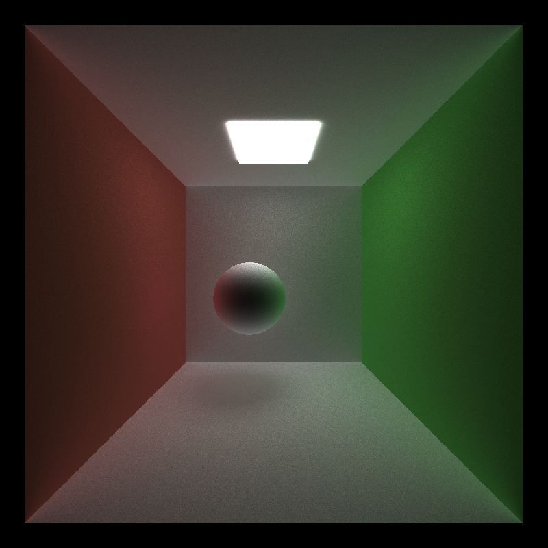  |  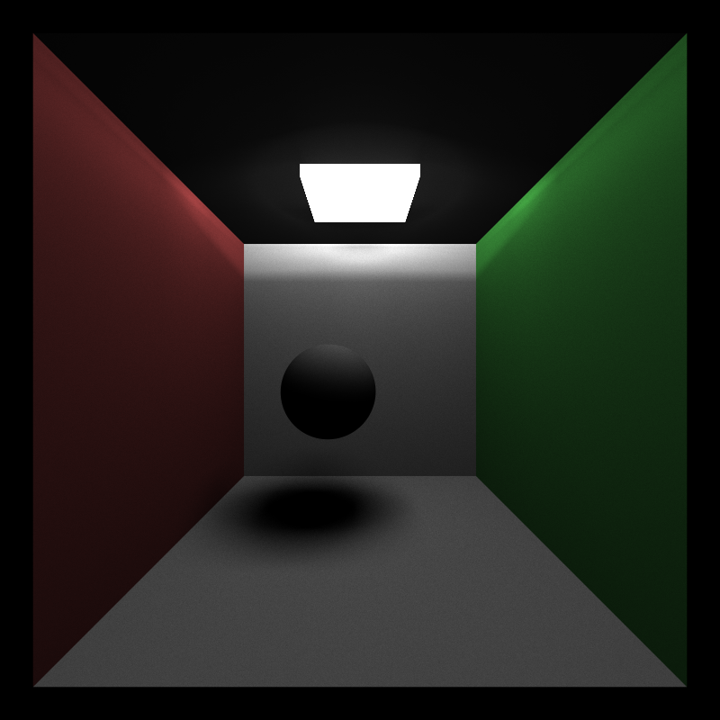

When a ray hits an object in the scene, we sample its BSDF and shoot a second ray towards the light. We sample a random position on the light and determine its contribution. If there is another object in between the original object and the light, then the point is in shadow, otherwise we account for the light's contribution. Direct lighting only does a single bounce as opposed to the naive integrator.

*This is based on my CIS561 implementation of the direct lighting integrator.

# Analysis

## Stream Compaction
Stream compaction was used to remove rays that have terminated from `dev_paths` so that there would be less kernel function calls. I implemented `thrust::partition` and a helper function `endPath()`. 

Here are some tests using 5 bounces per ray on a single iteration.

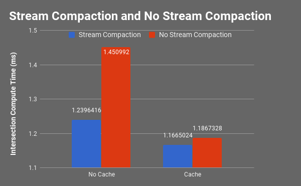

There is a significant drop in computing intersections when stream compaction is used since there are less rays to compute intersections for. 

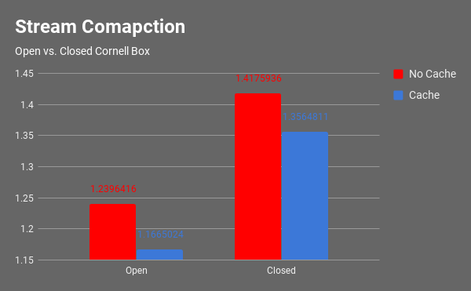

An second test was an open vs. closed scene. To create the closed scene, I added a fourth wall to the Cornell Box and moved the camera inside the scene. I believe that the open scene is significantly faster because rays can terminate faster after bouncing around. Having the closed scene gives more of a chance to hit the fourth wall (to account for global illumination) on a bounce even though it's not directly visible.

However, caching the first bounce is still faster in both scenarios.

## First Bounce Caching
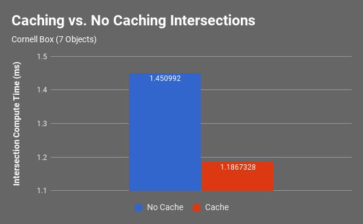

After through several bounces, caching the first intersection helped decrease the time since you won't have to cast a ray to the same intersection. 

## Material Sorting
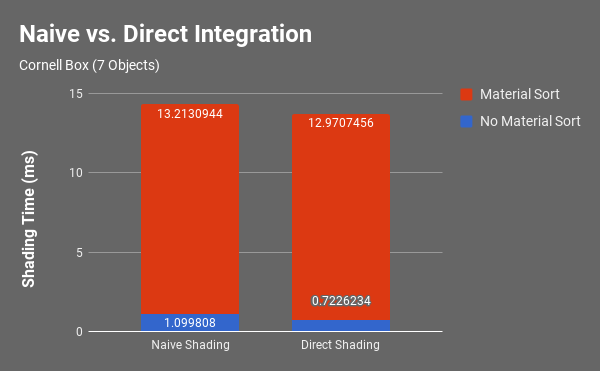

Material sorting seems to not make a lot of sense in a scene where there are a few materials, especially if they're the same. The Cornell Box that I tested with only had to be tested against red, green, and white, diffuse materials. I don't think that this step is necessary unless the scene is using a lot of different materials and textures. 

Also, there is an overhead for direct lighting. Even though there is only 1 bounce, you still have to shoot a second ray to the light in direct lighting. With the naive shader, we just had to account for the BSDF at that bounce.  

# Future Work
- Full Lighting/MIS
- Photon Mapping
- Acceleration Structures
- OBJ Loader

# References
- [CIS 561 Path Tracer](https://github.com/AgentLee/PathTracer)
- [PBRT](https://github.com/mmp/pbrt-v3)
- Subsurface Scattering
    - [http://www.davepagurek.com/blog/volumes-subsurface-scattering/]()
    - [https://computergraphics.stackexchange.com/questions/5214/a-recent-approach-for-subsurface-scattering]()
- [https://www.scratchapixel.com/]()
- Fresnel
    - [Schlick's Approximation](https://en.wikipedia.org/wiki/Schlick%27s_approximation)
    -   [How to use Schlick's Approximation](https://computergraphics.stackexchange.com/questions/2494/in-a-physically-based-brdf-what-vector-should-be-used-to-compute-the-fresnel-co)

# Bloopers

### Naive 
Unless noted otherwise, I don't entirely remember how most of these happened other than messing around in `scatterRay` and depth values.

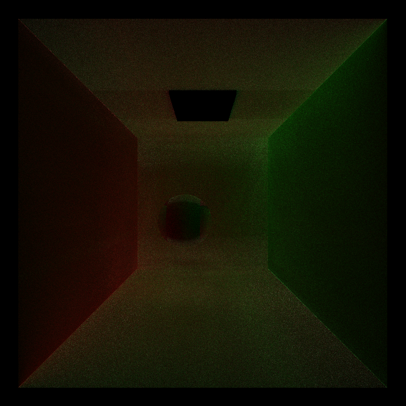

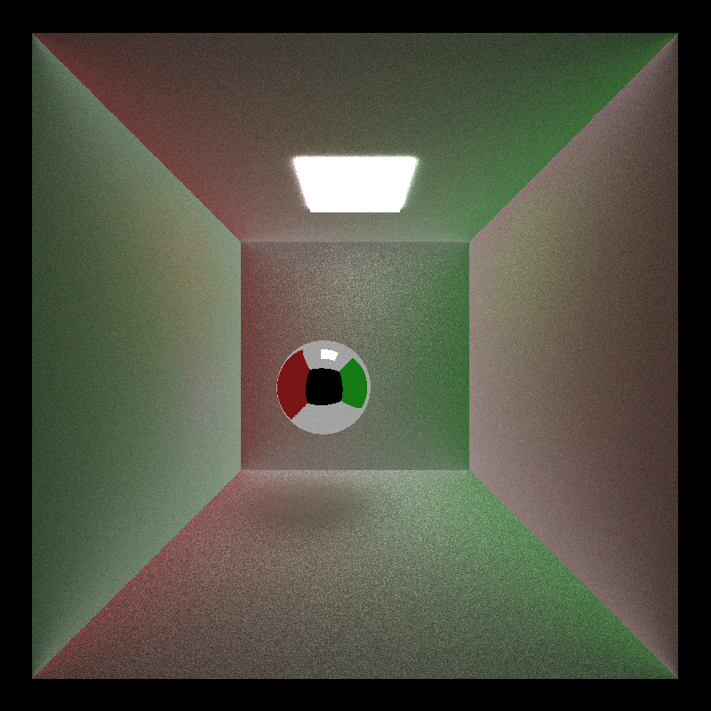

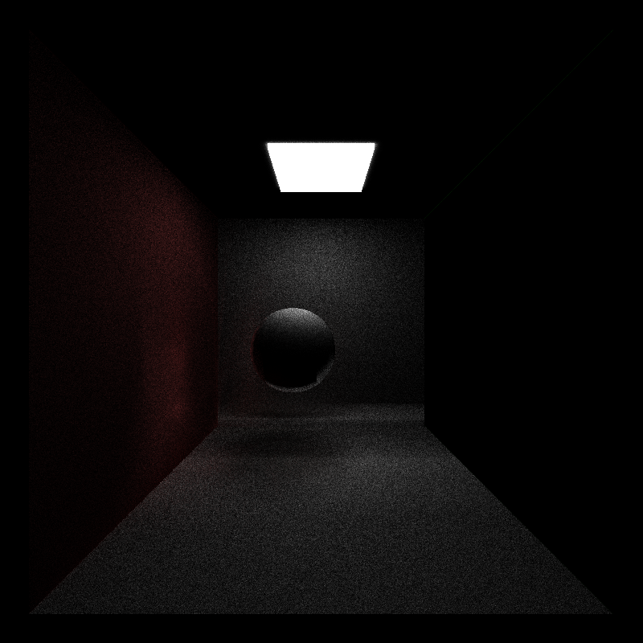

I assumed the ray was coming from the camera to the object so I negated the outgoing ray which would definitely affect the reflection.

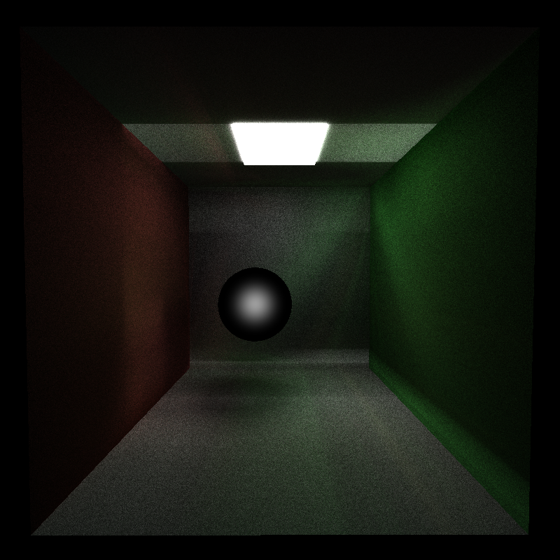

### Sorting fails

First attempt at sorting the paths by material. I did things on the CPU and also didn't update the paths.

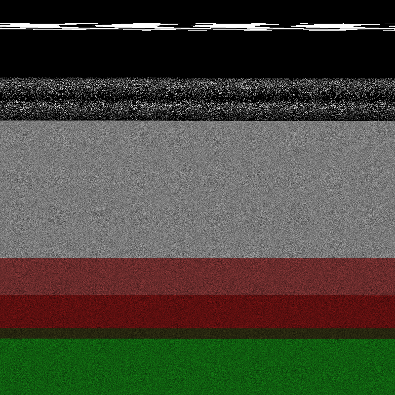

Forgot to sort the materials before shading. :unamused:

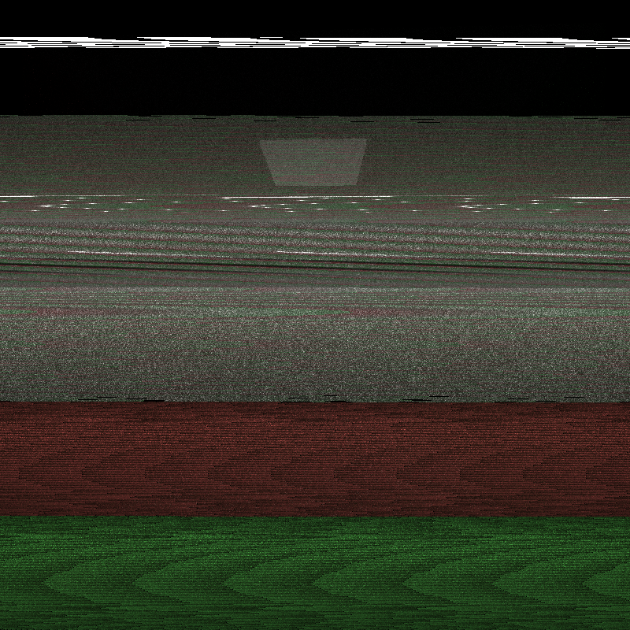

### Direct Lighting

I think for this one I added an extra lighting term.
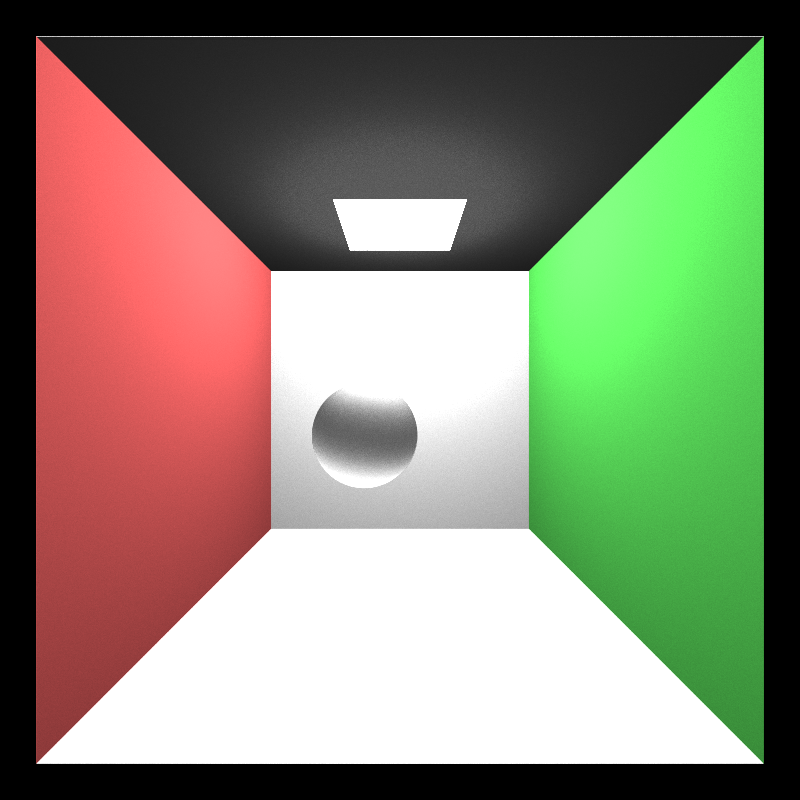

I inverted the shadow ray, so everything was in shadow.
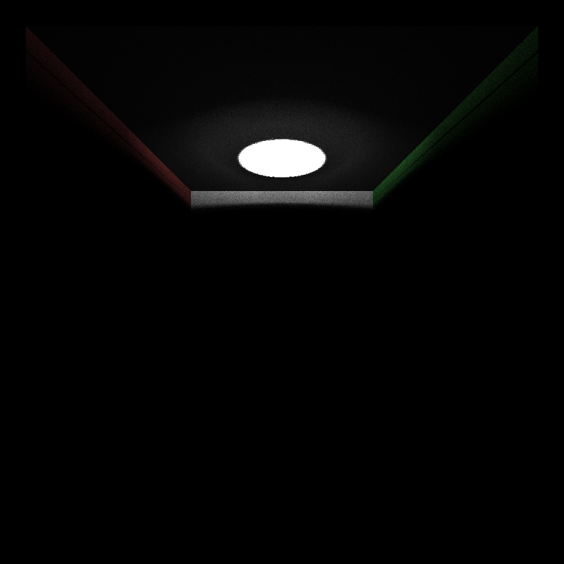