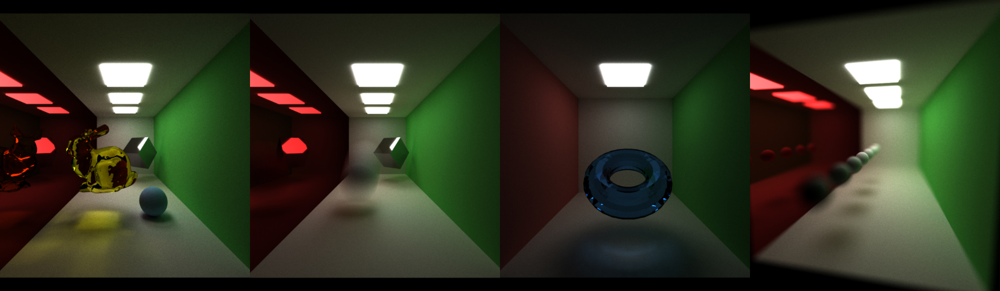
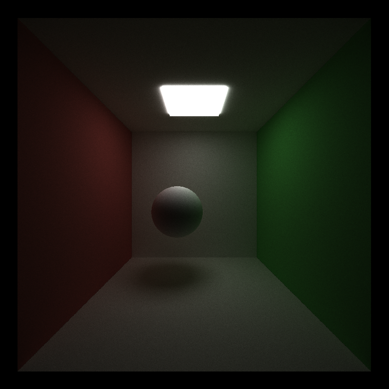
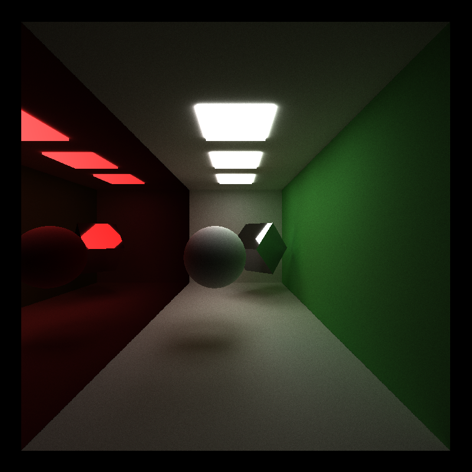
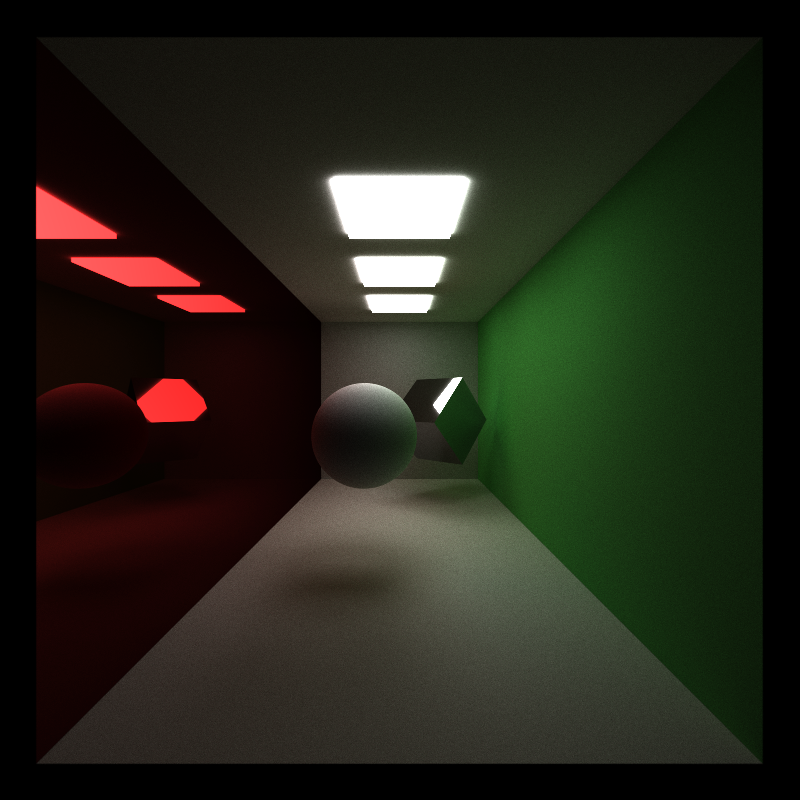
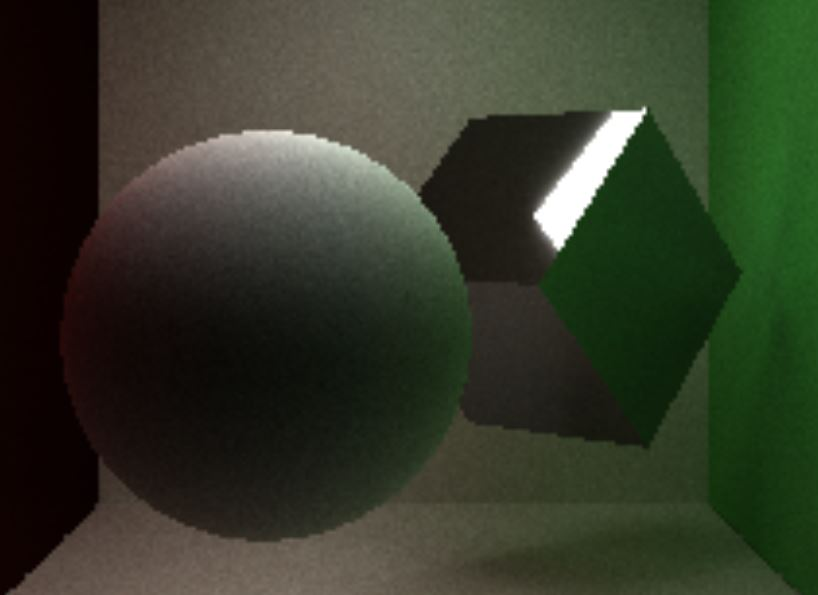
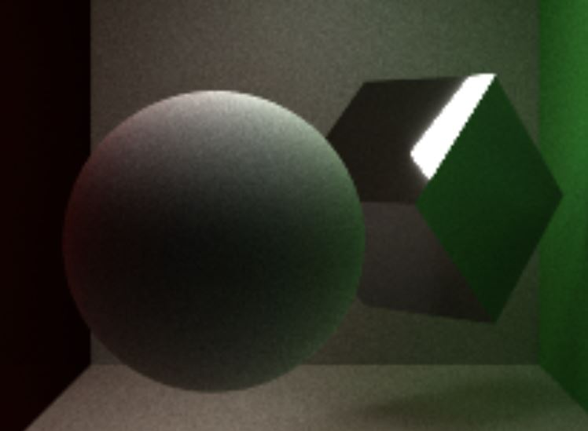
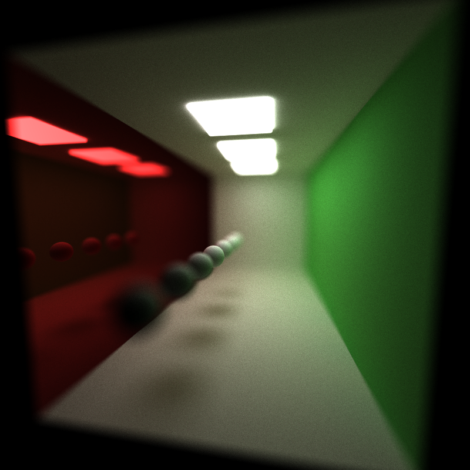

CUDA Path Tracer
================

**University of Pennsylvania, CIS 565: GPU Programming and Architecture, Project 3**

* Jiawei Wang
* Tested on: Windows 10, i7-6700 @ 2.60GHz 16.0GB, GTX 970M 3072MB (Personal)
## Results:
___

### Basic Path Tracer:

### Other Features:
* **Anti-Aliasing**: Realized by Stochastic *Sampled Antialiasing*, just jitter a little bit when create Camera ray, this will cause a little blur on the image, which can solve the aliasing problems.

  Here is the results: (The left image is without anti-aliasing, the right one is with anti-aliasing)
 
 

* **Depth Of Field**: Realized by jittering around pixel. See at [PBRT 6.2.3]

  Here is the results: ( left: `lens_radius = 0.5`, right: `lens_radius = 1.0`)
 

