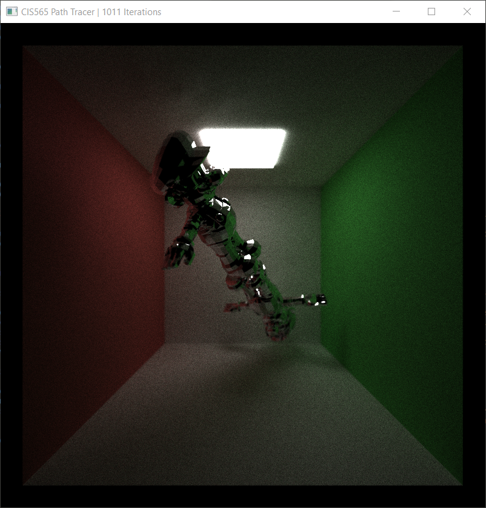
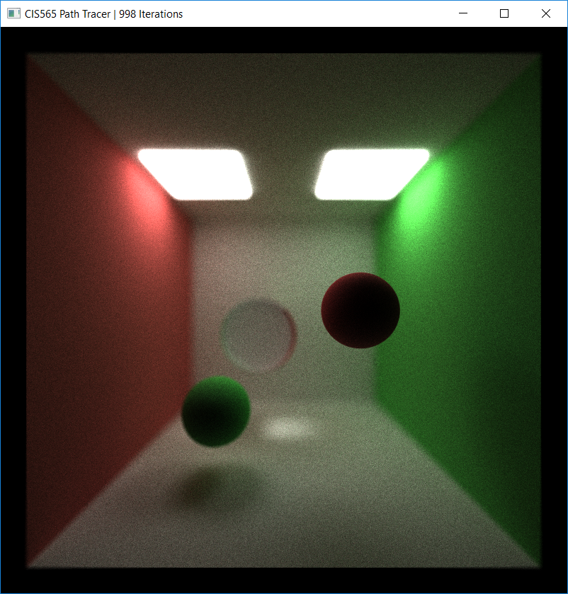
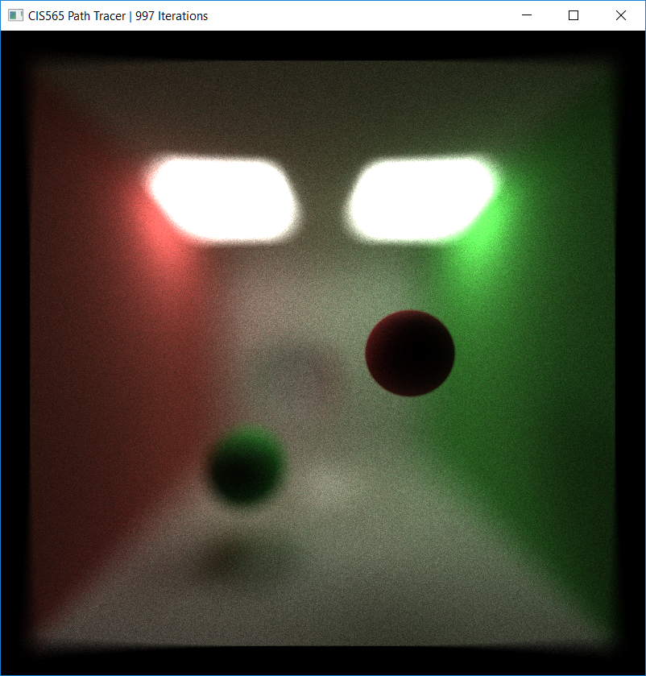
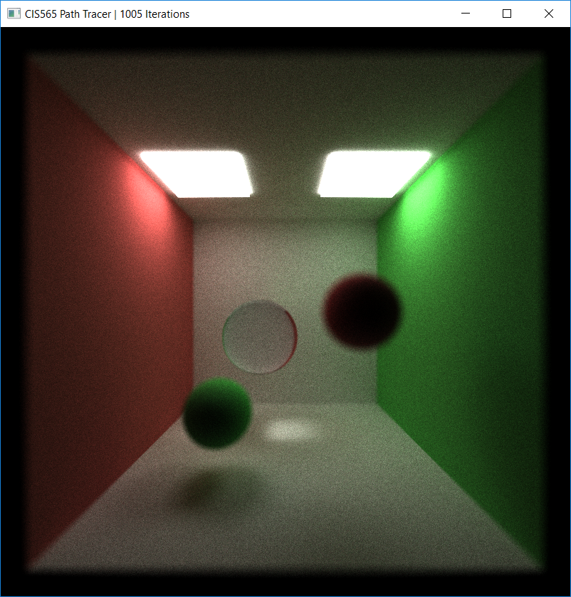
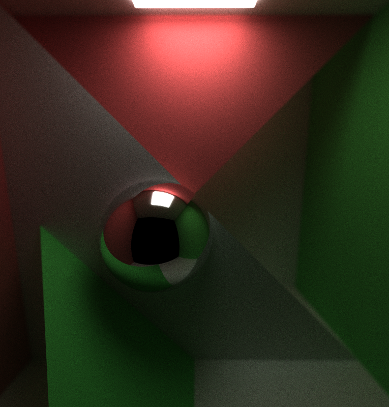
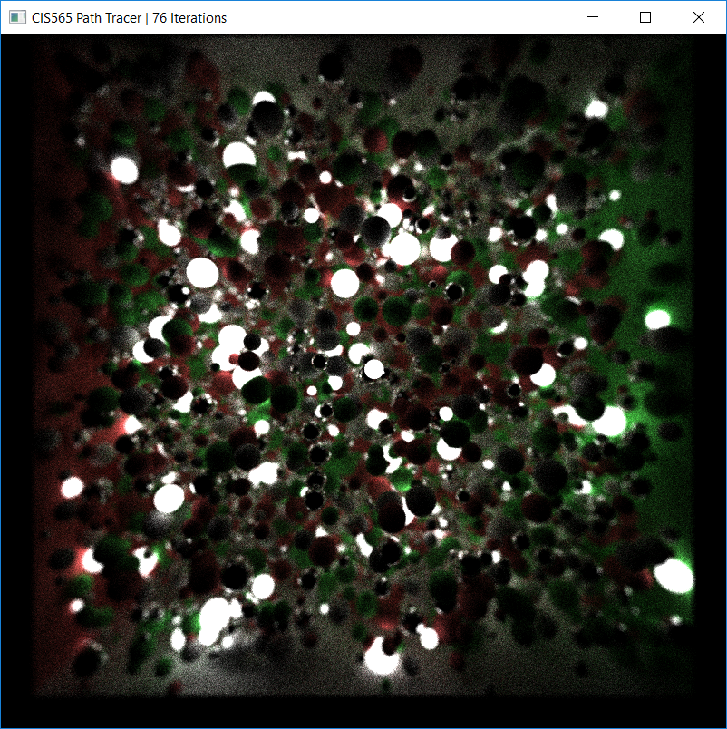
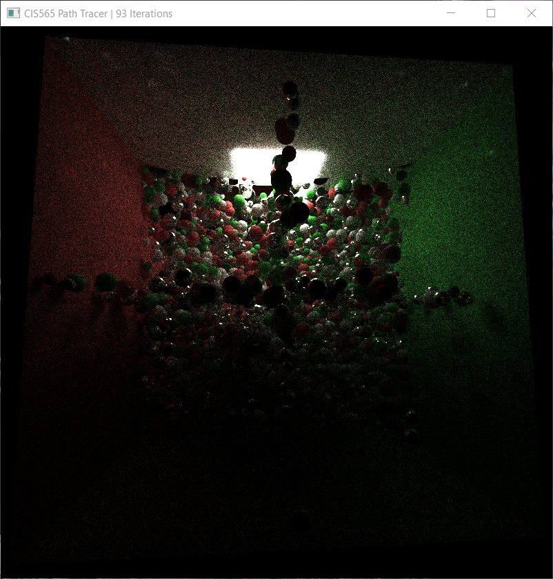

CUDA Path Tracer
================

**University of Pennsylvania, CIS 565: GPU Programming and Architecture, Project 3**

* Daniel McCann
* Tested on: Windows 10, i7-5700HQ CPU @ 2.70GHz, GeForce GTX 970M, 16 GB RAM

### Overview

This project simulates the path of light through the Monte-Carlo Path tracing algorithm on the GPU. From the camera, rays are traced to objects and reflected off of them in random directions determined by their respective materials. This will naturally create global illumination effects, where objects will be lit by light from other objects. Since these paths are random, it is necessary to iterate repeatedly and average the iterations. Eventually the image will converge. While there are ways to make this happen faster by sampling directions (Multiple Importance Sampling), this project does not focus on sampling. Instead I tried to create an acceleration structure to ease finding intersections.

### Implemented Features

## Depth of Field and Jitter Anti-Aliasing

Images:
1. A scene with anti aliasing. 
2. The same scene with DOF focusing on the sphere in the foreground.
3. The same scene, same focus distance and a wide lens.
4. The same scene with DOF focusing on the refractice sphere in the background.

The path tracer finds light as it travels through the viewport to the eye. As such, rays intuitively originate from pixels in world space. But rays that originate from the same place every iteration will find the exact same intersection point every time. This creates an aliasing effect, where rays from pixel centers will always hit an object when in reality that object should only occupy a portion of that pixel, resulting in binary hit-or-miss colors. We want pixels to blend object and background colors proportionally without jagged edges.

For this tracer, jittering is fine to eliminate aliasing. Instead of the centerpoint being chosen every time, a random position within the pixel is chosen. Thus rays launched from this pixel can hit different objects each iteration.

Depth of field is a quick way of simulating the aperture and focus effect from a camera. This creates an effect where a certain distance is in focus and object further from the focus distance become progressively blurrier. The algorithm is as follows:
* Make the jittered ray as described above. 
* Find the point on that ray which is the lens focus distance away from its origin. This is the focal point.
* Find a random point on the lens. The lens is a disc of specified radius around the pixel position in world space. This is the new origin.
* Find the direction from the new origin to the focal point. This is the new direction.

## Materials

I added baseline materials for Lambert (perfectly rough), reflective (perfect mirror) and refractive. Refractive with Fresnel reflections is TBI.

## Mesh Loading

I added mesh loading and triangle intersections to the tracer. The loader is the TinyObjLoader by Syoyo Fujita, used under the MIT License. Triangle intersections are Moller Trumbore algorithm. Both are linked under resources.

But loading meshes with 5000-10000 triangles is already taxing for computations. So I tried to make an acceleration structure to speed this up:

## Octree

Above: cornell box containing 10,000 randomly-generated spheres

# Introduction

Without an acceleration structure, every ray must test every object. Octrees are one way of partitioning the space to test the intersections of less objects. If a ray moves through a space with few or no objects, it should test as few as possible. With octrees, the space is repeatedly partitioned evenly into octants to bound objects.

In my first graphics class I tried and failed at making an octree, so I figured I would implement it here. After this, I personally would not recommend using an octree for producing renders quickly. The strength of an octree lies in its quick and simple construction. The traversal process is not optimal for intersections.

The octree is constructed on the CPU and flattened into a 1D array for the GPU. Both functions take only a few seconds on a CPU, single-threaded.

Unlike KD trees and BVH structures, construction actions are per-element instead of accounting for chunks of the elements per iteration (e.g. finding median positions, splits that divide shapes by surface area). In the future I will likely replace the octree with one of these structures. 

# Implementation

Regardless, the construction is as follows:
* calculate a bounding box for the entire scene and every piece of geometry
* for each geometry
	* traverse the tree until finding a leaf or the smallest enclosing node
	* add the index of the geometry to the node found in the previous step
	* if the node was a non-empty leaf, determine if it should be split.
		* if it is split, move its elements accordingly. if this results in a leaf with more than 1 element, recurse on that leaf.

And that's it. Now there is a tree of structs with either 0 or 8 children plus lists of the geometries they enclose, and references to their parents. Now it has to be translated into something usable by the GPU. Recursively translate the tree into a 1D array of analagous structs. Pointers to children are translated to indices in this array, and the geometry indices are accumulated in a separate list. Empty nodes with no children are discarded. This is good for an unmoving scene because now there can be portions of the space that are never tested for intersections. This would actually cull a very very large portion of the tree.

The CPU structure of a node looks like this:

{
	node* parent;
	vector<node*> children;
	vector<int> geometryIndices;
	int depth;
	vec3 centerPoint;
}

The size of the bounding box is calculated from its depth and the scene bounds.

The analogous GPU structure is this:

{
	int parentIndex;
	int childIndexStart;
	int childIndexEnd;
	int geometryIndexStart;
	int geometryIndexEnd;
	int depth;
	vec3 centerPoint;
}

The good thing about this sort of approach is it also applies very easily to other spatial structures. In fact, the translation process might barely be changed at all.

I then have a kernel to traverse this tree iteratively for intersections. I manage the stack as two arrays: one with the remaining number of children to check and one without. A major benefit of this traversal kernel is it would be almost unchanged for other spacial data structures.

# Results / Performance

Using my OBJ loader:

I traced scenes from the default camera until 50 iterations.

| Geometries | Time Without Octree | Time With Octree | Improvement |
| --- | --- | --- | --- |
| 5200 | 176s | 138s | 21.6% |
| 10400 | 399s | 256s | 35.8% |

A 36% improvement may seem good at first, but each iteration still took over 5 seconds. This is still not acceptable for a scene of this size. This result means I will probably try to implement a different structure later. On the other hand, naive traversal would cause my computer to hang with each iteration. So at least it doesn't do that.

Of course, the default camera has the most complex geometry all on display. From positions far away or outside the scene's box, the octree is extremely fast compared to the naive scene traversal. But a simple bounding volume will do the same thing for far positions.

For the larger scene, performance did not vary strongly with maximum tree depth. 9 was ideal, 11 and 7 both took ten seconds longer. The major bottleneck is in the largest nodes, described in the next section.

# Shortcomings

As described above, the octree is not constructed while accounting for the entire scene. This is an inherent disadvantage and the structure is less flexible.

I made the design decision to allocate geometries to the smallest enclosing node. For some extremely large shapes, this would be unavoidable for an octree. The consequence is that some large number of geometries will be enclosed only by the root or its immediate children, which will be traversed very often. The idea was to avoid repeatedly intersecting the same geometry, if it belonged to multiple leaves. I believe they can instead be passed to leaves / splits that contain any portion of them. This may seem wasteful, but for any given ray it is not as if it will intersect every single leaf enclosing part of the geometry. However, this could be very space inefficient. With the current approach, geometry is never duplicated and every shape belongs to exactly one node. This also allowed me to sort the geometry array based on the GPU node ordering, but the improvement was minimal and probably not worth the traversal speed.

## Unimplemented feature options

* Material ID path sorting: the intention is to minimize divergence inside GPU warps by making them all use the same material. However I had few materials and they were extremely simple. Furthermore, every peer who implemented this reported far, far slower iterations.
* First bounce caching: this would take off a fraction of the work after the first iteration, which could be very significant for scenes with thousands of shapes. Unfortunately it is completely incompatible with the Depth of Field and Jitter effect. The purpose of these effects is to improve the image by getting a different intersection with each first bounce.

### Resources

* https://github.com/syoyo/tinyobjloader 
* https://en.wikipedia.org/wiki/M%C3%B6ller%E2%80%93Trumbore_intersection_algorithm

# Bloopers:

A test with refraction on the mario mesh. Hard edged normals caused a lot of odd highlights, and a lot of the paths bounced around and terminated inside the mesh (black)

An octree optimization test. I wanted to traverse only nodes with closer intersections than my current best intersection. This was the result.

