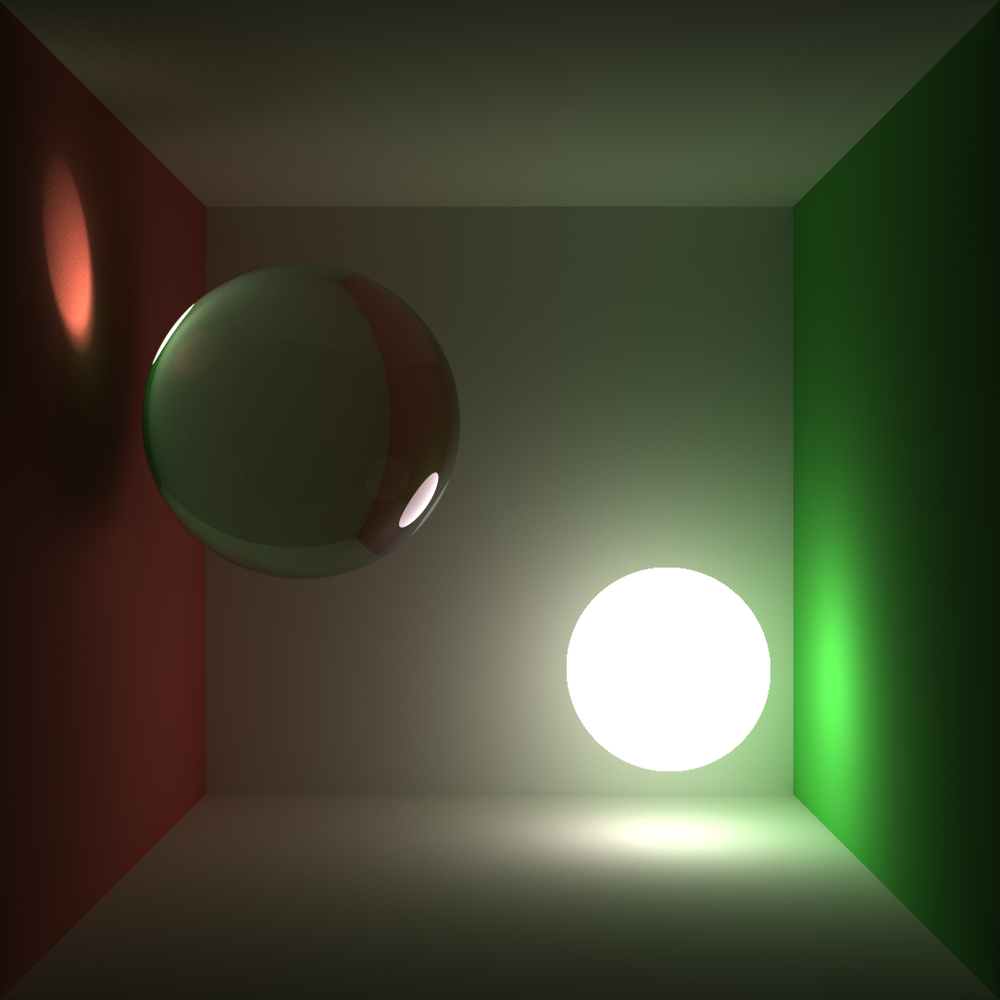

**University of Pennsylvania, CIS 565: GPU Programming and Architecture,
Project 3 - CUDA Path Tracer**

* Josh Lawrence
* Tested on: Windows 10, i7-6700HQ @ 2.6GHz 8GB, GTX 960M 2GB  Personal

**/src CMakeLists.txt Additions** 
shapefunctions.h 
utilkern.cu 
warpfunctions.h 

**Overview** 
For a detailed overiew of the path tracing techniques see the book Physcially-Based Rendering:
http://www.pbrt.org/

**Highlights** 
    Below are some are some renders using multiple importance sampling and and naive path tracing. Notice the noise rection due to direct light multiple importance sampling in the 100 samples per pixel image. You may see ringing artifacts when viewing on the web. Originals do not have this.
 
 
    The compaction optimization was not much of an optimization given that it did not reduce the render time per pixel sample. Reasons for this could be the sorting overhead. I tried to increase the pixel count to 1000x1000 image and did not see the compaction fuctions catching up to no compaction version. The warp retiring benefits we get from removing the dead paths does not outway the overhead from removing them in the first place.
 
 
    Of three optimizations that were performed, first bounce caching was the only one that provided any performance improvement. Across several depth termination settings it provided a constant savings of roughly 2ms. This is the amount of time it takes to determine the first itersection from the camera. 
 
 
    Material sorting was much worse than not sorting at all. This is likely due to the overhead of sorting not being greater than the savings. The purported benefits of sorting paths by material type was that if one type of material had many instructions to complete compared to other materials then you would get some performance benefit by only taking that code path for the warp. However, these performance benefits are only realized if the intersections per material are mutiples of 32, allowing the warps to execute only one material code path. This is highly unlikely. It is far more likely that they are not multiples of 32 and some warps must stride 2 or more materials. This negates the benefits of sorting becuase in order for the next kernel call to start executing, it must wait around for these kinds of mixed material warps to finish. The only way I could see this working with existing code is calling the uber shader for each material (and only on the array bounds of the material) and kicking off each kernel in its own stream to allow async kernel execution (so that the next material specific uber shader kernel call doesn't have to wait for the previous to finish before it starts running). 
 
 
    The reasons are as follows: for unsorted paths, the uber kernel should take C + sum(Mi) instructions to complete where C is some constant instruction overhead for all the material types and Mi is the number of instructions it takes to execute a specific material shading code path for material i. The material separated kernel call approach with different kernel streams per material should only take C + max(Mi) where max Mi is the longest material code path. A savings of sum(Mi) - max(Mi). If they are not separated into streams it would be a penalty of C(n-1) where n is the number of material types that have been hit this bounce. If the savings is not more than the cost to sort then there no reason to sort.
 
 

**Renders, may see ringing artifacts when viewing on the web** 
**MIS Diffuse vs Jensen01 BSSRDF with King13 importance sampling** 
**Jensen01 paper: ** 
**http://www.graphics.stanford.edu/papers/bssrdf/bssrdf.pdf** 
**King13 paper: ** 
**http://library.imageworks.com/pdfs/imageworks-library-BSSRDF-sampling.pdf** 
**800x800 5000spp** 

**Just a Light and the Material, Diffuse vs Jensen01 BSSRDF, Marble** 
**800x800 500spp** 

**Just a Light and the Material, Jensen01 BSSRDF, Marble Cube** 
**800x800 500spp** 

**Just a Light and the Material, Jensen01 BSSRDF, Marble** 
**800x800 100spp** 

**MIS with Fresnel Reflection and Transmission** 
**MIS 1080x1080 5000spp** 

**MIS 1080x1080 5000spp** 

**MIS 1080x1080 5000spp** 

**MIS 1080x1080 5000spp** 

**MIS VS Naive** 
**1080x1080 100** 

**Data** 

**Compacting the non-dead Paths** 

**Caching the First Bounce** 

**Material Sorting** 

**GPU Device Properties** 
https://devblogs.nvidia.com/parallelforall/5-things-you-should-know-about-new-maxwell-gpu-architecture/ 
cuda cores 640 
mem bandwidth 86.4 GB/s 
L2 cache size 2MB 
num banks in shared memory 32 
number of multiprocessor 5 
max blocks per multiprocessor 32 
total shared mem per block 49152 bytes 
total shared mem per MP 65536 bytes 
total regs per block and MP 65536 
max threads per block 1024 
max threads per mp 2048 
total const memory 65536 
max reg per thread 255 
max concurrent warps 64 
total global mem 2G 
 
max dims for block 1024 1024 64 
max dims for a grid 2,147,483,647 65536 65536 
clock rate 1,097,5000 
texture alignment 512 
concurrent copy and execution yes 
major.minor 5.0 
