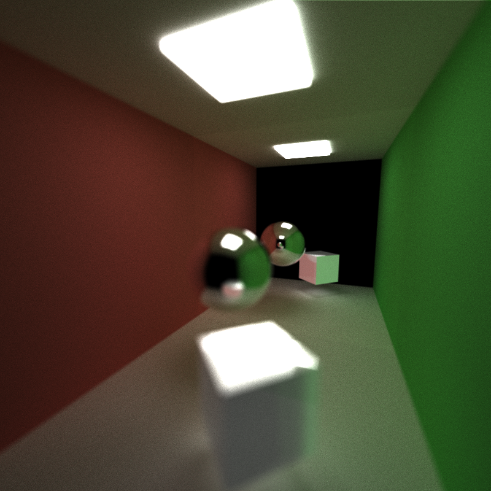

CUDA Path Tracer
================

**University of Pennsylvania, CIS 565: GPU Programming and Architecture, Project 3**

* Name: Meghana Seshadri
* Tested on: Windows 10, i7-4870HQ @ 2.50GHz 16GB, GeForce GT 750M 2048MB (personal computer)

## Project Overview

The goal of this project was to get an introduction to writing a GPU Path Tracer in CUDA. Path tracers implement a realstic lighting alogrithm that simulates light bouncing in a scene. By implementing this on the GPU, versus the CPU, we can render globally-illuminated images a lot more quickly.

The following features were implemented (most of which can be toggled with flags in `utilities.h`):

Path Tracing Features:

* Shading kernels with BSDF evaluation for:
	- Ideal diffuse surfaces (using cosine-weighted scatter function)
	- Perfectly specular-reflective surfaces
	- Specular-refractive surfaces
* Naive lighting
* Direct lighting 
* Anti-aliasing
* Depth of field

GPU Optimization Features:

* Path continuation/termination using Stream Compaction 
* Sorting rays, path segments, and intersections to be contiguous in memory by materials
* Caching first bounce intersections for re-use across all subsequent iterations 

## Renders

### Naive Lighting 

###### (Run with 5000 samples)

### Direct Lighting 

In this method, we directly sample the light from each intersection in the scene. Each intersection can be seen as long as it's not in shadow and is visible to the light.

###### (Run with 3860 samples)

### Anti Aliasing 

Anti-aliasing is the jittering or offsetting of a ray within each pixel. Without AA, rays are shot from the camera and through a screen, generally at the center of each pixel. The result (as seen below) show images where lines and edges seem to be more jagged. By offsetting where within the pixel we first shoot the ray into the scene, we can achieve smoother results.

Something to note here is that first bounce caching does not work if anti-aliasing has been implemented (first bounce caching talked about further below in the `Performance Analysis` section). If you offset the rays, then the first bounce intersections will be different.

###### (No AA, Run with 5000 samples)

###### (AA, Run with 5000 samples)

###### (No AA, Run with 67 samples)

###### (AA, Run with 324 samples)

### Depth of field

With depth of field, interesting effects can be achieved that emulate changing focus on an actual camera. Imagine there's a lens that has a certain radius and is a certain focal distance away from the camera - both of which determine what will be and not be in focus in the scene. For each ray shot from the camera, we find an intersection with a random point on the focal plane (the lens) using disk sampling. Then, shoot a new ray into the scene which has been offsetted by a certain amount. Objects in the focal plane will appear in focus.

###### (Run with 2518 samples, 0.2 radius, 20 focal length)

### Tranmission 

This is a specular refraction with Fresnel effects using [Schlick's approximation](https://en.wikipedia.org/wiki/Schlick's_approximation).

###### (Run with 1558 samples)

###### (Run with 2364 samples, 1.5 index of refraction)

###### (Run with 2801 samples, 2.5 index of refraction)

###### (Run with 2442 samples, 5.5 index of refraction)

## Performance Analysis 

All of the following charts and graphs have been tested on one sample with varying ray depths. The scene used is the "TransmissiveCube" scene with the following schematics:

* 8 objects (1 transmissive, 1 emissive, 2 reflective, 4 diffuse)

### Feature Analysis 

The following 2 charts compare the various path tracing and GPU optimization features that have been implemented. 

### Stream Compaction 

In the naive implementation of the path tracer, within each iteration (aka one sample), every pixel is being calculated by accumulating its color across multiple depths (until a maximum depth is reached). A kernel is being launched for per pixel in order to complete this task. 

Stream compaction allows us to remove any rays that have completed their total color accumulation and thus have terminated, without having to wait for every thread within the allocated kernels to complete. This allows us to save threads to be used elsewhere, and thus finish rendering faster.

In this code base, stream compaction has been implemented through the use of `thrust::partition`, using a predicate that distinguishes those path segments that have no more remaining bounces.

In the chart, we can observe that while stream compaction does take longer than without at smaller depth values (probably due to some overhead from thrust::partition, and memory allocation), we can see that at higher depth values, stream compaction begins to perform better, as opposed to the continuously linear increase in time without it.

### Material Sorting

In the chart, it can be seen that stream compaction greatly helps performance while material sorting.

As compared to the charts for stream compaction above, however, at first it looks like material sorting just makes performance even worse! Times across depth values have doubled. So why is this considered an optimization? 

First off, what are we trying to do here? We want to sort path segments/rays and intersections to be contiguous in memory by material type. 

What's the advantage of this? This really helps when we're implementing very complicated materials, or doing things like reading from texture or normal maps. You can read them all the necessary values from global memory once in the beginning, sort intersections and rays by material type, and have access to the materials' values contiugous in memory. This way you can cache necessary chunks of it whenever you need to, rather than reading from global memory each iteration. 

Why is the performance worse? There is a lot of overheard in allocating two new device arrays to complete this sorting task, especially when the materials currently being implemented in this code base do not require the access of large items from global memory.

### First Bounce Caching 

Here we are caching first bounce intersections in the scene to be used across all subsequent iterations. Caching the first bounce improves performance of stream compaction (as can be seen by comparing `Cache with SC` here and `Stream Compaction` in the corresponding section above). 

### More analysis to be added:
* Targeted analysis on specific kernels 
* Analysis on stream compaction performance between an open and closed scene 

## Features to be implemented in the future

* Material sorting by material type (not just ID)
* Multiple importance sampling lighting 
* Microfacet BTDFs
* Texture and bump mapping
* Arbitrary mesh loading and rendering

## Bloopers

Looney Tunes Throwback

Let there be (too much) light

It's a purple disco

When diffuse and specular don't act nicely with one another

The future

Watermelons!

