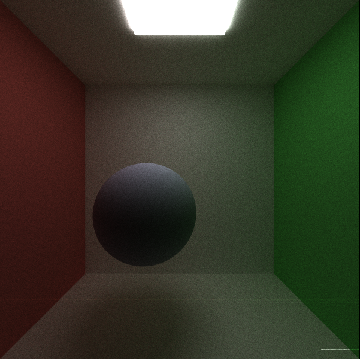

CUDA Path Tracer
================

**University of Pennsylvania, CIS 565: GPU Programming and Architecture, Project 3**

* Mauricio Mutai
* Tested on: Windows 10, i7-7700HQ @ 2.2280GHz 16GB, GTX 1050Ti 4GB (Personal Computer)

### Overview

#### Introduction

The aim of this project was to implement a simple path tracer that takes advantage of parallelism within a GPU to allow for faster rendering times.

A path tracer is a program that creates an image from a scene made from 3D objects, which can be made to look like they are composed of different materials. The basic path tracing algorithm is as follows:

* Shoot a ray from the camera's viewpoint towards one of the pixels of the image
* For each ray, check if it collides with any of the objects in the scene
* If so, evaluate the light reflected/refracted by that object, and shoot another ray (chosen based on the object's material's probability distribution function) into the scene
* If not, "terminate" this ray and move on to the next one

The path tracer implemented here is very simple, but does showcase some optimizations that can be made to speed it up.

#### Features

Below are this path tracer's main features:

* Support for perfect or imperfect diffuse and specular reflective materials
* Support for loading .OBJ files through tinyOBJ (only vertex positions and normals)

Toggleable features:

* Stream compaction for terminated paths
* Sort paths by material
* Cache first intersection
* Direct lighting for brighter, more convergent images
* Use normals as colors
* Bounding volume culling for .OBJ meshes

#### Optimizations

The following optimizations were implemented:

* Stream compaction for terminated paths
* Sort paths by material
* Cache first intersection
* Bounding volume culling for .OBJ meshes

Below, we take a look at their effect on performance.

### Analysis

#### General comparison in open Cornell box

The following measurements were made in a scene called `cornellMirrors.txt`, which is a basic Cornell box with a reflective sphere and a left wall that has both diffuse and reflective properties. Furthermore, the measurements were taken by rendering images with 5000 samples and a maximum path depth of 8. Below is an example render of this scene, with direct lighting and 5000 samples:


The graph belows shows the time required to render this scene with different optimizations enabled:


Here, we can see that only the cache optimization actually reduced the render time -- it was approximately 10 seconds faster than the bare-bones implementation. What could have caused the other two "optimizations" to make the path tracer take so much longer? To help explain this, below is another graph that shows measurements of a single call to the shader kernel, averaged over 100 calls. This means this is measuring only the kernel that determines the color for each intersection, and ignores the cost of other operations, such as sorting lists.


Here, we notice that the bare-bones version without any optimizations and the version that caches the first hit both have very similar runtimes for the shading kernel. This is expected, since caching does not save time on the shading kernel, but when computing the first batch of intersections for each sample.

More importantly, we see that both the stream compaction and sort by material optimizations were effective at reducing the shading kernel runtime. The former optimization reduces the number of threads, and therefore, the number of warps that need to be scheduled and launched, so it is clear why the overall shading kernel runtime is reduced in this case. When sorting by material, we do not reduce the number of threads, but we do group threads such that, in the vast majority of warps, all threads will be processing the same material, greatly reducing warp divergence, which also explains the performance improvement. In my particular implementation, I assign a negative material ID to intersections that do not hit any object, so those intersections are grouped together as well.

Finally, we can see that combining the two optimizations above further reduces the runtime for a single kernel, but not by much more.

From the two graphs above, we can conclude that, although the stream compactions and sort by material optimizations are successful in reducing the runtime of the shader kernel, there is a very large overhead incurred by both optimizations. For the former, it is the stream compaction algorithm itself that makes the runtime of a single path tracing iteration go up significantly. For the latter, the additional `cudaMemcpy` and sorting operations required by my implementation clearly add a heavy load to the runtime. In short, the costs from this overhead far outweighs the improvements in the shading kernel, such that these "optimizations" actually reduce performance. It is likely that, under other circumstances, such as if we had a much larger and complex shader kernel with a greater divergence potential (i.e. conditional branches), then these optimizations would improve runtime, since they could help in mitigating the cost of such a large kernel, while their overhead would be less significant in relative terms.

Interestingly, the caching first intersections optimization, while very simple, was very effective at reducing runtime. This is probably because, instead of targeting our light-weight shading kernel, it instead removes one round of costly intersection checks from each iteration. This meant it had little overhead compared to the other optimizations, but still made for significant gains.

Next, we will look at the performance impact of individual features in more detail.

#### Caching first intersection vs. maximum ray depth

Below is a graph of the time requires to render `cornellMirrors.txt` with 5000 samples at different maximum ray depths. This compares the bare-bones version and the version that caches first intersections.


As we can see, the absolute difference between runtimes is approximately constant, regardless of the maximum ray depth. This makes sense, since we are always saving the same amount of time per iteration -- i.e., the time required to compute the first intersections. 

Another way to look at this data is to compute the relative difference between runtimes, i.e. `1 - (caching runtime) / (bare-bones runtime)`. This gives us the following graph (note Y-axis scale):


As we can see, the optimization is approximately 20% faster at first, but quickly drops off to about 5% as we reach a more conventional ray depth of 8. Although the 20% speedup at a ray depth of 1 is great, images rendered with this ray depth are only useful if direct lighting is enabled, and even then, will lack features such as global illumination, soft shadows, etc. So, in relative terms, this optimization does not scale well as the ray depth increases.

#### Stream compaction in "closed" vs. "open" scenes

I created two scenes, `cornellClosed.txt` and `cornellOpen.txt`. The former is similar to `cornellMirrors.txt`, but had the ceiling, floor, and walls (except for the back wall) extended, and a wall was added to the "front" of the box to make it fully closed. `cornellOpen.txt` is similar, but had the front wall moved away such that it wouldn't close the box anymore, but would still be included in intersection tests.

Below are renders of these scenes:

`cornellClosed.txt`


`cornellOpen.txt`



Using these scenes, I took measurements of the runtime of the shader kernel for each of the 8 iterations in one path. I also measured the number of paths remaining after each iteration. The purpose of these measurements was to analyze the performance impact of the stream compaction optimization in "open" vs. "closed" scenes.

Below are the graphs showing these results. First, the number of paths:


Thus, we can see that, in the closed Cornell box, there are many fewer paths that get terminated early. This makes sense, since, in this case, paths only get terminated if they hit the light, whereas, in the open box, rays can go into the void outside the box and get terminated.


Here, note that the last iterations take much longer than the previous ones because direct lighting was enabled (so most of the rays incur an additional cost of looking for a light).

In the case of the closed Cornell box, note that there isn't a large difference between runtimes for most iterations. This make sense, since relatively few paths are terminated and removed at each iteration. However, for the open Cornell box, the shader runtime clearly decreases with each iteration (except for the final one, as explained before).

### Direct lighting

#### Overview

The idea behind direct lighting is to mitigate some of the randomness in a naive path tracer. When we reach our max ray depth, if a ray hasn't reached a light yet, we shoot a ray from its current intersection point to a randomly chosen light. This speeds up convergence, since we make it much more likely that any given ray will hit light.

Below is a comparison of the same scene, `cornellMirrors.txt`, rendered first without direct lighting, then with direct lighting:


Note that the "mirror" on the left wall is partially diffuse, hence why it is affected by direct lighting.

#### Performance impact

Below is a graph showing the time required to render `cornellMirrors.txt` with 5000 samples and ray depth of 8, under three different settings: bare-bones, cache only enabled, and both direct lighting and cache enabled:


As we can see, direct lighting does add slightly to our runtime, but not a significant amount. In fact, when coupled with the cache optimization, it is still faster than just the bare-bones version. The impact of direct lighting can also be seen at a lower level in the "closed" vs. "open" discussion above. 

Considering the much more convergent images we get from direct lighting, this small performance hit is definitely worth it.

#### Optimizations

If direct lighting is enabled, a separate list of indices of Geom objects which emit light is prepared in the path tracer initialization in order to speed up direct lighting. After all, by preparing this list, we don't need to iterate through the list of objects in our scene every time we need to run direct lighting in the shading kernel.

Compared to a hypothetical CPU version, this GPU implementation to perform well. Since direct lighting can only happen in the last bounce of a ray, the effects of warp divergence are greatly mitigated, so this should not be much worse than a CPU implementation.

If this feature were to be optimized further, one could consider finding a faster way of computing the intersection check versus the randomly chosen light.

### OBJ loading

#### Overview

Using the very convenient  library, this path tracer can load OBJ meshes and render them.

Due to the current lack of general support for texture mapping (from loaded files), any material information in the OBJs is ignored. However, the basic geometry data (vertex positions and normals) is loaded and used to render the mesh.

A slight modification was made to the original scene file format in order to support meshes -- see below.

Here is an example of a Porygon mesh, rendered in the scene `cornellPorygonMix.txt`:


#### Performance impact

Below is a graph comparing two similar scenes: `cornellMirrors.txt` and `cornellPorygon.txt`. The main difference between them is that, while the former has a sphere in its center, the latter has a mesh of Porygon from Pokemon Snap. The mesh was rendered once with culling enabled, and once with it disabled.


As we can see, regardless of culling, the mesh significantly increases the render time. The simple bounding volume culling reduced the render time by approximately 9% relative to when it is disabled.

Although it is slow, the ability to render arbitrary meshes is definitely valuable in a path tracer.

#### Optimizations

A very simple bounding volume culling was implemented to speed up mesh rendering slightly. When the mesh is loaded, an axis-aligned bounding box is computed. 

Then, when performing ray-scene intersection, instead of always checking all the triangles in the mesh, we first check if the ray hits this bounding box. If so, then we iterate all the mesh's triangles for intersection tests -- but if the bounding box is missed, then we can safely ignore all the mesh's triangles.

Compared to a hypothetical CPU implementation, this GPU implementation would probably be weighed down by the massive warp divergence that could happen in case some threads in a warp hit the mesh, but others do not.

One obvious optimization that can be made is implementing a more efficient spatial data structure to greatly reduce the number of triangles that must be checked when shooting a ray through the scene. Something like an octree or a BVH could significantly improve performance. 

### Use normals as colors

#### Overview

This very simple feature lets objects be shaded according to their normals, instead of the regular shader kernel. It is useful for debugging. Below is an example:


#### Performance impact

Since this greatly removes most of the complexity of path tracing (no need to shoot additional rays, very simple "shading", etc), this is very fast.

For example, the image above took 205519.031 ms to render, while the regularly shaded scene took 844956.938 ms.

Note that I waited for the full 5000 samples to finish, but the image was "ready" as soon as the first sample finished, since there is no randomness involved here.

#### Optimizations

There aren't many optimizations to be done here. Since there is no more work to be done after shooting the first ray and determining which surface it hits (if any), all paths are terminated before their first bounce.

This should be much faster than a hypothetical CPU implementation, since there would be very little warp divergence (only in geometry intersection testing). 

### Toggling features

Most features can be toggled on/off in `pathtrace.cu`:

```
#define COMPACTION 0
#define SORT_BY_MATERIAL 0
#define CACHE_FIRST_HIT 1
#define DIRECT_LIGHTING 1
#define COLOR_BY_NORMALS 0
#define MEASURE_SHADER 0
#define MEASURE_PATHS_PER_ITERATION 0
```

`intersections.h` contains the toggle for mesh culling via bounding volume:

```
#define CULL_BY_BBOX 1
```

### Scene file format

This project uses a custom scene description format. Scene files are flat text
files that describe all geometry, materials, lights, cameras, and render
settings inside of the scene. Items in the format are delimited by new lines,
and comments can be added using C-style `// comments`.

Materials are defined in the following fashion:

* MATERIAL (material ID) //material header
* RGB (float r) (float g) (float b) //diffuse color
* SPECX (float specx) //specular exponent
* SPECRGB (float r) (float g) (float b) //specular color
* REFL (bool refl) //reflectivity flag, 0 for no, 1 for yes
* REFR (bool refr) //refractivity flag, 0 for no, 1 for yes
* REFRIOR (float ior) //index of refraction for Fresnel effects
* EMITTANCE (float emittance) //the emittance strength of the material. Material is a light source iff emittance > 0.

Cameras are defined in the following fashion:

* CAMERA //camera header
* RES (float x) (float y) //resolution
* FOVY (float fovy) //vertical field of view half-angle. the horizonal angle is calculated from this and the reslution
* ITERATIONS (float interations) //how many iterations to refine the image
* DEPTH (int depth) //maximum depth (number of times the path will bounce)
* FILE (string filename) //file to output render to upon completion
* EYE (float x) (float y) (float z) //camera's position in worldspace
* LOOKAT (float x) (float y) (float z) //point in space that the camera orbits around and points at
* UP (float x) (float y) (float z) //camera's up vector

Objects are defined in the following fashion:

* OBJECT (object ID) //object header
* (cube OR sphere OR mesh) //type of object, can be either "cube", "sphere", or
  "mesh". Note that cubes and spheres are unit sized and centered at the
  origin.
* material (material ID) //material to assign this object
* TRANS (float transx) (float transy) (float transz) //translation
* ROTAT (float rotationx) (float rotationy) (float rotationz) //rotation
* SCALE (float scalex) (float scaley) (float scalez) //scale
* FILENAME (filename) //path to OBJ file -- only used if object is a mesh
