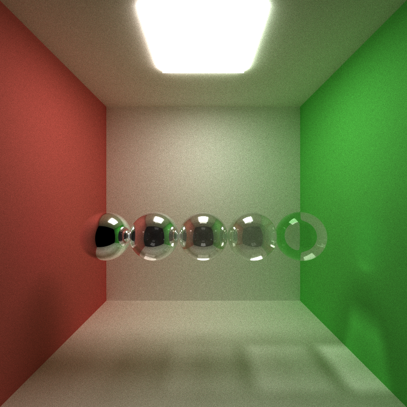

CUDA Path Tracer
================

**University of Pennsylvania, CIS 565: GPU Programming and Architecture, Project 3**

* LINSHEN XIAO
* Tested on: Windows 10, Intel(R) Core(TM) i7-6700HQ CPU @ 2.60GHz, 16.0GB, NVIDIA GeForce GTX 970M (Personal computer)

## Overview

In this project, I implemented a CUDA-based path tracer capable of rendering globally-illuminated images very quickly. Path tracing is a computer graphics Monte Carlo method of rendering images of three-dimensional scenes such that the global illumination is faithful to reality (reference: https://en.wikipedia.org/wiki/Path_tracing). Basially, for every pixel of the image, we shoot a ray from the camera, find an intersection, and return a color based on the material, position of the objects & lightsource and so on after a few depths. As this process for every pixel is relatively similar, we can use GPU to run the programs simultaneously to make the path tracer faster.

## Features

* Ideal Diffuse surfaces
* Perfectly specular-reflective surfaces
* Stream Compaction
	* By using stream compaction, we can remove the paths that have terminated;
* Material sort
	* Sort the rays/path segments so that rays/paths interacting with the same material are contiguous in memory before shading;
* First bounce intersection cache
	* Cache the first bounce intersections for re-use across all subsequent iterations;
* Refraction with Frensel effects
	* Refraction (e.g. glass/water) with Frensel effects using Schlick's approximation or more accurate methods;
* Physically-based depth-of-field
	* Physically-based depth-of-field by jittering rays within an aperture;
* Stochastic Sampled Antialiasing
	* Make the image smoother by add rays for sub-pixel sampling;
* Motion blur
	* Defining object motion, and motion blur by averaging samples at different times of iterations;

## Results

All the images below are rendered with 5000 samples and 8 depths if there is no special statement.

### Diffuse and specular-reflective surfaces


I adjust the emittance of emissive material of the light in the following images to be larger to show the features better.

### Refraction with Frensel effects

(Reference: https://graphics.stanford.edu/courses/cs148-10-summer/docs/2006--degreve--reflection_refraction.pdf)


From left to right: Full Diffuse, Full Reflection, Full Refraction

#### Refractive index


From left to right(Refractive index): Water(1.33), Olive oil(1.47), Flint glass(1.62), Sapphire(1.77), Diamond(2.42)

(Reference for data from https://en.wikipedia.org/wiki/Refractive_index)

#### Probablity for different materials:



From left to right(Reflective/refractive): 1/0, 0.75/0.25/, 0.5/0.5, 0.25/0.75, 0/1


From left to right(Diffuse/refractive): 1/0, 0.75/0.25/, 0.5/0.5, 0.25/0.75, 0/1


From left to right(Reflective/Diffuse): 1/0, 0.75/0.25/, 0.5/0.5, 0.25/0.75, 0/1

### Physically-based depth-of-field

(Reference for DOF from Physically Based Rendering, Third Edition p374)

(Reference for Concentric Sample Disk from https://www.dartdocs.org/documentation/dartray/0.0.1/core/ConcentricSampleDisk.html)


For the image above: focal distance = 3, lensradius = 0.1;

|no DOF | With DOF |
|------|------|
| |  |

For the image with dof above: focal distance = 10.5, lensradius = 0.5;

### Stochastic Sampled Antialiasing


Left: Without Stochastic Sampled Antialiasing; Right: With Stochastic Sampled Antialiasing;

|no AA | With AA |
|------|------|
| |  |

### Motion Blur

|no Motion Blur | With Motion Blur |
|------|------|
| |  |

For the image with Motion Blur above: for the cube on the left side, its original translation is [-2.8 5 0], original rotation is[45 0 45], and its final translation is [-1.8 6 1], final rotation is[45,45,45];

Format for moving objects:

```
OBJECT 6
cube
material 4
TRANS       -2.8 5 0
ROTAT       45 0 45
SCALE       2 2 2
ATRANS      1 1 1
AROTAT      0 45 0
```

ATRANS: the object translate [1,1,1] from the original translation.
AROTAT: the object rotate [0 45 0] from the original rotation.

## Performance Analysis

First, let's see the time used per iteration from the start to the end of the whole rendering process for different optimizations of the path tracer:


| Optimization     | NOTHING | CACHE_FIRST_BOUNCE | STREAM_COMPACTION | SORT_MATERIAL |
|:-----------------|:--------|:-------------------|:------------------|:--------------|
| ms per iteration | 50.1653 | 50.116             | 84.8758           | 319.047       |

We can see from the data above that only CACHE_FIRST_BOUNCE optimization is faster than the original one. When we cache the first bounce intersections for re-use across all subsequent iterations, it did save a little time but not so obvious. As for STREAM_COMPACTION and SORT_MATERIAL optimization, the sort and remove_if function cost way more time than the time saved in 
ShadeMaterial function, which leads to the more time wasted in per interation.

Next, let's see the time used in shadematerial function for the first interation as the depth become larger, compared with stream compaction is used or not and the box is open or not.


| Depth(Oepn box) | Stream compaction | No Stream compaction |
|:----------------|:------------------|:---------------------|
| 1               | 1.56384           | 1.55296              |
| 2               | 1.61491           | 1.60032              |
| 3               | 1.4656            | 1.54026              |
| 4               | 1.2528            | 1.43654              |
| 5               | 1.05738           | 1.34506              |
| 6               | 0.886816          | 1.268                |
| 7               | 0.733696          | 1.17837              |
| 8               | 0.614176          | 1.11734              |


| Depth(Close box) | Stream compaction | No Stream compaction |
|:----------------|:------------------|:---------------------|
| 1               | 1.59933           | 1.57213              |
| 2               | 1.68032           | 1.65667              |
| 3               | 1.75584           | 1.72659              |
| 4               | 1.75562           | 1.73251              |
| 5               | 1.71878           | 1.72067              |
| 6               | 1.68742           | 1.71328              |
| 7               | 1.65968           | 1.69434              |
| 8               | 1.62579           | 1.6759               |

We can see from the data above that as the path that terminated has been removed by using stream compaction, time used in ShadeMaterial function is less compared to the one that not using stream compaction. Though the time used is less, as I mentioned above, the remove_if function cost way more time than the time saved in ShadeMaterial function, which makes the each interation way slower. However, when compared with open box and close box, we can see that the time used in open box becomes much less as the depth becomes larger, that's because light can't excape from a close room, which makes the path harder to terminate, so the stream compaction will not  have obvious effect in close room compared with the open one.