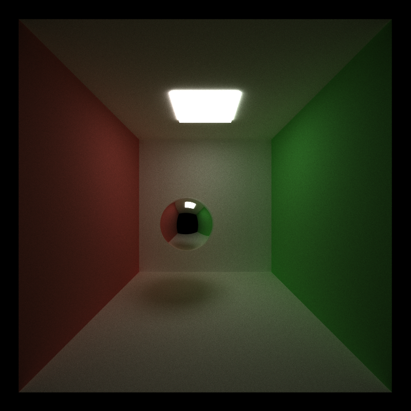
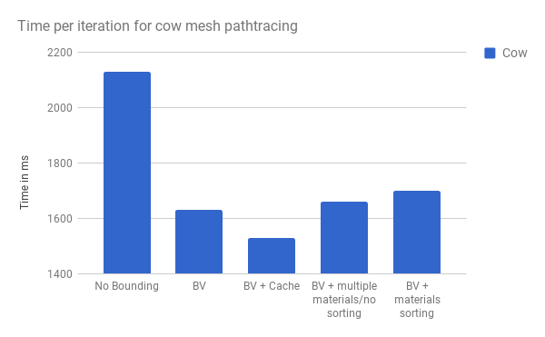
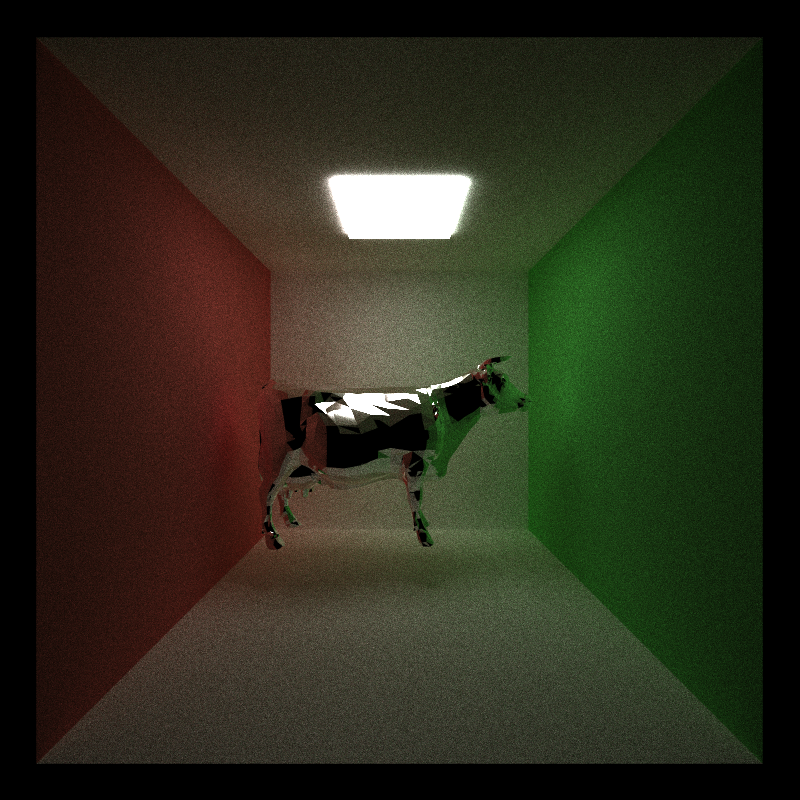

CUDA Path Tracer
================

**University of Pennsylvania, CIS 565: GPU Programming and Architecture, Project 3**

* Wenli Zhao
* Tested on: Windows 10 Pro, Intel Xeon CPU CPU E5-1630 v4 @ 3.70GHz 32GB, NVIDIA GeForce GTX 24465MB (Sig Lab)

### README

For this project, I implemented features on top of a skeleton renderer.

The core features include:

* A shading kernel for specular and ideal diffuse surfaces.
* Path termination using stream compaction
* A toggleable option to sort path segments based on materials.
* A toggleable option to cache the first bounce of intersections for all iterations/first bounces.

The additional features include:
* Anti-aliasing
* Depth of field
* Arbitrary mesh loading and rendering with toggleable bounding volume intersection culling
#### Figure 1: Anti-aliasing before

#### Figure 2: Anti-aliasing after

#### Figure 3: Depth of Field

#### Figure 4: Arbitrary mesh loading

### Analysis

### Core feature performance

#### Figure 5: Specular Sphere

#### Path termination
Path termination gets rid of path segments that don't hit any objects or lights in the scenes. In the scene, we begin with 640000 path segments because of our initial screen resolution and this tapers off immediately because the cornell box is an open box where plenty of rays will escape into the darkness. By the 7th bounce, there are only around 140000 bounces remaining for an iteration of pathtracing on Figure 5 above.

#### Figure 6: Number of Pathsegments vs. Bounces

#### Materials sorting
Materials sorting actually slowed down the speed of each iteration quite a bit. For a single specular sphere object in a diffuse cornell box, the materials sorting slowed the iteration time from 44ms to 101ms. For a specular dodecahedron, it slowed the iteration time from 54ms to 112ms. However for a specular cow object with over 5000 triangles, the materials sorting only slowed the iteration time from 1660ms to 1700ms.

First, I did not sort by actual material type and only by material id. This meams that I did not fully take advantage of the material sorting optimization. Also, the scenes I tested on were not too complex and onl had two materials. If there were more materials, and the final coloring of the materials required global memory reads or more complex operations, than materials sorting may have actually increased the efficiency of the pathtracing. However, for my simple scenes, material sorting slowed down my pathtracer.

#### Intersection caching
Caching the first bounce of the intersection did not make a huge difference for simple scenes without many intersections. For the simple specular sphere scene in figure 5, it reduced the iteration time from about 45ms to 42ms. However, for a specular cow, it improved the iteration time from 1632ms to 1530ms. The first intersection caching makes a bigger difference when the scene is more complex and calculating the intersections is more costly.

### Additional Features

#### Figure 7: Cow Mesh Performance

#### Figure 8: Specular Cow

#### Figure 8: Dodecahedron Performance

#### Figure 9: Specular Dodecahedron

#### Antialiasing
Antialiasing smooths out the edges of objects in the render. I accomplished this by adding a random x and y offset to the initial ray cast into the scene for each pixel. This did not affect the performance of the pathtracer because it doesn't affect the parallelism of the pathtracer.

#### Depth of Field
Depth of field is an affect that blurs some depths of the scene and brings others into focus. In order to add depth of field to the scene, I simulated a camera lens by modifying the initial ray cast into the scene. Similar to anti-aliasing this did not affect the performance of the pathtracer.

#### Arbitrary mesh loading
In order to load arbitrary meshes, I used [tinyobjloader](https://github.com/syoyo/tinyobjloader). I modified the scene files to include a new geometry type, mesh. I added the obj to the scene using a new buffer containing all the triangle geometry. In pathtrace.cu, I check the rays against a bounding volume box that contains the obj. If the ray intersects the bounding box, then I check triangle intersection with all the triangle geometry of that object. The bounding volume made a substantial performance difference in the iteration of the cow mesh. Without the bounding box, an iteration of the cow pathtracing took 2130ms. The bounding box brought this down to 1632ms. This feature could be optimized with better acceleration structures such as an octree or BVH tree.

