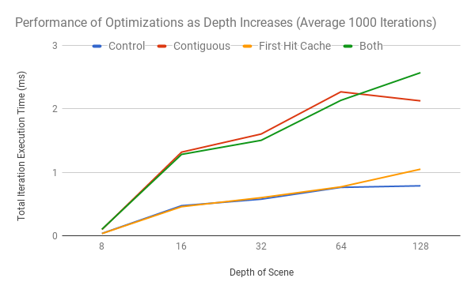

CUDA Path Tracer
======================

**University of Pennsylvania, CIS 565: GPU Programming and Architecture, Project 2**
* Timothy Clancy (clancyt)
* Tested on: Windows 10, i5-4590 @ 3.30GHz 8GB, GTX 970 4GB (Personal)

## Features

*A GPU Path Tracer featuring diffuse and specular materials, depth of field, antialiasing, and more.*

|||
|:-:|:-:|
|An example of the path tracer iterating in action.|An example render after many iterations.|

This path tracer is optimized to parallelize by ray, effectively tracking the number of bounces, direction, and color of each pixel. Rays terminate when they encounter a light, leave the scene, or after some number of bounces based on scene depth.

*An example of how scene depth, the number of times a ray bounces in a scene, can impact the resulting rendering: 500 iterations, no optimizations, antialiasing, direct lighting, and depth of field enabled.*

|||||
|:-:|:-:|:-:|:-:|
|Depth of 16|Depth of 32|Depth of 64|Depth of 128|

### Antialiasing

|||
|:-:|:-:|
|No antialiasing.|With antialiasing.|

This solution featurs antialiasing, implemented by randomly offsetting the camera's ray when fired into the scene. This random offset, across many iterations, introduces a smoothing effect by preventing us from always sampling the same exact pixels. It helps blend in subpixel-level details.

### Depth of Field

|||
|:-:|:-:|
|Slight depth of field.|Extreme depth of field.|

Depth of field is simulated in this solution by implementing the equations from page 374 of [*Physically Based Rendering: From Theory to Implementation*](https://www.google.com/url?sa=t&rct=j&q=&esrc=s&source=web&cd=2&cad=rja&uact=8&ved=0ahUKEwjk7M_D_dDWAhVK6iYKHY7GDZcQFggxMAE&url=http%3A%2F%2Fwww.pbrt.org%2F&usg=AOvVaw3WU9JqwMa58xo6ZrCzuf90). With this implementation, we simulate the effects of a curved lens on our camera. The focal distance and lens radius influence how the scene is perceived: some objects are blurred based on their distance from the camera.

### Direct Lighting

*In this graph, of the test scene after 500 iterations with a depth of eight, one can notice that the direct lighting brings in a very subtle enhancing of shadows. This is particularly visible in the corners of the room.*

|||
|:-:|:-:|
|Direct lighting disabled.|Direct lighting enabled.|

Direct lighting in this project is implemented by detecting when a ray has terminated on a surface which is not a light, and then randomly selecting a light-emitting piece of geometry in the scene to fire one last bounce towards. If the ray is able to reach the light, it is brightened. Otherwise, the ray is set to black. Over many iterations, the random shadows and bright spots are smoothed out into interesting illumination features. This simple change has the effect of subtly emphasizing surfaces which are directly illuminated by lights.

## Performance Analysis

The features demonstrated here all serve to make the path tracer produce more realistic, visually-interesting results. How do they affect performance, however? To benchmark this, I measured the average execution time of an iteration after 1000 iterations in the same test scene with a depth of eight. I separated this execution time across four distinct phases of the iteration: the time it took to actually trace the scene for intersections, the time it took to complete shading of the scene, the time it took to make memory contiguous by material (if enabled) and the time it took to use stream compaction to remove rays which have terminated on lights or by exiting the scene. These are the results:

  

As one can see, the runs are fairly similar to one another, with the bulk of the time being spent performing the actions needed to make paths and intersection data contiguous in memory by material. From this graph we can see two things: the visual enhancements don't seem to cause an appreciable slowdown and making memory contiguous does not seem to be worth it. Compared to the baseline implementation, adding antialiasing, direct lighting, and depth of field made the scene look better without a large slowdown. This is reassuring regarding the efficiency of my implementation.

### Contiguous in Memory

This path tracer comes with a setting to toggle whether or not intersection and ray data should be made contiguous in memory by the material they are associated with before shading. That is, all rays hitting a particular material will be next to each other in memory. As we can see from the graph above, this caused a rather dramatic performance hit. This could be due to the fact that this test scene only has five materials and is fairly low resolution. The overhead to reorganize all of that information is much greater than the time it takes to actually shade the screen.

### Cache First Hit

The second performance optimization is caching the first hit for a given orientation of the scene. This first hit is determined entirely by the camera, and is the same across all iterations of an orientation. Therefore, it can be reused for looking up what the first "depth" target in an iteration should be. This comes with two observations. First, the benefit of caching decreases as the depth count increases, because the time saved by looking up the cached value on the first iteration is dwarfed by the number of randomized bounces which still need to be computed. Second, this caching precludes us from doing any sort of nondeterministic actions with the camera. If we were to leverage randomization for implementing features such as antialiasing or depth of field, this first hit would be a different ray across iterations and caching could be of no benefit to us.

The following graph considers these two optimizations across various depths. It computes the average total iteration time across 1000 iterations for implementations with no antialiasing, depth of field, or direct lighting. It compares the performance of the control implementation, the implementation with contiguous memory rearrangement activated, with first hit caching activated, and with both optimizations activated.

  

Here we unfortunately don't see any real practical gains from our theoretical optimizations. The trials featuring the contiguous rearrangement are typically taking longer and tracking one another, while the first hit cache tracks the control. Towards the end, it falls off, as we would expect. Interestingly, at the extreme depths the first hit cache does seem to improve the otherwise poor performance of memory rearrangement alone.

### Bloopers

|||||
|:-:|:-:|:-:|:-:|
|Too bright!|Bad light!|Still bright!|Just right!|
