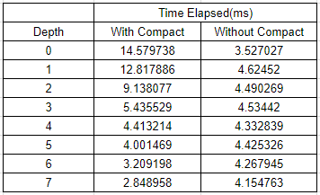

CUDA Path Tracer
================

**University of Pennsylvania, CIS 565: GPU Programming and Architecture, Project 3**

* Mohamed Soudy
* Tested on: Windows 10 Pro, i7-7700HQ @ 2.80GHz 16GB, GTX 1080 with Max-Q Design 8GB (Personal Computer)

## Overview

Naive Implementation of Monte Carlo Path Tracer on the GPU. Features implemented include antialiasing, refraction and motion blur. 

## Analysis

### Stream Compaction

Performance improvements with stream compaction weren't apparent until the trace depth is increased over 100. This is probably
because the overhead from stream compaction is too much and is not worth using unless the trace depth is really high; allowing the
performance boosts that come from stream compaction to outweigh the overhead that come with it.

### Caching First Bounce

Caching the first bounce intersections improves performance but not dramatically. Since the performance depends greatly on the number of intersections
computed in the first bounce, the impact of caching will be clearer with more intersections. This can be simulated by increasing the image size as
shown in the chart below.

### Material Sorting

Sorting based on materials before shading didn't improve performance. In fact, it was much worse than not sorting. The idea behind sorting the materials
was to sort rays interacting with the same material to be contiguous in memory. This will allow rays in warps to not have to wait for other rays which interact
with other material types which might take much longer to finish. However, since the number of rays with a specific material type is not necessarily a factor of 32,
some warps might still contain rays with more than one material leading us back to our initial problem. Therefore, sorting before shading leads to adding sorting
overhead with no added benefit.

## Antialiasing

By jittering the rays, we can achieve the effect of antialiasing as shown in the images below. The sphere in the image on the left has hard edges while the
sphere in the right image has smooth edges.

## Refraction

The image below shows two cloudy colored spheres having a transmissive and reflective material. Schlick's approximation is used to approximate the specular
reflection coefficient. Both spheres reflect the light source on their respective surfaces and have caustics which can be seen on the walls.

## Motion Blur

The motion blur effect can be achieved by transforming geometry using sin with respect to the iteration number (time). Since this is done in parallel
a copy of the original transformation of the object needs to be preserved to be used across all the path segments for every iteration. 
The images below show examples of the motion blur effect by transforming the object in hand along the y-axis using sin.  

