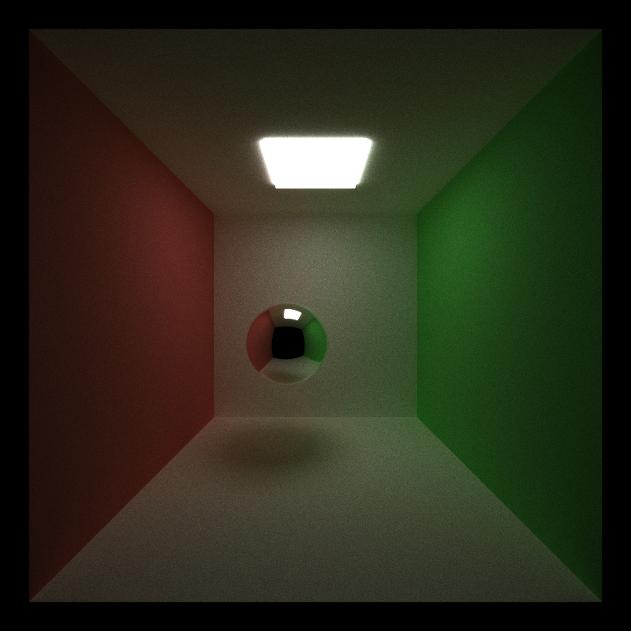
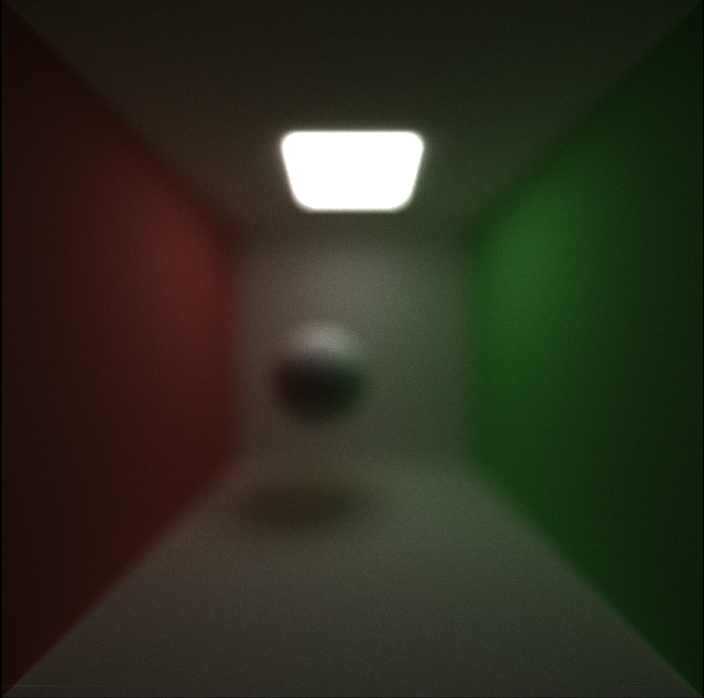
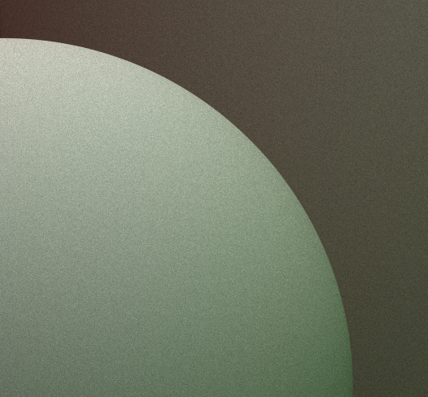
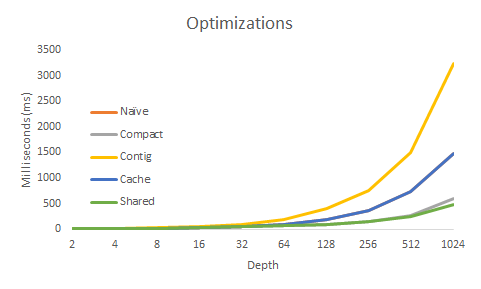

CUDA Path Tracer
================

**University of Pennsylvania, CIS 565: GPU Programming and Architecture, Project 3**

Sarah Forcier

Tested on GeForce GTX 1070

### Overview

This project introduces a simple CUDA Monte Carlo path tracer. A path tracer is a highly parallel algorithm since each pixel of the image casts a ray in the scene and accumulates color until reaching a light. An algorithm designed for the GPU takes advantage of this parallelization and creates a seperate thread for each pixel. This path tracer handles diffuse and specular materials, arbitrary mesh objects along with simple spheres and cubes, and real lens-based cameras with variable depth-of-field. To achieve addition acceleration, the path tracer culls intersection test with bounding volumes, sorts intersections in order of materials, caches each pixels' first bounce, and removes terminated ray with stream compaction.    

### Path Tracing Features

#### Materials

| Ideal Diffuse | Perfect Specular |
| ----------- | ----------- |
|  |  |

#### Arbitrary Mesh Loading

The path tracer loads vertices, indices, normals, and uv coordinates with the open-source [tiny obj loader](https://syoyo.github.io/tinyobjloader/) library. While the uv coordinates are not currently used, they can be used to texture map, but since global memory access is comparitively slow, loading a texture would dramatically slow each iteration. For this reason, GPU accelerated path tracers have not been adopted in animation or VFX studios. 

| Octahedron |  Icosahedron | Dodecahedron| 
| ----------- | ----------- | ----------- |
| 8 Triangles |  20 Triangles | 36 Triangles | 
|  |  |  |

| Cylinder |  Torus | Helix | 
| ----------- | ----------- | ----------- |
| 80 Triangles | 200 Triangles |  492 Triangles |
|  |  |  | 

The above objects were loaded into the scene, with and without bounding volume culling. As seen in the graph below, bounding volumes provide little performance increase. A hierarchical structure created before ray tracing would provide much better acceleration. 

#### Depth-of-Field

Real cameras uses lenses with thicknesses and sizes instead of the pin-hole concept that a naive path tracer is based on. The curvature and size of the lens controls the focal distance (d) and the radius affects how much is in focus. As the radius (r) approaches zero, the images converge to the pinhole construct. Of course in real cameras, focus and aperature are controlled by a system of lenses. The sphere is in focus 11 units away from the camera.

| f = 10, r = 0.2 | f = 11, r = 0.4 | f = 10, r = 0.8 | 
| ------------- | ----------- | ----------- |
|  |  |  |

| f = 5, r = 0.4 | f = 11, r = 0.4 | f = 15, r = 0.4 | 
| ------------- | ----------- | ----------- |
|  |  | 

In order to achieve depth-of-field, both CPU and GPU path tracers sample points on a circle (the imaginary lens) and trace rays through this point instead of a pinhole without affecting performance. There are many sampling algorithms for chosing this point. I used uniform disk sampling for the least bias. 

#### Antialiasing

The images below demonstrate the quality improvement antialiasing provides - the sphere transition appears smoother with anti-aliasing. This feature is achieved by jittering the ray spawned from the camera so that each iteration spawns a slighly different ray. In the case of the pixels on the sphere edge, jittering the ray will cause the ray to sometimes hit the sphere and sometimes hit the back wall, and the result is a smoothed average of these different events.

| Naive | Antialiasing | 
| ------------- | ----------- | 
|  |  | 
|  |  |

Antialiasing is a simple feature that provides great image improvement without affecting performance and is not changed between GPU and CPU versions. This implementation simply takes a random 2D sample within the pixel square. However, there are many other sampling distributions, such as stratified or blue-noise dithered, that look better in Monte Carlo path tracing. 

### Optimizations

* Ray Termination

On the CPU, path tracing is a recursive algorithm. However, this is not possible on the GPU, so instead path tracing must be iterative. To terminate rays, the array of rays is stream compacted and only active rays are analyzed in the next iteration. This optimization provides benefits for large depths.  

* Shared Memory Stream Compaction

This feature is an optimization to the stream compaction algorithm used to removed terminated rays from later iterations. Shared memory is used speed up memory access by reducing the number of global access needed. See the GPU accelerated stream compaction [algorithm](https://github.com/sarahforcier/Project2-Stream-Compaction) and [reference](https://developer.nvidia.com/gpugems/GPUGems3/gpugems3_ch39.html). This algorithm could be further improved by changing our memory access pattern to avoid bank conflicts.

* Sorted Materials

This optimization sorts the pixels based on the materials the current ray intersects. In theory, this optimization should provide a performance increase because all the paths interacting with the same materal are contiguous in memory before shading. However, the shading kernel does not perform many global memory access, but instead does a lot of computation which do not benefit from contiguous memory. Sorting takes more time than is saved, so this feature does help performance. 

* Cache first bounce intersection

The naive and cached graphs are overlayed because caching the first bounce does nothing to performance. In addition, when antialiasing is used, the first ray is not the same, so caching does not accelerate later iterations. 

### Controls

* Esc to save an image and exit.
* S to save an image. Watch the console for the output filename.
* Space to re-center the camera at the original scene lookAt point
* left mouse button to rotate the camera
* right mouse button on the vertical axis to zoom in/out
* middle mouse button to move the LOOKAT point in the scene's X/Z plane