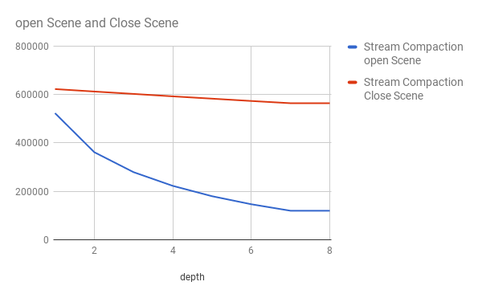
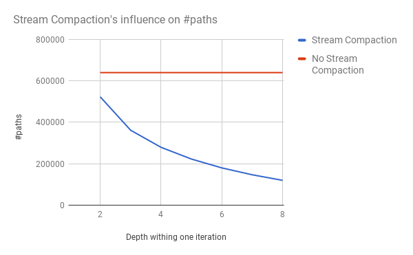

CUDA Path Tracer
================

**University of Pennsylvania, CIS 565: GPU Programming and Architecture, Project 3**

* Name: Jiahao Liu
* Tested on: Windows 10, i7-3920XM CPU @ 2.90GHz 3.10 GHz 16GB, GTX 980m SLI 8192MB (personal computer)

Project Description
======================

This projects implements the naive path tracer and direct light path tracer( Refering to PBRT, Phisically Based Rendering Thried Edition)

Features implemented
======================

All the feature can be turned off by changing define value in pathtrace.cu from line 21 to line 26. 1 represents for turned on and 0 represents for turned off.

### Naive Path Tracing with Fresnel

* Naive Path Tracing refer to PBRT. Fresnel is implemented in src/interactions.cpp for material with both BRDF and BTDF property.
* Fresnel will not influence performance. Acceleration can only be applied on float number calculation.
* GPU has more threads then CPU, makes the integrator runs much faster then CPU path tracing.
* The frame work starting with missed some important feature used in PBRT. Framework need to be changed if want to add more feature.

### Direct light

* Simple direct light with fake Sample_Li assuming the light is a cube. Refer to PBRT.
* Runs faster then Naive because each path will not bounce.
* For steady scene, cache the first intersection will largely improve the performance.
* GPU version runs faster then CPU version due to the number of threads in parallel.
* Could implement a better shadow checking function.

### Direct light

* Realistic Camera. Focal distance is set on the backwall so the sphere between camera and backwall is blured. Randomly choosing starting ray from a virtual lens in front of the camera.
* Slightly slower for each iteration because need more computation and code to find the ray generated from camera.
* No difference implementing on GPU and CPU for a single threads.
* Could implement parameters reading for lens instead of hard coding into source code.

### Motion Blur

* Motion Blur. With sphere moving a clear bluring trace is rendered.
* No difference in running time. In confliction with caching the first bounce due to the changing scene.
* No difference implementing on GPU and CPU.
* Could cache scene for each frame instead of copy from ram. This will reduce the running time.

Performance Analysis
======================

### Caching the first bounce

This optimization is tend to cache the first bounce if the intersections for the fist bounce does not change. Not applicable for realistic camera and motion blur.

This optimization is not so obvios if the maximum path depth is large. This optimization only reduced the running time for the first depth, which means larger maximum path depth will make the optimization time less obvious.

### Sorting material for shading

This optimization influence the runnig time of shading for each depth within a typical depth. This optimization sorts all the path before shading, making paths have the same material continuous on memory.

It is obvious the running time for each depth is reduced with sorted paths. For threads in the same block,it will cost less time for copying data to cache if they all want the information for a single material. However the sort it self need to access different material several times, which actually increase the running time for each iteration.

### Stream compaction

Stream compaction will drop paths with no remaining bounces and only run threads for those still have bouncing numbers.

Stream compaction reduces the number of paths effectively in open scene, which will have a lot ray shooting to void each depth. This optimization works well for open scene.