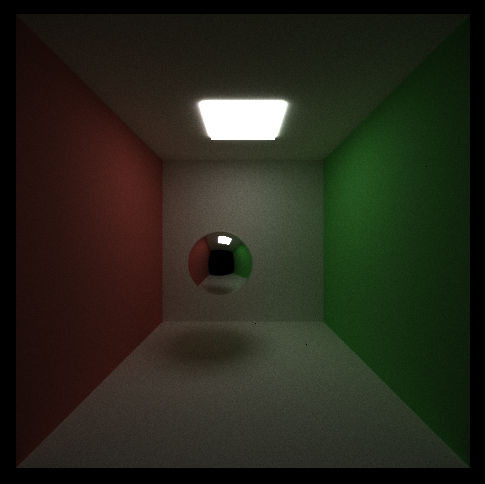
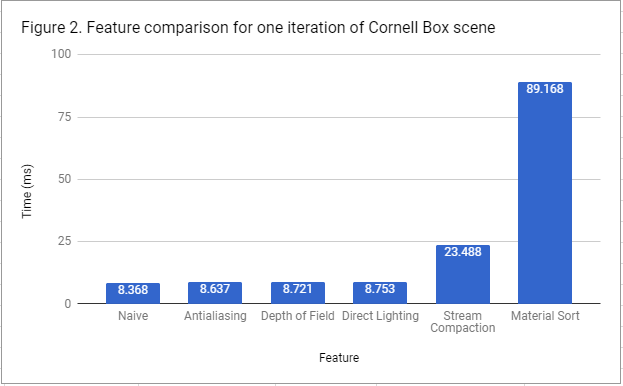

CUDA Path Tracer
================

**University of Pennsylvania, CIS 565: GPU Programming and Architecture, Project 3**

* Mohamad Moneimne
* Tested on: Windows 10, Intel Xeon @ 3.70GHz 32GB, GTX 1070 8120MB (SigLab Computer)

### Overview

In this project, I was able to implement a simple CUDA Monte Carlo path tracer. The overall goal of the project was to understand how a typically CPU-based application, such as path tracing, might be implemented on the GPU. Of course, path tracing is a highly parallel algorithm if you think about it. For every pixel on the image, we cast a ray into the scene and track its movements until it reaches a light source, yielding a color on our screen. In this project, every pixel's ray is dispatched as its own thread, for which intersections and material contributions are processed on the GPU. 

### A Naive Path Tracer

To begin with, I simply stuck with rendering basic shapes without any additional features. These included rendering diffuse and specular materials with light contributions from area lights. As expected of a Monte Carlo path tracer, samples are processed in sequence. For each sample, a kernel casts a ray for each pixel into the scene and bounces up to some terminal depth. If an ray interescts a light source or nothing, the ray will either return an accumulated color along bounces or black, respectively. If a ray bounces around the scene and fails to reach a light source by the maximum depth condition, the sample's contribution is void and black is returned. With this, we can create simple images such as these Cornell Boxes with 5,000 samples and a ray depth of 12 bounces.

### Stream Compaction for Ray Culling

An important observation can be made about our naive path tracer. At each depth of a single sample iteration, we always dispatch a kernel with a number of threads that equals the number of pixels being processed. This is wasteful! Consider a ray that misses the scene completely when it is first cast into the scene. We know this ray should return black, but the ray is still dispatched in a kernel at every depth (up until a maximum depth). In order to remedy this, we can use stream compaction at every bounce to cull rays that have already determined their color contribution. This means we will have fewer threads to dispatch for every depth of a single sample, which will allow us to keep more warps available and finish faster at increasing depths.

We expect this to give us a drastic improvement in speed, but here are the timings of a single sample with and without stream compaction on the Cornell Box scene.

As can be seen here, stream compaction ends up being slower! This is likely because there is a significant overhead to doing stream compaction compared to not. One observation that we can make is that with stream compaction, the simulation becomes much faster with increasing depth compared to without stream compaction. We only allow our rays to bounce up to 12 times, but in movie productions, rays are likely allowed to bounce much more in order to account for global illumination as best as possible. With a larger depth cap, we would likely see the stream compaction at large depth values have faster speeds than without.

### Material Sorting

Another optimization we can attempt is sorting our rays at each depth by material type. The motivation for this has to do with warp divergence. Consider a megakernel that processes the shading of all possible materials in our path tracer. A switch statement can be used to determine what type of material our ray intersects before calling a function that will process the material. This switch statement is the source of a possible divergence in which each thread in a warp is processing a different kind of material, leading to a sequential processing for each thread within the warp. 

To remedy this, we can sort the rays by material type and minimize warp divergence. This means that if a scene has _n_ types of materials, we can only have up to _n-1_ warp divergences. Sorting by material should give us significant gains when looking at the bigger picture, but we can expect that sorting will only slow down our simulation because of the simplicity of our materials. Diffuse surfaces are the most complex materials in our scene, which only need about 20 lines of code to process (including BRDF computation and spawning a new ray). Reflective surfaces are processed with a glm::reflect call. Finally, light surfaces and missed intersections are processed with a single line of code. This means in the worst case, a warp will need to finish the computations for each material in sequence, which actually isn't that bad with our sparse material set. Consider highly complex shaders such as car paint materials. These can take hundreds of lines of code to process, for which we would notice a much larger performance hit if we had to wait.

### Feature Comparison

Here is a comparison of the time it takes to process a single sample in the path tracer with various features turned on for the Cornell Box scene.

**Material Sorting**

As can be seen, material sorting has a large enough overhead for it to cause the largest slowdown (about 10x slower). As mentioned above, this optimization likely starts to shine with multi-hundred line shaders for more complex materials. Implementing materials like these are outside of the scope of this project, but we can still probably predict gains in this situations.

**Antialiasing**

As a part of this project, I also added antialiasing by jittering the initial ray cast from the camera between samples. We do this by generating a random _x_ and _y_ offset for a ray within the context of a single pixel. This allows us to generate rays that don't always hit the same initial intersection, which can cause jagged edges in our renders. With an added random jitter, we can see smoother results, noteably on the edges of the sphere and the corners of the Cornell Box.

As can be seen in Figure 2, we only incur a slight time penalty for having to generate the random samples upon initial ray generation. It is worth noting that implementing a first-bounce cache becomes unnecessary with antialiasing because we are no longer generating the same intial intersections for every sample.

**Depth of Field**

Another fun feature that can yield interesting visual results is depth of field. This allows us to model the camera as a lens with a specific radius and focal plane. We assume the lens to be infinitely thin and specify a distance that we want to be in focus. With this information, we generate a random sample on a disk of the same radius as the lens and use it as an offset from the original ray towards the focal point. Here is a render of the result when focusing at the center of the Cornell Box. Notice that the sphere is in focus while portions of the walls closer and farther from the camera start to blur.

Similarly to antialiasing, we only incur a slight time penalty because we have to generate these extra samples on the lens when generating the initial ray.

**Direct Lighting**

Another observation we can make is that on any iteration, a large number of rays reach their final depth without hitting a light source or missing the scene. When this happens, we return black as if the ray would have never hit the ligt anyway. This is fairly wasteful considering we have done all the work leading up to the final depth, only to be cut off. Maybe had the ray been given one more chance to bounce, it could have hit the light source. We remedy this problem by using a technique called direct lighting.

When a ray has reached its max depth and hasn't hit the light source yet, we decide to give it one last chance. The simulation chooses a random light source and generated a random point on the surface of that area light. We then cast one final ray towards this point, giving the ray some color based on the light source if the point is visible. This allows our renders to converge faster than before considering fewer paths return black! With this, we get slightly more illuminated scenes, as can be seen here.

As can be seen in Figure 2, direct lighting doesn't incur much of a penalty. For a subset of rays that haven't reached a light source, we only ask them to attempt one more raycast. In the worst case, this increases our depth by 1 for all rays.

**Stream Compaction**

We already analyzed why stream compaction is slower than naive path tracing in the case of our Cornell Box scene, which explains the results in Figure 2. However, I thought it would be interesting to also test a scene that is much more sparse. I created a scene with only two spheres: a light source and a diffuse sphere. This means that a majority of our paths should miss intersections on the first bounce and become faster almost instantly.

We see that stream compaction is much faster than in the Cornell Box scene, but it is still slower than the naive implementation. This is likely because we still have an overhead of stream compacting the rays. We might notice stream compaction overtake the naive algorithm if we were rendering a scene with a much larger resolution, but for the time being it seems that the naive algorithm dominates for the simple scenes we are rendering.

The remaining features stay fairly consistent with the previous results in Figure 2. The only difference is that direct lighting is no longer slightly slower than the naive path tracer because we will never enter the case in which we need to cast a ray directly to the light source.