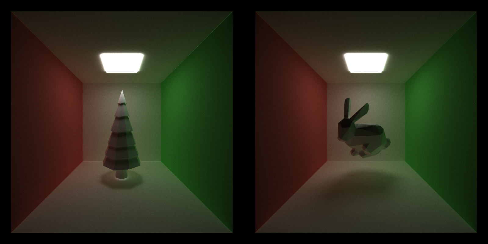
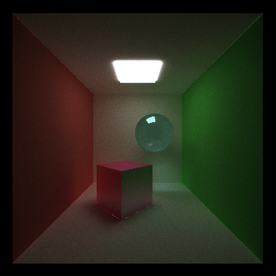
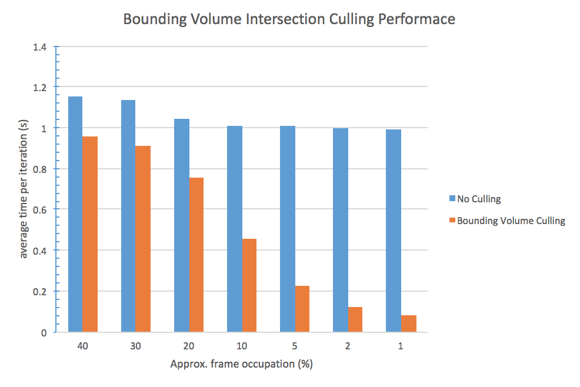
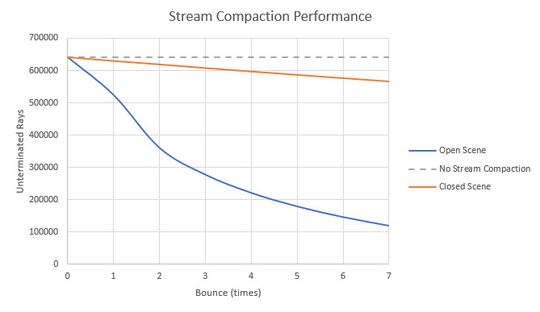
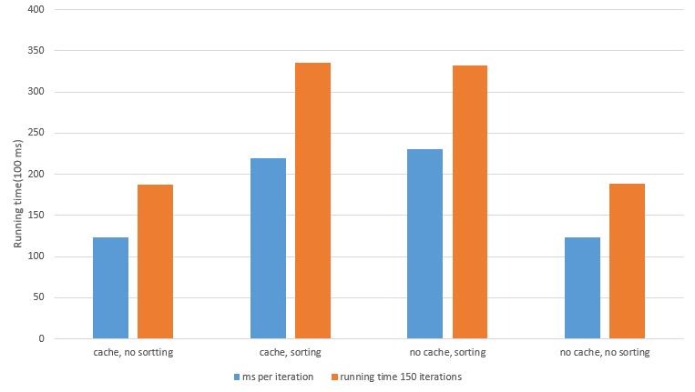
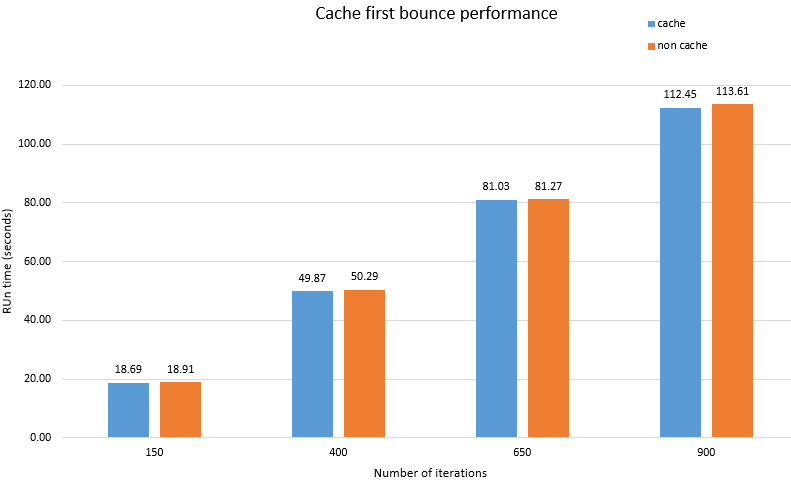

University of Pennsylvania, CIS 565: GPU Programming and Architecture, Project 3 CUDA Path Tracer
======================
* Ziyu Li
* Tested on: Windows 7, Intel Core i7-3840QM @2.80GHz 16GB, Nvidia Quadro K4000M 4GB

## Features
#### All Features
 - A shading kernel with BSDF evaluation
	 - Ideal diffuse surfaces
	 - Perfectly reflective surfaces
	 - Non-Perfectly reflective surface
	 - Refraction with Frensel effects
 - Depth of Field
 - Anti-Aliasing
 - Motion Blur (with Batch Render)
 - Arbitrary mesh loading and rendering with bounding volume intersection culling
 - Path continuation/termination using Stream Compaction
 - Sort rays/pathSegments/intersections contiguous in memory by material type
 - Cache first bounce

#### Shading Kernel with BSDF
| Diffuse | Reflective | Glossy  | Refractive |
| ----- | ----- | ----- | ----- |
|  |  |  |  |

(Figure 1-4: Diffuse, Reflect, Glossy, Refract Shading)


#### Depth of Field


(Firgure 5: Depth of Field Comparison)

#### Anti- Aliasing


(Firgure 6: Anti- Aliasing Comparison)

#### Motion Blur


(Firgure 7: Motion Blur Comparison)
#### Mesh Loading and Rendering


(Firgure 8: Mesh)

For loading custom *.obj mesh into program please use the following format in scene file.

```
OBJECT   [number]
mesh       // indicate a custom mesh
material  [material_id]
TRANS     [x] [y] [z]
ROTAT     [x] [y] [z]
SCALE     [x] [y] [z] 
FPATH	  [relative_path]   // relative path for *.obj file
```


**Third-party loading mesh function are list below**
> tinyobjloader 
>
> https://github.com/syoyo/tinyobjloader


#### Batch Render (Only support Windows 7+ OS or Windows Server 2012+ with .Net Framework)


(Figure 9: Batch Render)

**For render a sequence of images, please read the following instructions.**
First you have to assign animation to at least one object in scene. This will need to make some slightly change in scene file.

```
OBJECT   [number]
[type]
material  [material_id]
TRANS     [x] [y] [z]
ROTAT     [x] [y] [z]
SCALE     [x] [y] [z] 
FPATH	  [relative_path]   // option
MT          [x] [y] [z]     // Translation
MR          [x] [y] [z]     // Rotation
```

After this, you already define a basic animation.

The batch render is achieved by executing a series command by Windows PowerShell. Most of time, executing such script need OS grant such operation. So first make sure your system grant the execution policies set on host. If you not sure about that or system need such permission, please running the following script in Windows PowerShell as administrator. 

> Set-ExecutionPolicy RemoteSigned

For more information, see https://technet.microsoft.com/en-us/library/ee176961.aspx

Now, your system is ready to execute Windows PowerShell script.
Here's one test script already in **batch** folder, feel free to test or change the script. (Please make sure the both ray tracing program and powershell script is under same directory.)


## Performance Analysis
#### Timing
Use argument "**-t**" to output each iteration time

```
cis565_path_tracer.exe [scene_file] [time] -t
```

#### Bounding Volume Intersection Culling
Bouding Volume Intersection Culling termiates the intersection test of this object when the ray outside the object bouding volume.
Basically, a small object or a object far from camera will get benifit from this feature.

Bounding Volume Intersection Culling Test:
| Object | Materials | Iterations | Effects | Other Optimize | 
| ----- | ----- | ----- | ----- | ----- | 
| lowpolytree.obj | Diffuse | 5000 | N/A | N/A | 

Result:


#### Path Continuation/Termination Using Stream Compaction

Stream Compaction Performance Comparision:
Object | Materials | Iterations | Effects | Other Optimize
 ----- | ----- | ----- | ----- | ----- 
lowpolytree.obj | Diffuse | 5000 | N/A | Stream Compaction vs N/A


Stream Compaction Performance Comparision of Open/Closed Scene:
Object | Materials | Iterations | Effects | Other Optimize
 ----- | ----- | ----- | ----- | -----
lowpolytree.obj | Diffuse | 5000 | N/A | Stream Compaction



#### Sort Rays/PathSegments/Intersections Contiguous in Memory by Material Type

Based on benchmark, it seems no different for a *complex scene*(1). However, there are some performance lost in the *simple scene*(2) test. The reason of that could be the sorting kernel occupies too much computation in each iteration. But for a complex scene, that could be trivial compare to computate a huge amount of ray interation. 



#### Cache first bounce

Based on benchmark, a complex scene can get some benifits from caching. But for a simple one, the performance boost is trivial.




(1) *complex scene* : approx. 300-400 triangles with 3 materials
(2) *simple scene*  : 8 spheres with 6 materials