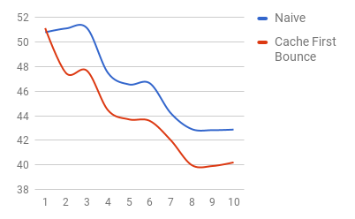
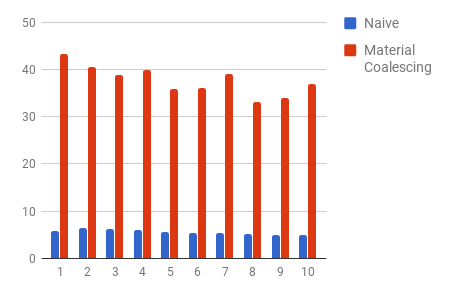
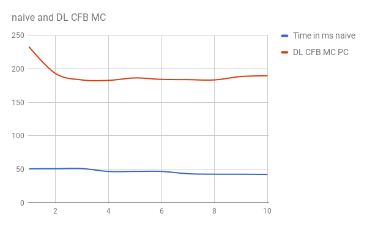

CUDA Path Tracer
================

**University of Pennsylvania, CIS 565: GPU Programming and Architecture, Project 3**

* Rudraksha Shah
* Tested on: Windows 10, i7-7700HQ @ 2.80GHz 16GB, GTX 1050 4096MB (Personal Computer)

## Features

* Anti-Aliasing
* Depth of Field
* Materials
     * Diffuse
     * Specular
     * Refractive
* Direct Lighting
    * First Bounce Direct Light based on PBRT
    * Last Bounce Direct Lighting
* Performance Optimizations
    * Stream Compaction for Path Termination and Compaction
    * Material Compaction
    * First Bounce Caching

## Depth Of Field

## Diffuse Sphere

## Specular

## Transmissive

## Scene With Direct Lighting (PBRT)

## Last Bounce Direct Lighting

## Anti-Aliasing
* With AA & Without AA

 

Performance Analysis
===================

* For the following performance analysis the scene consisted of 1 Reflective, 1 Transmissive and 1 Diffuse Surface with 2 Area Lights.

## Naive vs Caching First Bounce (CFB)

* In this test I ran 10 iterations each of depth 8 with the naive path tracer and with the caching for first bounce turned on. 

     

* For enhancing performance we know that for each iteration we generate the same rays from the camera and they intersect the same geometry in the scene. If we store this first bounce intersection information and in the subsequent iteration start from the first bounce bypassing the camera ray generation and intersetion phase we can gain a performance inctrrease. 

* This can be clearly verified from the graph that as we first save the data of the first bounce we lag behind for that iteration due to the slight overhead of copying the data. But the performance gain over the subsequent iterations is very significant and worth the initial expense.

## Naive vs Path compaction (PC)

* In this test I rendered a scene with 20 depth per iteration and checked the time it takes to complete each depth for just naive and with path compaction turned on.

     
    
    

* The GPU runs kernels with 32 threads scheduled together called a `warp`. All threads in a warp start together and end together. our primary goal is to reduce branching in the code so as to reduce branches in a single warp there by efficiently dispaching the warps as fast as possible.

* In order to have all the threads in the warp run the same instrections despite of conditional statements we can use the concept of memory coalescing. After each depth we take all the paths and remove all those paths that are terminated and bunch together all the paths that are still going on. This way when we go for the next depth we iterate over only valid paths that are contigous in memory.

* One would expect this re-structoring of the paths in line with the way GPU `warps` and kernels work would provide a significant boost but we can see that the graph says that instead path compaction makes the path tracer slower. This can reasoned that as compared to the naive path tracing we have to consider the overhead of scanning and compacting the paths arrays over each depth iteration. This can explain the reduced performance

* One important thing to consider is that as we go into subsequent depths the number of paths decrease in each step and the path compaction reaches very close to the naive implementataion.

## Naive vs Material Coalescing (MC)

* In this test I run the naive and the material coalescing version of the path tracer each for one iteration over a depth of 10.

    
    

* Similar to the path compaction stratergy we can gain a performance benefit by reducing the indirections that are caused due to the paths intersecting different materials are jumbled together.

* If we bunch all the paths that are hitting the same material together we can recieve a performance benefit by dispaching the paths faster.

* Intutively this will give us a performance benefit but as we can see in the chart above the compaction significantly lowers the speed of the path tracer. This is because there is a significant overhead of shuffling the data around. Moreover we are doing this for two arrays one of path segments and the other intersections. This will indeed significantly slow our renderer. 

## Naive vs Last Bounce Direct Lighting (LBDL)

* In this test I run 10 itertaions one with naive and the other with last bounce direct lighting turned on.

     

* As a hack way to include direct lighting in the scene for those rays that have reached their trace depths instead of terminating the ray we perform one last step to get the direct lighting effect. We calculate the direct lighting for those rays by spanning a light feeler ray in the direction of a randomly chosen light in the scene and caluclate the final color of the pixel by mixing in the intensity and the color of the light. This way we can gain the effect of direct lighting without any extra effort.  
 
* In an intutive sense these calculations will most likely yield the iteration time to increase as we are performning more calculations per iteration per pixel. But as a shocker I find that the last bounce calculation has reduced the iteration time. After some analysis I feel the problem is not with the path tracer but due to the inconsestancies of floating point errors as I see a distince `fire flies` effect in the scene which are a indication that there is something up with the intersection calculation or z-fighting issue. Though that does not clearly explain the performance boost recived.

# Naive vs LBDL, MC, CFB, PC

* In this test I run 10 iterations of naive path tracer and one with all the above optimizations turned on

     
    

* This was a purely comparision test of how the different optimization scheme can complement each other to reduce the speed.

* Clearly they are not as fast but the peculiar thing to nite is the initial performance gain due to the first bounce caching and the subsequent lack of gain even though the paths will compact and reduce in size which should technically reduce the load over time but the graph has nearly flatlined which is picular and will need furthure investigation to understand.

## BLOOPERS

* It looks like motion blur! But actually it was a problem with my random number generator :)

        

-----------------------
* Thank you for viewing my path tracer if you see any mistakes, typos or incorrect assessment I would love to hear from you!