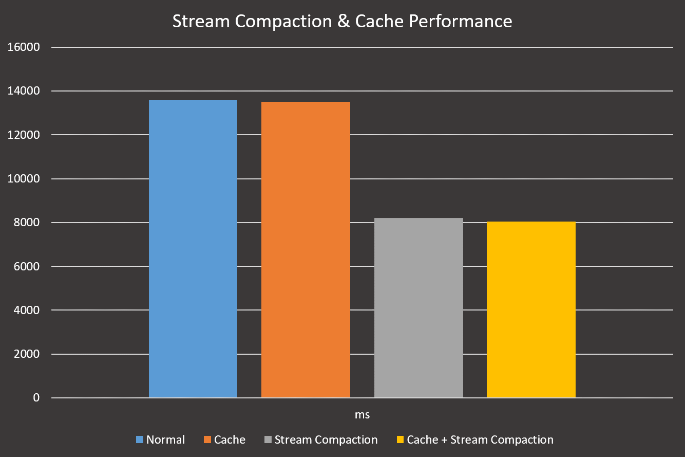

CUDA Path Tracer
================

**University of Pennsylvania, CIS 565: GPU Programming and Architecture, Project 3**

* Byumjin Kim
* Tested on: Windows 10, i7-6700HQ @ 2.60GHz 15.89GB (Personal labtop)

- Scene file : Chromie.txt
- Resolution : 1024 x 1024
- Iteration : 5000

### Complete requirements
- Part 1: Core Features
	- Ideal Diffuse
	- Perfectly specular-reflective
	- Path continuation/termination
	- contiguous in memory by material type
	- cache the first bounce intersections

- Part 2: Make Your Pathtracer Unique!
	- Work-efficient stream compaction
	- Refraction with Frensel effects
	- Physically-based depth-of-field 
	- Antialiasing
	- Texture mapping and Bump mapping
	- Arbitrary mesh loading and rendering with toggleable bounding volume intersection culling

- Part 3: Independent features
	- Physically-based BRDF shading
	- Infinite area light (sky hemisphere light)

### Descriptions

# Ideal Diffuse

When the user sets the material's REFL value to 0.0, Ideal diffuse material is rendered.

- Scene file : cornellDiffuse.txt
- Resolution : 800 x800
- Iteration : 5000

# Perfectly specular-reflective

When the user sets the material's REFL value to 1.0, mirrored material is rendered.

- Scene file : cornell.txt
- Resolution : 800 x800
- Iteration : 5000

# Path continuation/termination and Cache for the first bounce intersections

When the user sets USE_STREAM_COMPACTION (in pathtrace.cu) value to 1, it makes decision whether pathes keep going or terminating with using scan.
When the user sets USE_CACHE_PATH (in pathtrace.cu) value to 1, it makes cache the first bounce intersections.

|               |  Normal  |  Cache   | Stream Compaction    | Cache + Stream Compaction   |
| ------------  | :------- | :------: | :------: | -------: |
| ms	        |    13583 |    13511 |     8203 |     8034 |

| Max depth      |   8   |   9   |   10   |   11   |   12   |   13   |   14   |   15   |   16   |   17   |   18   |
| -------------  | :---- | :---: | :----: | :----: | :----: | :----: | :----: | :----: | :----: | :----: | -----: |
| Normal	     | 6215 | 6881 | 7449 | 8119 | 8706 | 9376 | 9966 | 10562 | 11215 | 11926 | 12466 |
| Stream Compaction | 5415 | 5610 | 5873 | 6294 | 6657 | 6869 | 7343 | 7126 | 7370 | 7656 | 7800 |

| Max depth      |   8   |   9   |   10   |   11   |   12   |   13   |   14   |   15   |   16   |   17   |   18   |
| -------------  | :---- | :---: | :----: | :----: | :----: | :----: | :----: | :----: | :----: | :----: | -----: |
| Opened	     | 5415 | 5610 | 5873 | 6294 | 6657 | 6869 | 7343 | 7126 | 7370 | 7656 | 7800 |
| Closed     	 | 8849 | 9464 | 10860 | 11367 | 11826 | 13037 | 12886 | 12876 | 14148 | 15049 | 14543 |

- Test scene file : Cornell.txt
- Resolution : 800 x800
- Iteration : 100

As expected, cache and stream compaction increase the perfomance.
An interesting point is when cache is activate while  stream compaction is also activate, it makes synergy to boost the performance.
It seems, when the number of alive rays decrease, cache's efficient also increases.

# Contiguous in memory by material type

When the user sets USE_RADIX_SORT (in pathtrace.cu) value to 1, it makes rays/pathSegments/intersections contiguous in memory by material type.

|   | Normal	    | Cache	   | Stream Compaction    | Cache + Stream Compaction   | Material Sorting |
| -------------  | :------- | :------: | :------: | :------: | -------: |
| ms	 | 13583 | 13511 | 8203 | 8034 | 309396 |

- Test scene file : Cornell.txt
- Resolution : 800 x800
- Iteration : 100

It makes slower than before.
I think the iteration (loop) for switching digits' placement in radix sorting is not efficient enough to make it faster.
(ex. 800x800 pixels scene have to iterate 20 times to sort)

# Work-efficient stream compaction

This is included in "Path continuation/termination" above

# Refraction with Frensel effects

When the user sets the material's REFR value to a number over 0.0, refraction material is rendered.

< The difference of refraction along the roughness >

- Scene file : Trans.txt
- Resolution : 800 x800
- Iteration : 5000

if its REFL value is also 0.0, lambertian-refraction material is called. (The bottom one)
And, if the REFL value is 1.0 mirrored-refraction material is called. (The top one)
If the REFL value is placed between 0.0 and 1.0, BRDF (cook-torrance) transmission material is rendered. (Triple spheres between the top and bottom)

# Physically-based depth-of-field

When the user sets the camera's FOCALDST and LENSRADIOUS values, depth-of-field feature is activate.
FOCALDST value control the focus distance from the camera in the scene, literally.
And, bigger LENSRADIOUS value makes more blur image.
For scaattering the sample on the lens, I use uniform disk distribution with lens radious size.

< The difference of depth of field along the focal distance >

- Scene file : DOF.txt
- Resolution : 800 x800
- Iteration : 5000

# Anti-aliasing

When the user sets SRT_SPP (in pathtrace.cu) value to a digit over 1, Anti-aliasing is activate.

< X1 original image >

< X16 anti-aliasing >

- Scene file : cornell.txt
- Resolution : 800 x800
- Iteration : 5000

|  | Normal	    | x16	   |
| -------------  | :------- | -------: | 
| ms	 | 8203 | 93476 |

- Test scene file : cornell.txt
- Resolution : 800 x800
- Iteration : 100

# Texture mapping and Bump mapping

The user can sets the material's DIFFUSEMAP, SPECULARMAP, NORMALMAP and ROUGHNESSMAP.
(I didn't implement procedural texture fetures)
For getting better result, I adjusted bilinear filter to get the texture's colors.
NORMALMAP's values replace the object's vertex normal.

And, ROUGHNESSMAP's values make to control the roughness values in BRDF model materials.

# Arbitrary mesh loading and rendering with toggleable bounding volume intersection culling

The user can load obj files with using "mesh" type and its path.
And its bounding box is created automatically.

|   | Normal	    | Bounding volume |
| -------------  | :------- | -------: | 
| ms	 | 55097 | 42722 |

- Test scene file : Chromie.txt
- Resolution : 256 x 256
- Iteration : 100

# Physically-based BRDF shading

If the the material's REFL value is placed between 0.0 and 1.0, BRDF (cook-torrance) surface material is rendered.

< The difference along the roughness >

- Test scene file : PBR.txt
- Resolution : 800 x800
- Iteration : 1600

In above image, left-top one is Ideal diffuse material and right-bottom one is mirrored material.
We can check that mirrored material doesn't have fresnel effect.

# Infinite area light

When the ray hits nothing, instead of just finishing, it takes a color from enviroment map with its direction.
Bilinear filter is also adjusted in this feature.

- Test scene file : Infinite.txt
- Resolution : 800 x800