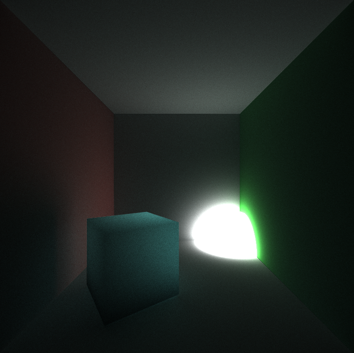

CUDA Path Tracer
================

**University of Pennsylvania, CIS 565: GPU Programming and Architecture, Project 3**

* Jonathan Lee
* Tested on: Tested on: Windows 7, i7-7700 @ 4.2GHz 16GB, GTX 1070 (Personal Machine)

# Overview

In this project, I was able to implement a basic Path Tracer in CUDA.

100,000 samples, 8 bounces (~1h30m)

Features:
- The Cornell Box
- [Depth of Field](#depth-of-field)
- [Anti-Aliasing](#anti-aliasing)
- [Materials](#materials)
    - Diffuse*
    - Specular*
    - Refractive
    - Subsurface 
- [Shading Techniques](#shading-techniques)
    - Naive*
    - Direct Lighting
- Stream Compaction for Ray Termination*
- Material Sorting*
- First Bounce Caching*

[Analysis](#analysis)

(*) denotes required features.

# Results and Renders

## Depth of Field

No Depth of Field             |  Depth of Field
:-------------------------:|:-------------------------:
 Lens Radius: 0 & Focal Distance: 5  |   Lens Radius: .2 & Focal Distance: 5 |

## Anti&#8208;Aliasing

NO AA      |  AA
:-------------------------:|:-------------------------:
   |    |

You can definitely see the jagged edges are more profound on the left since AA is turned off. AA was achieved by randomly offsetting/jittering the pixel at each iteration.

## Materials

### Specular
Perfectly Specular   |  Pink Metal
:-------------------------:|:-------------------------:
      |   |

### Transmissive
Refractive Index: 1.55    |  Refractive Index: 5
:-------------------------:|:-------------------------:
      |   |

|   |Subsurface Scattering |  |
| ------------- |:-------------:| -----:|
|       |  |  |

Density: .9

At each ray intersection with the object, the ray gets scattered through the object causing a random direction for the next bounce. A direction is chosen by spherical sampling. A distance is also sampled using `-log(rand(0, 1)) / density`.

Here's the same scene but with diffuse and transmissive materials.

Diffuse             |  Transmissive
:-------------------------:|:-------------------------:
  |  

## Shading Techniques

Naive             |  Direct Lighting
:-------------------------:|:-------------------------:
  |  

When a ray hits an object in the scene, we sample its BSDF and shoot a second ray towards the light. We sample a random position on the light and determine its contribution. If there is another object in between the original object and the light, then the point is in shadow, otherwise we account for the light's contribution. Direct lighting only does a single bounce as opposed to the naive integrator.

*This is based on my CIS561 implementation of the direct lighting integrator.

# Analysis

# Future Work

- Full Lighting/MIS
- Photon Mapping
- Acceleration Structures
- OBJ Loader

# References
- [CIS 561 Path Tracer](https://github.com/AgentLee/PathTracer)
- [PBRT](https://github.com/mmp/pbrt-v3)
- Subsurface Scattering
    - [http://www.davepagurek.com/blog/volumes-subsurface-scattering/]()
    - [https://computergraphics.stackexchange.com/questions/5214/a-recent-approach-for-subsurface-scattering]()
- [https://www.scratchapixel.com/]()

# Bloopers

### Naive 
Unless noted otherwise, I don't entirely remember how most of these happened other than messing around in `scatterRay` and depth values.

I assumed the ray was coming from the camera to the object so I negated the outgoing ray which would definitely affect the reflection.

### Sorting fails

First attempt at sorting the paths by material. I did things on the CPU and also didn't update the paths.

Forgot to sort the materials before shading. :unamused:

### Direct Lighting

I think for this one I added an extra lighting term.

I inverted the shadow ray, so everything was in shadow.
