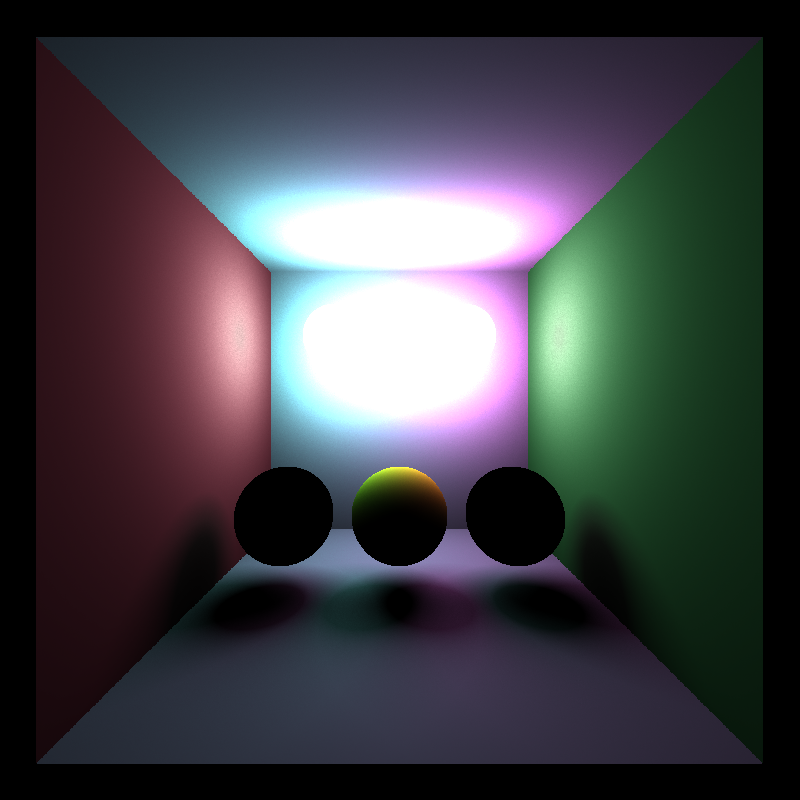

CUDA Path Tracer
================

**University of Pennsylvania, CIS 565: GPU Programming and Architecture, Project 3**

* Rishabh Shah
* Tested on: Windows 10, i7-6700HQ @ 2.6GHz 16GB, GTX 960M 4096MB (Laptop)

## Overview
Monte-Carlo Pathtracing is a way of approximating the behavior of light in the physical world. This technique is used in rendering photorealistic images. Because light rays bounce off the surfaces based on the surface properties, trying to calculate this is a computationally intensive process. Movie studios generally use CPU pathtracers due to memory limitations of GPUs, but the algorithm itself is highly parallel.

In this project, I have implemented a GPU pathtracer.

## Functionalities Implemented

* Shading:
    * Lambertian shading for diffuse surfaces
    * Perfectly specular (Reflective) surfaces
    * Refractive surfaces using Schlick's approximation. There is a `#define FRESNEL` flag in interaction.cpp, but it needs some fixing.

* Stream Compaction using `thrust::partition`

* Sorting paths and intersections based on material

* Caching first bounce, and using it in all subsequent iterations

* Physically-based depth-of-field (by jittering rays within an aperture) (based on PBRT Thin Lens Camera Model)

* Stochastic Sampled Antialiasing.

* Direct Lighting - directly sampling light after the last bounce

* Purely Direct Lighting (based on PBRT) - I implemented this as the first step towards an integrator with Multiple Importance Sampling (MIS). This converges very fast, but does not take into account bouncing of light, so lacks global illumination.

* Russian Roulette path termination

* Full Lighting Integrator - This integrator uses MIS to give weights to Direct Light contribution, and BRDF sampling contribution using a heuristic.
    * This is currently a work in progress. There is some bug which causes the image to blow-out instead of converging.

## Performance Analysis

##### Time comparison of different integration schemes

Direct lighting is only a 1 bounce process. So it is the fastest. Naive integration on the other hand involves light mouncing based on BSDF of the surface, so it is slower. Direct lighting on the last bounce, does not significantly increase the total time cost, but it is difficult to properly weight the contributions of direct and indirect lighting components this way, so not all scenes will look correct.

|   Integrator   |   1000 spp   |   5000 spp |
|:---------------------|-------:|---------------:|
|Naive	|61	|306 |
|Direct	|17	|87	|
|Naive and Direct on last bounce |70	|347 |

*Plot: performance for a depth of 8*

##### Time comparison of different optimization techniques

Stream compaction should reduce the time taken for rendering, but it does not. Perhaps, the depth here is not enough to make a difference, and in fact the overhead is higher than not sorting.

Caching first bounce effectively reduces 1 bounce from the tracing, so when the number of bounces is low, it definitely makes things faster.

Material sorting was implemented based on the idea that branch divergence would reduce if paths and intersections of same material are contiguous in memory. But it turns out that the sorting overhead is so high that the total computation time is many times higher than not doing it.

Russian roulette path termination is a way of terminating the path without going up to the maximum depth if enough color contribution is already available for the path. This becomes increasingly helpful with larger depths.

|   Optimizattion   |   Depth 8   |   Depth 16 |
|:---------------------|-------:|---------------:|
|Without stream compaction	|61	|108 |
|With stream compaction	|123 |137 |
|Cashing first bounce	|59	|104 |
|Material sorting |473 |945 |
|Russian roulette |60 |104 |

*Plot: performance for 1000 spp*

## Sample Renders

#### Naive Integrator

#### Direct Lighting Integrator

#### Naive Integrator with Direct Lighting at last bounce

#### Anti-Aliasing

This cannot be used with first bounce cache, as we are jittering the rays from the camera before the first bounce for AA.

*Left: with anti-aliasing vs Right: without anti-aliasing*

#### Depth of Field

#### Full Lighting Integrator with Multiple Importance Sampling
As this uses both direct and indirect lighting computations with weights, it give global illumination, and converges very quickly. This image below is a nearly converged result in only about 2000 spp, as compared to very noisy image we get by naive integration at 5000 spp. There is some bug due to which, I was losing color. Fixing this issue creates other issues, so I'm still working on it.

*Still Buggy*

#### Bonus

*Specular and Refractive*

*Noise Art*

