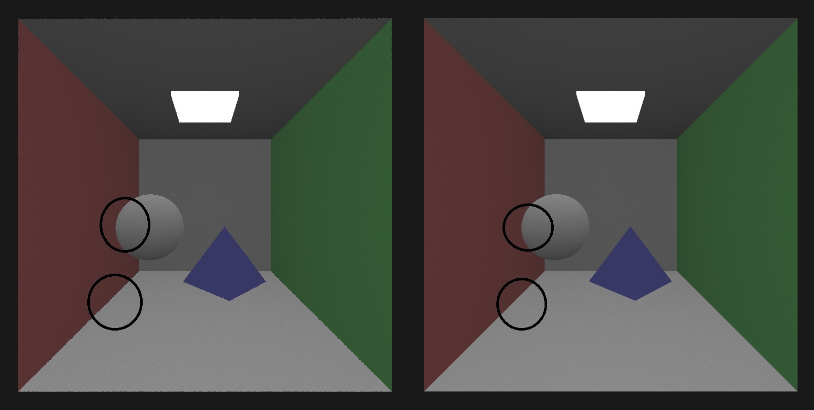

CUDA Path Tracer
================

**University of Pennsylvania, CIS 565: GPU Programming and Architecture, Project 3**

* Hanming Zhang
* Tested on: Windows 10 Education, i7-6700K @ 4.00GHz 16.0GB, GTX 980 4096MB (Personal Desktop)

Project Features
================
#### Final Renders (5000 samples per pixel) :
 |  
------------ | -------------
cornell.txt | cornell_mesh.txt
 |  
cornell.txt with thin lens | cornell_wahoo.txt with BVH
 |
cornell.txt (Direct Lighting)|

#### Part 1 : Core Features
- Shading kernel with BSDF evaluation
- Path continuation/termination using Stream Compaction
- Sorting Path segments & intersections by Material ID using Radix Sort / thrust::sort_by_key
- First bounce intersections and Camera ray cache

#### Part 2 : Make Unique!
- Work-Efficient Stream Compaction using dynamic shared memory
- Small features:
  - Pure specualr refractive material & Glass(Specualr reflection + Specualr refraction)
  - Thin lens camera(depth-of-field)
  - Stochastic sampled antialiasing
- Direct Lighting
- Arbitrary mesh loading with bounding volume intersection culling
- BVH (Hierarchical spatial data structures)

##### **About Toggleable Macros** :
  To enable/disable some features, just uncomment/comment Macros in ***scene.h***, ***sceneStructs.h***, ***pathtracer.cu***

- scene.h :
 - #define **ENABLE_MESHWORLDBOUND** : enable/disable bounding box for **each** mesh object loaded, bounding box will be used in intersection test kernel. Default **ON**.
 - #define **ENABLE_BVH** : Should first enable mesh world bound to enable BVH. All meshes(triangles) will form one BHV tree in CPU side and used for intersection test in GPU side.Default **ON**.

- sceneStructs.h :
 - #define **ENABLE_DIR_LIGHTING** : enable/disable Direct lighting. Default **OFF**.
 - Please just ignore MIS lighting part. I haven't finished it yet. Still have some bugs :(

- pathtracer.cu :
 - #define **NO_FIRSTBOUNCECACHE** : Uncommment to disable First bounce ray and intersections cache. Default **OFF**
 - #define **AA_STOCHASTIC** : enable/disable Stochastic Sampled Antialiasing. Default **ON**
 - #define **THRUSTSORT** : enable/disable sorting PathSegments and ShadeableIntersections by using thrust::sort_by_key. MaterialID in ShadeableIntersection will be used as key and PathSegments as value. Default **OFF**
 - #define **RADIXSORT** : enable/disable sorting PathSegments and ShadeableIntersections by using Radix sort. Default **OFF**
 - #define **LENPERSPECTIVECAMERA** : thin lens camera. Default **OFF**
 - #define **LEN_RADIUS 3.0f** : Should enable lens camera first. set the lens radius value. Default **OFF**
 - #define **FOCAL_LENGTH 13.0f** : Should enable lens camera first. set the lens FOCAL_LENGTH value. Default **OFF**

##### **\*Cmakelists change** : tiny_obj_loader, bounds, bvh added.

### Project Analysis (Under x64 Release mode)
- #### Shading(Diffuse, reflection, refraction, glass)
  

  As we can see, there are four types of materials, ideal diffuse, pure reflection, pure refractive and glass(reflection + refraction, use **Schlick's approximation** to generate Frensel effects)

 |  
-------------|------------
 wrong offset of the intersection point position make refractive ball itself totally white on the reflection ball surface| after offset value changes(not only offset in the ray direction, but also normal direction), refractive ball itself appear on the rflective ball surface

 - #### Stream compaction analysis(cornell.txt, cornell_total_open.txt, cornell_total_close.txt)
   ###### In this analysis, I use dynamic shared memory stream compaction method.  Kernel   kernScanDynamicShared in EfficientStreamCompaction.cu is after optimization. I run 100 iterations for each scene, and try 5, 10, 15, 20 depth respectively, which is horizontal axis. Then, I get the average time (ms) for one iteration, and use it as our vertical axis.
   ###### Some details about test scenes :

   - normal : cornell.txt scene like we see above, **5 walls, 1 light, 4 balls (green lines below)**
   - open : cornell_total_open.txt, compared with cornell.txt scene, **it has no walls, just 1 light, 4 balls(yellow lines below)**.
   - close : cornell_total_close.txt, compared with cornell.txt scene, **one front wall is added and camera is moved inside box, so 6 walls, 1 light, 4 balls(purple lines below)**;

  

   ###### Analysis:
   As shown in the line graph, I found myself in a very embarrassing situation, which is, in most cases, the time needed for each iteration takes more time if I use stream compaction. But it's actually understandable, because for the normal Cornell scene here, in face, it's very "close"! It has 5 walls around, and I have 800x800 = 640000 pixels(threads) needed to be processed, there is not so much pixels(threads) dying(remain bounces == 0) as I originally imagine. *The time threads wait during divergent branches is apparently less than the time used to do compaction*.

   However, **for the open scene, and depth == 20, iterations with compaction takes apparently less time than without compaction!** In this case, the time wasted on divergent branches is more than doing stream compaction.

   For the total close scene, as we seen, those two purple lines. We know that **doing steam compaction is a total waste of time in total closed scenes!** Because, except that we don't want our path tracer to trace paths that  hitting lights, there is basically no paths ends early. As a result, there is no need to do stream compaction here.

- #### Material ID Sort analysis(no sorting, radix sort, thrust sort)
  ###### In this analysis, I use cornell.txt scene as a test scene, and run 100 iterations. The vertical axis is the total time used for 100 iterations (ms), and horizontal axis is how things change after optimization for radix sort. I also add no sorting and sort by thrust::sort_by_key (ShadeableIntersection.materialID as key and PathSegments as value) for reference. I start from the radix sort from our course slides.
  ###### Some details about optimizations :

  - **Optimization 1** : Host side array is removed, and directly call **StreamCompaction::Efficient::scanDynamicShared** to sort **device side array**. Some arrays used during the radix sorting process are removed(according to our slides, actually we can **only use e array and f array, and b array, t array, d array can be removed**)
  - **Optimization 2** : I find reshuffling ShadeableIntersection and PathSegment every time one bit of number is processed is unnecessary, and we just want sort them **once per iteration** to save time. So RadixElement is created(formed only by original index and materialID) to be sorted when every bit of materialID is processed. After radix sorting per iteration, I use them to sort ShadeableIntersection and PathSegment. Besides that, some latency hiding is added.

  

  ###### Analysis:
  Blue line represents no sorting condition, green for thrust method, and red for radix sort. As we can see, Basically, time used with sorting is like about 50% more than that without sorting. It can be explained as that our scene is actually "uniform" in material distribution. For example, cornell.txt, we have some green diffuse material(left wall), then white diffuse(back wall), and red diffuse(right wall). As a result, there is not so much time wasting in divergent branches compared with the time used to sort all these things. **However, if the scene is more complex in material distribution, for example, several materials continue taking turns to appear with a very short interval distance, sorting can be better**.    

- #### First bounce cache analysis
  ###### In this analysis, I use cornell.txt scene as a test scene, and run 100 iterations. The vertical axis is the average time used for one iterations (ms), and horizontal axis is depth change.

  

  ###### Analysis:
  In this case, cache first bounce intersections and cam rays apparently takes less time, and around 2-5 ms less for each iteration and it's the same condition(taking less time) for 5, 10, 15, 20 depth.

- #### Thin lens camera

 |   | 
------------ | ------------- | -------------
len radius = 3.0, focal length = 10.0 | len radius = 3.0, focal length = 13.0 | len radius = 1.0, focal length = 13.0

 ###### Analysis:
 thin lens camera model is simply created by jittering rays generated from camera. Basically, there is no specific performance impact, because there are just several extra addition or multiplication when generating camera rays.

- #### Stochastic Sampled AA

 

 

 ###### Analysis:
 According to comparison I got above, stochastic sample AA works better, and it just need to compute the very first camera rays for each iteration. According to First bounce cache analysis above, generating camera rays for each iteration actually won't take so much time, and 2-5 ms for each iteration, it's pretty acceptable.

- #### Direct lighting analysis

  |   | 
 ------------ | ------------- | -------------
 direct lighting 50 spp|direct lighting 100 spp| direct lighting 5000 spp
  |   | 
 direct lighting 50 spp|direct lighting 100 spp| direct lighting 5000 spp

 ###### Analysis:
 Like comparison shown above, direct lighting converges much quicker and thus definitely much cheaper. Basically, there is no clear difference for 50spp and 5000 spp for direct lighting except for so complex places, like the lower right glass ball, and only this ball converges relatively slow, and can see clear noises in it for 50spp and 100spp. There is no performance difference between two methods in terms of the time need for each iteration.

 - #### Arbitrary mesh and acceleration analysis
   ###### In this analysis, different methods to accelerate rendering especially for arbitrary mesh are analyzed. Basically, I start from naive method, which means just testing every triangle in the mesh, to one bounding box culling, which means before testing every triangle of a mesh, I test it's whole bounding box first, and finally to BVH, which builds on CPU, and is used in GPU intersections tests. Vertical axis represents for the average time used for each iteration after 50 iterations.

  

   ###### Analysis:
   The blue line refers to cornell_mesh.txt, which is the **pyramid(6 triangles)** shown at the very beginning of README and red for **wahoo(5172 triangles)**. As we can see, when triangles number for a mesh is low, it doesn't influence performance much. However, when mesh becomes more complex and triangle number increases, even testing for one bounding box before test each triangle of a mesh helps a lot, and saves around 25% time incase of wahoo.
   Of course, as I imagine, BVH works best, and is almost 8 times faster than the naive method. So far, I regard all meshes(triangle) as one BVH, in the future, this can be optimized and BVH creation can also transfer to GPU if possible in the future.
