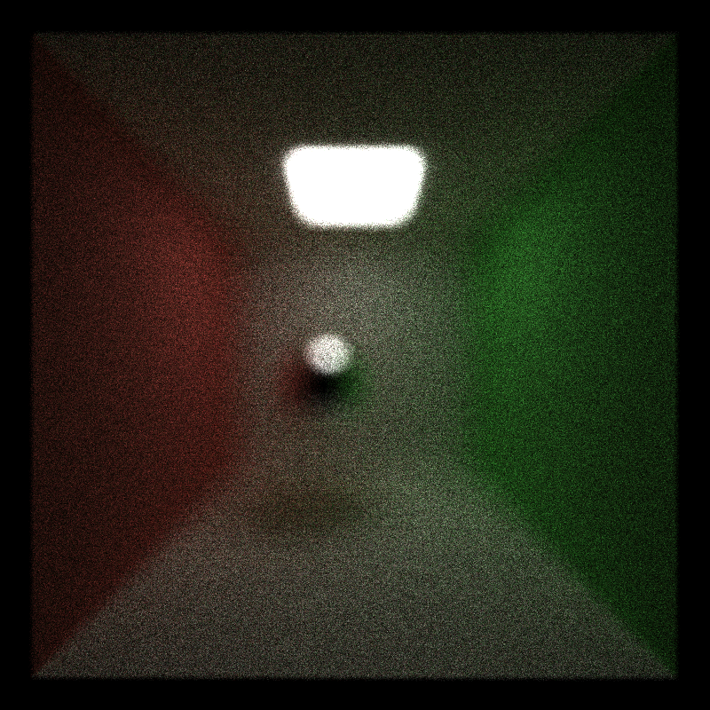

CUDA Path Tracer
================

**University of Pennsylvania, CIS 565: GPU Programming and Architecture, Project 3**

* Alexander Perry
* Tested on: Windows 10, i5-2410M @ 2.30GHz 8GB, NVS 4200M (personal computer)

This is my most representative image of the ray tracer. It includes antialiasing and path compression. It took a couple minutes to render.
Due to the low stats of my GPU I was unable to get high occupancy on many of the kernels. Several take a couple dozen registers to run with not much room to optimization. This limited the occupancy in the long running kernels to 33-46% and limited the overall performance of the renderer. 

## Depth of field

These images showcase the depth of field effect. The first image has the focal distance set to near the center sphere while the second has the focal distance set to the distance of the rear wall. In the second image, it is clear to see the out-of-focusness increase along the wall toward the camera as the bleed-over increases between the walls and the floor/ceiling.

Depth of field was implemented by jittering ray origins in a disc.

This is a series of images with reducing lensRadius. The focal distance is closer than everything in the scene but one can see how the radius of the lens affects the blur.

## Antialias

These images were created with no antialias for the first image and with antialiasing on the second. Both images were approximately 325 samples. Through the noise, it is possible to tell that the image on the left is a bit blockier along the edge.

Antialiasing was accomplished by jittering rays in a pixel. This is possible to run at the same time as depth of field. Antialiasing runs first, followed by depth of field in that case.

## Direct lighting

Direct lighting was accomplished by sending a feeler ray to a random light source of all rays still alive at the end of the iterations. This helps the image converge faster as more pixels have a light source in them at the end.

## Bloopers

This was caused by drawing all pixels at the end rather than only valid pixels. Due to stream compaction, pixels at the end of the array (at the bottom of the screen) showed up multiple times in the array and were significantly brighter.

This is standard "shadow acne". Due to floating point error, intersections were occuring in the wall rather than in front of it.

This was early in setting up direct lighting.
